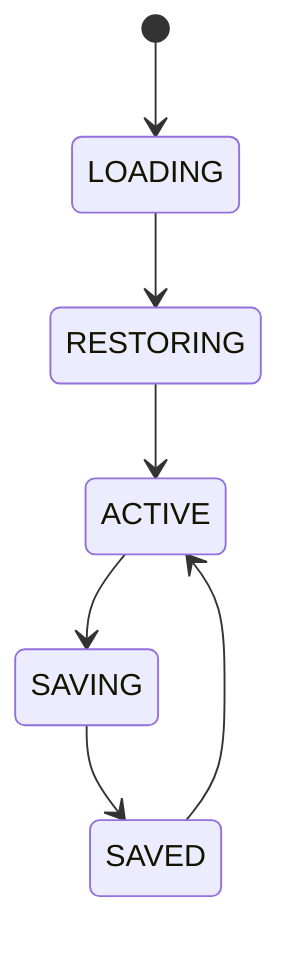

# Workspace Manager

## Document type
Document type: [REFERENCE]

This document is a stable, short-form entry point for workspace management. The authoritative Workspace Manager service contract — state machine, schema, API, events, configuration ownership, and cross-subsystem wiring — is owned exclusively by `../dashboard/dashboard-workspaces.md`. This file summarizes the workspace model for navigation and orientation; it does not override the contract owner.

## Purpose
Defines workspace ownership, layout, settings, providers, dashboards, strategies, and wallets for each workspace.

## Workspace composition
- **Layout** — saved window and panel arrangement for the dashboard.
- **Settings** — operator preferences and profile selection.
- **Providers** — selected AI and RPC providers for the workspace.
- **Dashboards** — bound dashboard bindings and widget sets.
- **Strategies** — enabled strategies and their configuration.
- **Wallets** — connected wallets and their assignment.

## State machine

## Persistence and recovery
- Workspace state persists across application restarts.
- A workspace restores its selected chain, wallet, providers, and layout on reopen.
- A restore failure falls back to the last known good snapshot and alerts the operator.
- Workspace snapshots are versioned and listed in the dashboard workspace surface.

## Snapshot versioning
- Snapshots are versioned; a restore targets a specific snapshot version.
- Snapshot corruption is detected and reported rather than silently restored.
- A restore failure falls back to the last known good snapshot and alerts the operator.
- Snapshot lists are surfaced in the dashboard workspace surface.

## Cross-references
- `../dashboard/dashboard-workspaces.md`
- `../windows/windows-desktop.md`
- `../configuration/core/configuration-profiles.md`

## Operational Contract

Defines workspace composition, layout, settings, dashboard bindings, provider selection, and recovery state. The full service contract lives in `dashboard-workspaces.md`; this document is the stable entry point that readers and the documentation map use to reach it.

## Example
A simulation workspace restores its selected chain, wallet, and layout on reopen, and a failed restore falls back to the last saved snapshot.
