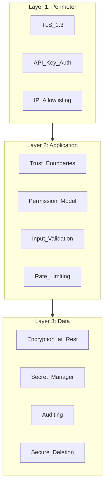

# Security

## Document type
Document type: [CONTRACT]

## Version
**Version:** 1.0.0 | **Status:** Canonical | **Last Updated:** 2026-07-29 | **Owner:** Security Team

## Purpose
Defines the platform security baseline — threat model, secret handling, trust boundaries, permission model, signing, incident response, and Windows-specific security integration.

---

## 1. Security Architecture Overview

The platform follows a **defense-in-depth** model with 3 layers:



---

## 2. Trust Boundary Integration

Trust boundaries are defined and enforced at the architecture level. This document integrates them:

| Trust Domain | ID | Security Controls | Reference |
|-------------|----|-------------------|-----------|
| **Kernel** | T0 | Minimal — implicit trust within domain | `./trust-boundaries.md` §2 |
| **Application** | T1 | IPC authentication, schema validation, process identity | `./trust-boundaries.md` §3 |
| **AI** | T2 | IPC authentication, no secret exposure, prompt safety filters | `./trust-boundaries.md` §3 |
| **UI/Dashboard** | T3 | Session token auth, data anonymization, IPC typed channels | `./trust-boundaries.md` §3 |
| **Plugins** | T4 | Process isolation, capability grants, no network initiation | `./trust-boundaries.md` §3 |
| **External** | T5 | TLS 1.3, certificate pinning, API key HMAC signing | `./trust-boundaries.md` §3 |

All cross-domain communication must pass through the **IPC Security Gateway**, which validates:
- Source domain identity
- Target domain authorization
- Message schema conformance
- Data sensitivity classification

---

## 3. Secret Lifecycle Integration

Secrets follow the full lifecycle defined in `./secret-lifecycle.md`. This document establishes binding:

| Secret Type | Classification | Storage | Rotation | Used By |
|-------------|----------------|---------|----------|---------|
| Wallet private keys | Critical | OS keychain | 90 days | T1 Wallet Manager |
| Exchange API keys | High | OS keychain | 90 days | T1 Trading Engine |
| AI provider API keys | High | Encrypted file | 90 days | T2 AI Provider Gateway |
| Database credentials | Medium | Encrypted config | 180 days | T0 Database Pool |
| Session tokens | Medium | In-memory | Per session | T3 Dashboard |

### Secret Access Rules
- No subsystem may access a secret outside its trust domain.
- T2 (AI) never receives raw secrets — only usage tokens (time-limited, scope-limited).
- T4 (Plugins) never receives any secret — all external calls proxy through T0/T1.
- All secret access attempts are audited.

---

## 4. Permission Model Integration

The permission model (detailed in `./permission-model.md`) defines:

| Role | Scope | Permissions |
|------|-------|-------------|
| **Operator** | Full system | Configure, deploy, manage wallets, override trades |
| **Trader** | Trading only | View markets, create/edit strategies, view positions |
| **Viewer** | Read-only | View dashboard, view trades, view logs |
| **Plugin** | Sandboxed | Declared capabilities only (e.g., `ohlc_data`, `signal`) |

### Permission Enforcement Points
- IPC preload bridge enforces permissions per-call.
- Dashboard UI hides actions the user's role cannot perform.
- API gateway rejects unauthorized requests before they reach the backend.

---

## 5. Windows Security Baseline

| Feature | Implementation | Config Key |
|---------|---------------|------------|
| **DPAPI** | User data encryption via `CryptProtectData` | — |
| **Credential Manager** | Secret storage for API keys | `security.secret.storage_backend: windows_credential_manager` |
| **Windows Defender** | App registered as safe in Defender exclusion list | — |
| **AppContainer** (future) | Sandboxed plugin execution via UWP AppContainer | `plugin.sandbox.isolation: appcontainer` |
| **Code Signing** | Authenticode signing for all installers | `build.signing.enabled: true` |
| **Firewall** | App registers Windows Firewall rules on install | `network.firewall.auto_configure: true` |

### Windows Threat Model
| Threat | Mitigation |
|--------|------------|
| Credential theft (malware reading process memory) | Secrets stored in OS keychain, never in plaintext memory |
| DLL injection | Code signing, process integrity checks at startup |
| Keylogger (input capture) | Wallet operations use hardware wallet or external signing |
| Registry tampering | Config files have integrity checksums |
| Sleep/hibernation memory dump | Secrets zeroed before sleep; re-auth required on wake |

---

## 6. Incident Response

### Severity Classification
| Severity | Examples | Response SLA |
|----------|----------|--------------|
| **Critical** | Private key leak, unauthorized wallet access | 15 min acknowledge, 1 hr containment |
| **High** | API key compromise, plugin sandbox escape | 1 hr acknowledge, 4 hr containment |
| **Medium** | Suspicious IPC pattern, repeated auth failures | 4 hr acknowledge, 24 hr investigation |
| **Low** | Schema validation warning, abnormal but not malicious | Next business day |

### Incident Flow
```
1. Detection: automated (event, metric, anomaly) or manual report.
2. Triage: classify severity, determine scope.
3. Containment: rotate affected secrets, isolate affected subsystem.
4. Investigation: audit log replay, root cause analysis.
5. Remediation: fix vulnerability, deploy patch.
6. Post-mortem: write incident report, update security docs.
```

---

## 7. Security Monitoring Events

| Event | Severity | Trigger | Delivery |
|-------|----------|---------|----------|
| `security.violation` | Critical | Trust boundary bypass | Exactly-once, Critical priority |
| `secret.compromised` | Critical | Breach detected | Exactly-once, Critical priority |
| `security.unauthorized_access` | High | IPC auth failure | Exactly-once, High priority |
| `security.rate_limit_exceeded` | Medium | Rate threshold hit | At-least-once, Medium priority |
| `security.audit.violation` | Low | Policy violation | At-least-once, Low priority |

---

## Cross-References

- **TRUST-BOUNDARIES.md** — Trust domain definitions and enforcement matrix.
- **SECRET-LIFECYCLE.md** — Full secret lifecycle and rotation.
- **PERMISSION-MODEL.md** — Role/action permission matrix.
- **SECURITY-CONTRACTS.md** — Security contracts and policies.
- **EVENT-OWNERSHIP-MATRIX.md** — Security event ownership.
- **WALLET-MANAGEMENT.md** — Wallet key management.
- **PLUGIN-SANDBOX-CONTRACT.md** — Plugin sandbox isolation.
- **CONFIGURATION-REFERENCE.md** — Security config keys (`security.*`).
- **TRACEABILITY-MATRIX.md** — Security requirement coverage.

---

## 8. STRIDE Threat Model

### 8.1 Threat Analysis

| Threat Type | Example | Affected Component | Mitigation | Severity |
|-------------|---------|-------------------|------------|----------|
| **Spoofing** | Malicious plugin impersonates trusted subsystem | IPC bridge, Plugin Manager | Process identity verification (PID + signature), IPC authentication | High |
| **Tampering** | Malicious plugin modifies trade data in transit | IPC messages, Event Bus | Schema validation, checksum per message, idempotency keys | Critical |
| **Repudiation** | Operator denies executing a trade | Trading Engine, Audit Log | Immutable audit log, cryptographic signing of critical actions | Medium |
| **Information Disclosure** | AI model receives wallet private key in context | AI Pipeline, Memory System | Secret masking before AI context injection, no secrets in T2 domain | Critical |
| **Denial of Service** | Malicious plugin floods event bus | Event Bus, IPC Bridge | Rate limiting per producer, queue depth limits, DLQ overflow policy | High |
| **Elevation of Privilege** | Plugin gains Operator-level permissions | Permission Model, IPC Bridge | Capability grants immutable after init, IPC permission enforcement per call | Critical |

### 8.2 Per-Trust-Domain STRIDE Analysis

| Trust Domain | Spoofing | Tampering | Repudiation | Info Disclosure | DoS | Elevation |
|-------------|----------|-----------|-------------|----------------|-----|-----------|
| **T0 Kernel** | Low (internal) | Low (internal) | Low (logged) | Low (internal) | Low (bounded) | Low (minimal) |
| **T1 Application** | Medium (IPC auth) | Medium (IPC validate) | Medium (audit log) | Medium (internal data) | Medium (bounded resources) | Medium (role enforcement) |
| **T2 AI** | Medium (IPC auth) | Medium (prompt injection) | Low (logged) | **Critical** (secret masking) | Medium (rate limited) | Medium (capability grants) |
| **T3 Dashboard** | Medium (session auth) | Low (read-only action) | Low (action log) | Medium (data anonymization) | Low (queue bounded) | Medium (role check) |
| **T4 Plugin** | **High** (impersonation risk) | **High** (data tampering risk) | Low (action log) | **High** (data access risk) | **High** (flood risk) | **Critical** (capability escalation) |
| **T5 External** | **High** (API spoofing) | **High** (response tampering) | **High** (replay attacks) | **High** (credential exposure) | **High** (rate limiting) | **High** (API privilege) |

---

## 9. Secure Update Chain

### 9.1 Update Verification Steps

```
1. Update manifest signed with Authenticode + SHA-256.
2. Manifest contains: version, checksum, signature, download_url.
3. Downloaded update package verified against manifest checksum.
4. Signature chain validated: root CA → intermediate → leaf → manifest.
5. Certificate revocation checked (OCSP/CRL).
6. Timestamp verified (within validity period).
7. Content hash verified (SHA-256 of all files matches manifest).
8. If any step fails → update rejected, operator notified.
```

### 9.2 Update Signing Policy

| Component | Signing Level | Certificate | Verification |
|-----------|-------------|-------------|-------------|
| **Update manifest** | Authenticode + SHA-256 | EV certificate | Full chain + revocation |
| **Update package** | SHA-256 checksum | Manifest-declared | Compare checksum |
| **Code signing** | Authenticode | Standard certificate | Verify binary signature |

---

## 10. Cross-Subsystem Integration

### 10.1 Who Calls Security

| Caller | Purpose | Contract |
|--------|---------|----------|
| Trading Engine | Risk check before trade | `security.risk.check` API |
| Execution Engine | Validate TX before submit | `security.tx.validate` API |
| AI Pipeline | Validate AI response safety | `security.ai.validate` API |
| Plugin Manager | Plugin capability check | `security.plugin.authorize` API |
| IPC Bridge | Per-message permission check | `security.ipc.authorize` API |
| Event Bus | Producer/consumer auth | `security.event.authorize` API |

### 10.2 Events Security Emits

| Event | Payload | Consumer |
|-------|---------|----------|
| `security.violation` | `{violation_id, severity, domain_from, domain_to, reason, ts}` | Runtime, Audit, Notification |
| `security.auth.failure` | `{source, action, role, required_role, ts}` | Audit, Dashboard |
| `security.threat.detected` | `{threat_type, component, details, severity, ts}` | Dashboard, Operator |
| `secret.compromised` | `{secret_id, classification, severity, ts}` | Runtime, Audit, Notification |

### 10.3 Configuration Security Owns

| Config Key | Default | Description |
|-----------|---------|-------------|
| `security.secret.storage_backend` | `windows_credential_manager` | Secret storage method |
| `security.audit.immutable` | `true` | Audit log cannot be deleted |
| `security.ipc.enforce_permissions` | `true` | IPC permission enforcement |
| `security.plugin.max_capabilities` | `8` | Max capabilities per plugin |
| `security.update.require_signature` | `true` | Updates must be signed |
| `security.threat.auto_block` | `true` | Auto-block on threat detection |

---

## Version History

| Version | Date | Changes | Author |
|---------|------|---------|--------|
| 1.0.0 | 2026-07-29 | Added formal Document type declaration, Version block, and Version History section to satisfy [CONTRACT] compliance (`architecture-tests/validate_contracts.py`, `architecture-tests/validate_ownership.py`). Substantive content unchanged. | Security Team |
