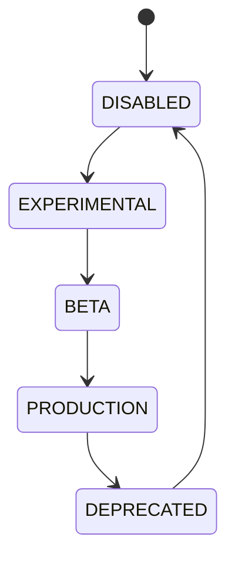

# Feature Flags

## Document type
This document is an overview, reference, or index as noted below.

# Feature Flags

## Purpose
Defines controlled rollout states for all product capabilities.

## States
Experimental, Beta, Production, Deprecated, Disabled.

## State machine

## Failure modes
Unsafe rollout, invalid default, conflicting environment override.

## Recovery
Rollback, disable, or pin to previous version.

## Cross-references
- `configuration/CONFIGURATION.md`
- `POLICY-ENGINE.md`
- `deployment/VERSIONING.md`

## Operational Contract
Defines the responsibilities, invariants, and expected behavior for this component.

## Example
An input is validated before any state-changing action.

## Rollout rules
- Must define environment overrides and strategy rollout controls.

## Required details
- Define rollout, scope, and override behavior.
