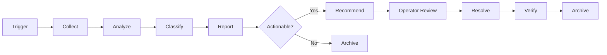

# Diagnostics

## Document type
Document type: [CONTRACT]

## Version
**Version:** 1.1.0 | **Status:** Canonical | **Last Updated:** 2026-07-27 | **Owner:** Ops Team

## Purpose
Defines the diagnostics subsystem — diagnosis workflow, artifact schema, export format, analysis pipeline, and integration with health checks, monitoring, and recovery coordination.

---

## 1. Diagnosis Workflow

When a subsystem reports a failure or anomalous behavior, the Diagnostics subsystem follows this workflow:



### Workflow Steps

| Step | Description | Input | Output | Timeout |
|------|-------------|-------|--------|---------|
| **Trigger** | Anomaly detected via health check, event, metric threshold, or operator report | Error event, health failure, metric breach | Diagnostic session initiated | — |
| **Collect** | Gather all relevant artifacts from affected subsystem(s) | Subsystem name, error code, timestamp | Diagnostic artifact bundle | `diagnostics.collection_timeout_ms` (30s) |
| **Analyze** | Run automated analysis on collected artifacts | Artifact bundle | Analysis result: root cause hypothesis, severity, scope | `diagnostics.analysis_timeout_ms` (60s) |
| **Classify** | Classify the diagnosis by severity and category | Analysis result | Classification: Critical/High/Medium/Low + domain category | 5s |
| **Report** | Generate diagnostic report with findings and recommendations | Classification + analysis | Diagnostic report (structured JSON) | 10s |
| **Recommend** | Provide actionable recommendation to operator | Diagnostic report | Recommended action (restart, config change, escalation) | 5s |
| **Resolve** | Operator takes action based on recommendation | Recommended action | Action taken; resolution state | Operator-dependent |
| **Verify** | Verify the subsystem is healthy after resolution | Resolution action | Health check result | `runtime.health_check_interval_ms` |
| **Archive** | Store diagnostic session for future reference | Full session data | Archived diagnostic record | 10s |

---

## 2. Diagnostic Artifact Schema

Each diagnostic collection produces a structured artifact bundle:

```json
{
  "diagnostic_session_id": "diag-uuid",
  "trigger_timestamp_utc": "2026-07-27T12:00:00Z",
  "trigger_source": "health_check|event|metric_threshold|operator",
  "affected_subsystem": "trading_engine|risk_engine|ai_pipeline|...",
  "trigger_error_code": "ERR-TRADE-001",
  "severity": "Critical|High|Medium|Low",
  "artifacts": {
    "system_state_snapshot": {
      "engine_state": "DEGRADED",
      "subsystem_states": {"trading": "RUNNING", "execution": "FAILED", ...},
      "health_score": 0.65,
      "active_trades": 3,
      "pending_txs": 1
    },
    "event_stream_snapshot": {
      "last_50_events": [...],
      "event_bus_queue_depth": 150,
      "dlq_size": 5
    },
    "metric_snapshot": {
      "process_rss_mb": 850,
      "cpu_percent": 75,
      "trade_latency_p50_ms": 500,
      "trade_latency_p99_ms": 2000
    },
    "log_snapshot": {
      "last_100_log_entries": [...],
      "error_count_last_5_min": 12,
      "warning_count_last_5_min": 25
    },
    "config_snapshot": {
      "config_hash": "sha256:...",
      "last_reload_timestamp": "2026-07-27T11:55:00Z",
      "active_profile": "default"
    },
    "chain_state_snapshot": {
      "chain_id": {
        "rpc_endpoint": "...",
        "last_block_number": 12345,
        "rpc_latency_ms": 150,
        "rpc_status": "connected|disconnected"
      }
    },
    "wallet_state_snapshot": {
      "wallet_balance_gas": "0.5 ETH",
      "pending_tx_count": 1,
      "nonce_sequence": {...}
    }
  },
  "analysis_result": {
    "root_cause_hypothesis": "RPC connection timeout causing execution failure",
    "confidence_score": 0.85,
    "category": "network|execution|risk|ai|config|security|plugin|runtime",
    "affected_scope": ["chain_1", "execution_engine"],
    "correlation_ids": ["trade-123", "exec-456"]
  },
  "recommendation": {
    "action": "restart_rpc_connection|switch_fallback_rpc|pause_trading|increase_gas|escalate_operator",
    "automated_possible": true|false,
    "expected_recovery_time_ms": 15000
  }
}
```

---

## 3. Diagnostic Export Format

Diagnostics can be exported for operator review or external support:

| Format | Description | Content | Trigger |
|--------|-------------|---------|---------|
| **JSON bundle** | Full diagnostic artifact + analysis | Complete artifact schema | Operator API request: `POST /api/admin/diagnostics/export` |
| **Markdown report** | Human-readable diagnostic summary | Key findings, root cause, recommendations, timeline | Operator API request or auto-generated on Critical severity |
| **CSV metrics** | Metric snapshot in tabular format | All subsystem metrics at collection time | Operator API request |
| **Windows Event Log entry** | Structured event log entry | Error code, subsystem, severity, recommendation | Auto-generated for Critical/High severity in service mode |

### Export Retention
- JSON bundles: retained for 90 days in diagnostic store.
- Markdown reports: retained for 365 days in audit store.
- CSV metrics: retained for 30 days.
- Windows Event Log: follows Windows Event Log retention policy.

---

## 4. Analysis Pipeline

| Analyzer | Description | Input | Output | Triggered For |
|----------|-------------|-------|--------|---------------|
| **Pattern matcher** | Match error pattern against known failure catalog | Error code + subsystem | Known failure pattern + recommended playbook | All failures (first pass) |
| **Correlation analyzer** | Link related events by correlation ID, time window, subsystem dependency | Event stream snapshot | Correlation graph + related failure chain | Complex/multi-subsystem failures |
| **Metric anomaly detector** | Detect metric anomalies (spikes, drops, trend changes) | Metric snapshot | Anomaly flags (which metrics, how far from baseline) | Metric threshold triggers |
| **Timeline reconstructor** | Reconstruct event timeline leading to failure | Event stream + log snapshot | Ordered timeline of events leading to trigger | All failures |
| **Chain state verifier** | Verify on-chain state matches in-memory state | Chain state + wallet state + trade state | Consistency report (in-flight trade actual status) | Trading/execution failures |

---

## 5. Integration with Recovery

| Diagnosis Outcome | Recovery Action |
|-------------------|-----------------|
| Root cause: RPC timeout | Switch to fallback RPC (automated) |
| Root cause: Gas spike | Pause trading; resume when gas normalizes |
| Root cause: AI provider quota | Switch to secondary provider |
| Root cause: Memory exhaustion | Force GC; if persistent → Safe mode |
| Root cause: Plugin crash | Disable plugin; notify operator |
| Root cause: Database corruption | Escalate to operator (no automated recovery) |
| Root cause: Unknown | Escalate to operator with full diagnostic bundle |

---

## Cross-References

- **MONITORING-OBSERVABILITY.md** — Metric collection and alerting.
- **HEALTHCHECKS.md** — Health probe definitions and failure timing.
- **RECOVERY-COORDINATION.md** — Recovery coordination workflow.
- **RECOVERY-PLAYBOOK.md** — Per-failure-class playbooks.
- **ERROR-CATALOG.md** — Error code definitions.
- **ERROR-CODES.md** — Stable error codes.
- **FAILURE-MATRIX.md** — Failure mode catalog.
- **TRACEABILITY-MATRIX.md** — REQ-RUNTIME-002.

---

## Version History

| Version | Date | Changes | Author |
|---------|------|---------|--------|
| 1.1.0 | 2026-07-27 | Complete diagnostics contract with workflow, artifact schema, export format, analysis pipeline, recovery integration | Ops Team |
| 1.0.0 | 2025-01-15 | Initial stub (8 lines) | Ops Team |
