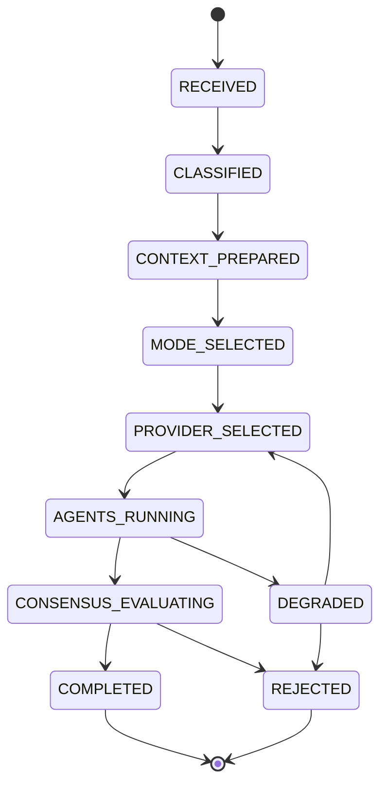

# AI Orchestration

## Document type
Document type: [CONTRACT]

## Version
**Version:** 1.1.0 | **Status:** Canonical | **Last Updated:** 2026-07-31 | **Owner:** AI Team

## Purpose
Defines lifecycle, coordination rules, multi-model orchestration, agent routing, sequencing, fallback, tool selection, memory coordination, consensus, decision handoff, and degradation behavior for the AI agent set.

---

## Architecture

AI Orchestration coordinates product AI agents inside the application runtime. It is not a repository-agent governance layer. It owns the sequencing, coordination, fallback, consensus, and handoff behavior for AI agents that participate in market analysis, risk assessment, planning, execution advice, learning, documentation search, and operations assistance.

The architecture has these control surfaces:

- agent registry and capability routing
- execution mode selection
- tool selection and fallback
- memory snapshot sharing
- consensus aggregation
- provider and cost coordination
- event emission and consumption
- degradation and recovery behavior

## Runtime Lifecycle

The orchestration lifecycle for a request is:

1. Receive an orchestration request from a product subsystem or operator command.
2. Classify intent, complexity, required agents, safety level, and expected output.
3. Select execution mode: single-model, sequential, parallel, hierarchical, or fallback-only.
4. Resolve required agent contexts and memory snapshots.
5. Select providers and tools under configured budget and capability constraints.
6. Execute the selected orchestration path.
7. Validate response quality, safety, consensus, and confidence.
8. Emit completion, rejection, degradation, or recovery events.
9. Persist trace, cost, and reflection inputs for downstream learning and explainability.

## State Machine



## Event Model

The event model is the authoritative integration boundary for AI orchestration. Requesting subsystems produce intent events, AI Orchestration consumes them, and AI Orchestration emits status, consensus, degradation, and result events. Event payloads must remain provider-neutral and must not expose secrets, wallet material, or unapproved trade execution commands.

---

## 1. Agent Registry

| Agent | ID | Domain | Purpose | Input Events | Output Events | Tools | Priority |
|-------|----|--------|---------|-------------|---------------|-------|----------|
| **Market Agent** | `ai.market` | Market analysis | Detect opportunities, assess market conditions | `market.data.*`, `network.*` | `ai.market.analysis`, `ai.market.signal` | `price_lookup`, `volume_check`, `spread_calculator` | P1 |
| **Risk Agent** | `ai.risk` | Risk assessment | Evaluate trade risk, enforce risk limits | `trade.opportunity.detected`, `risk.*` | `ai.risk.assessment`, `ai.risk.approval` | `exposure_check`, `liquidity_assess`, `drawdown_check` | P0 |
| **Planner Agent** | `ai.planner` | Strategy planning | Plan trade execution, optimize routes | `ai.market.analysis`, `ai.risk.approval` | `ai.plan.proposed`, `ai.plan.route` | `route_optimizer`, `gas_estimator`, `timing_window` | P0 |
| **Execution Agent** | `ai.execution` | Trade execution | Execute approved trades, manage leg sequencing | `ai.plan.proposed`, `execution.*` | `ai.execution.request`, `ai.execution.confirmation` | `submit_tx`, `confirm_tx`, `cancel_tx` | P0 |
| **Learning Agent** | `ai.learning` | Adaptive learning | Update strategy weights, learn from outcomes | `trade.completed`, `trade.aborted`, `risk.circuit_breaker.*` | `ai.learning.weight_update`, `ai.learning.strategy_adjust` | `backtest`, `pattern_match`, `weight_adjust` | P2 |
| **Documentation Agent** | `ai.docs` | Knowledge management | Maintain knowledge graph, update docs | `config.*`, `system.*` | `ai.docs.update`, `ai.docs.search_result` | `search_docs`, `update_knowledge`, `cross_reference` | P3 |
| **Operations Agent** | `ai.ops` | Operational health | Monitor system health, suggest optimizations | `health.*`, `system.*` | `ai.ops.alert`, `ai.ops.suggestion` | `health_check`, `capacity_assess`, `restart_recommend` | P2 |

---

## 2. Execution Modes and Multi-Model Orchestration

### 2.1 Orchestration Modes

| Mode | Description | Trigger | Models Active |
|------|-------------|---------|---------------|
| **Single-model** | One model handles entire request | Low complexity, budget constraint | 1 |
| **Sequential** | Models called in order — each builds on previous | Complex reasoning requiring depth | 2-3 |
| **Parallel** | Models called simultaneously — results merged by consensus | Multiple perspectives needed | 2-4 |
| **Hierarchical** | Senior model delegates subtasks to junior models | High-complexity, cost optimization | 2-3 |
| **Fallback-only** | Primary model fails → fallback model | Error, timeout, rate limit | 2 |

### 2.2 Orchestration Algorithm

```
orchestrate(request):
  1. Classify request intent → {mode, required_agents, complexity}
  2. Based on mode:
     - Single: select best provider for intent → call
     - Sequential: order agents by dependency → call chain
     - Parallel: dispatch to all agents → merge via consensus
     - Hierarchical: senior agent plans → delegates to juniors
  3. Monitor response quality (confidence, latency, cost)
  4. If quality below threshold → escalate mode (single → sequential → hierarchical)
  5. If cost exceeds budget → downgrade mode (parallel → sequential → single)
  6. Return structured result to caller
```

### 2.3 Sequential Orchestration Sequence

```
Market Analysis → Risk Assessment → Planning → Execution Request
     (GPT-4o)        (Claude)      (GPT-4o)    (Local fallback)
```

Each step's output becomes the next step's context input. Total token budget across all steps: `ai.orchestration.max_total_tokens` (default 50000).

### 2.4 Parallel Orchestration Merge

```
Request → Market Agent + Risk Agent + Planner Agent → Consensus Merge → Result
```

Consensus merge algorithm:
1. Collect all agent responses.
2. For each response, compute confidence score.
3. Weight responses by confidence × agent priority.
4. For conflicting recommendations: majority vote, with Risk Agent having veto power.
5. For complementary recommendations: concatenate into unified result.

### 2.5 Hierarchical Orchestration Delegation

```
Senior Agent (GPT-4o) → Plans subtasks → delegates to:
  Junior Agent 1 (Claude) → Risk subtask → returns partial result
  Junior Agent 2 (GPT-4o-mini) → Market subtask → returns partial result
Senior Agent → Synthesizes partial results → final result
```

Delegation budget: `ai.orchestration.delegation_budget_pct` (default 60% of total tokens for juniors).

---

## 3. Tool Selection Algorithm

### 3.1 Tool Selection Process

```
1. Parse request intent → required capabilities.
2. Scan registered tools for matching capabilities.
3. Score each tool:
   score = capability_match × 0.4 + reliability × 0.3 + latency × 0.2 + cost × 0.1
4. Select top-N tools (N = ai.orchestration.max_tools_per_request, default 5).
5. If no tool matches → request to agent for "no tool available" response.
6. If tool fails during execution → fallback to next-scored tool.
```

### 3.2 Tool Availability Matrix

| Tool | Required By | Availability | Fallback |
|------|-------------|-------------|----------|
| `price_lookup` | Market Agent | Always (via RPC) | Cache fallback |
| `volume_check` | Market Agent | Always (via RPC) | Cache fallback |
| `spread_calculator` | Market Agent | Always (local) | No fallback |
| `exposure_check` | Risk Agent | Always (local) | No fallback |
| `liquidity_assess` | Risk Agent | Always (via RPC) | Stale data |
| `drawdown_check` | Risk Agent | Always (local) | No fallback |
| `route_optimizer` | Planner Agent | Always (local) | Simple route |
| `gas_estimator` | Planner Agent | Always (via RPC) | Manual estimate |
| `timing_window` | Planner Agent | Always (local) | No fallback |
| `submit_tx` | Execution Agent | Requires wallet | Abort trade |
| `confirm_tx` | Execution Agent | Requires RPC | Stuck → nonce replace |
| `cancel_tx` | Execution Agent | Requires wallet | Stuck → escalate |
| `backtest` | Learning Agent | Local simulation | No backtest |
| `pattern_match` | Learning Agent | AI-dependent | Simplified |
| `weight_adjust` | Learning Agent | Always (local) | No adjustment |
| `search_docs` | Docs Agent | Local index | No search |
| `update_knowledge` | Docs Agent | Local store | No update |
| `health_check` | Ops Agent | Always (local) | No check |
| `capacity_assess` | Ops Agent | Always (local) | No assessment |

---

## 4. Agent Coordination Rules

### 4.1 Routing Rules

| Request Intent | Routing Path | Priority | Timeout |
|---------------|-------------|----------|---------|
| Market analysis | `ai.market` → `ai.risk` → `ai.planner` | P1 → P0 → P0 | 10s → 5s → 8s |
| Risk assessment (standalone) | `ai.risk` | P0 | 5s |
| Trade execution | `ai.planner` → `ai.execution` | P0 → P0 | 8s → 30s |
| Learning feedback | `ai.learning` | P2 | 15s |
| Documentation query | `ai.docs` | P3 | 20s |
| Operational health | `ai.ops` | P2 | 10s |

### 4.2 Sequencing Rules

- **Market → Risk → Planner** is the required order for trade-related requests.
- Risk Agent has **veto power** — if risk assessment is REJECTED, planning is not called.
- Planner Agent output is validated before Execution Agent is invoked.
- Learning Agent runs asynchronously — does not block trade flow.
- Documentation Agent and Operations Agent are always non-blocking (background priority).

### 4.3 Fallback Rules

| Failure | Fallback Action |
|---------|----------------|
| Market Agent timeout | Use cached market analysis (max 60s stale) |
| Risk Agent timeout | Reject trade (safety-first: no execution without risk check) |
| Planner Agent timeout | Use default strategy parameters |
| Execution Agent timeout | Abort trade, notify operator |
| Learning Agent failure | Skip learning, log warning |
| Documentation Agent failure | Skip docs update |
| Operations Agent failure | Skip ops suggestion |

### 4.4 Degradation Under Failure

```
Level 0: All agents active, full orchestration
Level 1: Documentation + Operations agents disabled → P0-P1 agents only
Level 2: Learning agent disabled → P0 agents only
Level 3: Market agent uses cached data → risk + planner only
Level 4: Single-agent mode (Risk Agent runs all checks locally, no AI assistance)
Level 5: AI completely disabled → manual operator decision required
```

---

## 5. Memory Integration

### 5.1 Memory Sharing Between Agents

| Memory Type | Shared Between | Access Mode | Consistency |
|------------|---------------|-------------|-------------|
| **Market context** | Market → Planner, Risk | Read-only for consumers | Latest snapshot |
| **Risk state** | Risk → Planner, Execution | Read-only for consumers | Latest snapshot |
| **Trade plan** | Planner → Execution | Read-only for Execution | Frozen after approval |
| **Learning weights** | Learning → Market, Risk, Planner | Read-only for consumers | Updated every 60s |
| **Knowledge graph** | Docs → All agents (search) | Read-only for consumers | Latest index |
| **Operational context** | Ops → All agents (background) | Read-only | Latest snapshot |

### 5.2 Memory Isolation

- Each agent maintains its own **working memory** (conversation history, intermediate results).
- Working memory is never shared between agents.
- Agents receive **context snapshots** from other agents (via events), not live state.
- Memory is pruned per CONTEXT-PRIORITY-MATRIX.md rules.

---

## 6. Consensus Protocol

### 6.1 Consensus Rules

| Scenario | Consensus Method | Tie-breaking |
|----------|-----------------|-------------|
| **All agents agree** | Accept recommendation | — |
| **Majority agree** | Accept majority position | — |
| **Risk Agent disagrees** | REJECT (Risk veto) | Risk Agent has absolute veto |
| **Split 50/50** | REJECT (safety-first) | No trade |
| **Single agent (fallback)** | Accept with lower confidence | Confidence × 0.7 |

### 6.2 Confidence Aggregation

```
consensus_confidence = Σ(agent_confidence × agent_weight) / Σ(agent_weight)
weights: Risk=2.0, Planner=1.5, Market=1.0, Execution=1.0, Learning=0.5
min_consensus_confidence: 0.8 (configurable: ai.orchestration.min_consensus_confidence)
```

---

## 7. Streaming Lifecycle

### 7.1 Streaming Protocol

| Stage | Behavior | Timeout | Failure |
|-------|----------|---------|---------|
| **Stream start** | Agent begins streaming response | — | — |
| **Chunk delivery** | Each chunk delivered within `ai.streaming.chunk_timeout_ms` (default 5000ms) | If timeout → assume stream terminated, process partial |
| **Stream completion** | Agent sends `[DONE]` marker | `ai.streaming.max_duration_ms` (default 60000ms) | Timeout → process partial + warn |
| **Stream cancellation** | Caller sends cancel signal → agent stops generating | 1000ms for agent to acknowledge | If not acknowledged → discard stream |
| **Partial processing** | If stream terminates early, process available chunks | — | If < 20% of expected tokens → REJECT |

### 7.2 Cancellation Rules

- Operator can cancel any AI request via dashboard or API.
- Cancellation propagates to all agents in the orchestration chain.
- If a cancelled request has already triggered execution, cancellation does NOT abort the trade — only stops further AI reasoning.
- Cancellation is acknowledged by the AI Pipeline — no zombie requests.

---

## 8. Provider Integration and Cost Optimisation

### 8.1 Provider Scoring Formula

```
provider_score = (speed_weight × (1 / latency_p50))
              + (cost_weight × (1 / cost_per_1k_tokens))
              + (reliability_weight × uptime_pct)
              + (capability_weight × capability_match_pct)

defaults:
  speed_weight: 0.3
  cost_weight: 0.2
  reliability_weight: 0.3
  capability_weight: 0.2
```

### 8.2 Cost Optimisation Rules

| Strategy | Implementation | Config Key |
|----------|---------------|------------|
| **Model tiering** | Simple requests → GPT-4o-mini; complex → GPT-4o | `ai.orchestration.model_tier_threshold` |
| **Token budgeting** | Allocate token budget per agent per request | `ai.orchestration.agent_token_budgets` |
| **Caching** | Cache similar requests (semantic similarity > 0.9) | `ai.pipeline.cache_enabled` |
| **Local-first** | Route low-complexity to local model if available | `ai.local.prefer_for_simple` |
| **Batching** | Batch similar requests (same intent, same time window) | `ai.orchestration.batch_window_ms` |

### 8.3 Cost Tracking

- Every AI request tracks: `tokens_used`, `cost_usd`, `provider`, `model`, `agent`, `latency_ms`.
- Monthly cost budget: `ai.cost.max_monthly_usd` (default 50.0).
- Cost exceeded → non-critical agents (Docs, Ops, Learning) disabled; critical agents (Risk, Planner) continue.
- Cost reset: monthly rolling window.

---

## 9. Reflection Cycles

### 9.1 Reflection Protocol

| Trigger | Reflection Type | Depth | Budget |
|---------|----------------|-------|--------|
| **Trade completed** | Post-trade reflection | Full analysis of decision quality | `ai.reflection.post_trade_tokens` (default 500) |
| **Trade aborted** | Failure reflection | Root cause analysis | `ai.reflection.failure_tokens` (default 500) |
| **Circuit breaker tripped** | Safety reflection | Review risk parameters | `ai.reflection.safety_tokens` (default 300) |
| **Scheduled (daily)** | Strategy reflection | Review overall strategy effectiveness | `ai.reflection.daily_tokens` (default 2000) |
| **Operator request** | Custom reflection | Operator-defined scope | Unlimited (operator override) |

### 9.2 Reflection Output

Reflection produces structured output:
```json
{
  "reflection_type": "post_trade",
  "trade_id": "abc123",
  "decision_quality": 0.85,
  "missed_factors": ["gas spike not predicted"],
  "recommendations": ["increase gas buffer for volatile hours"],
  "weight_adjustments": {"risk.gas_buffer_multiplier": 1.5}
}
```

---

## 10. Cross-Subsystem Integration

### 10.1 Who Calls AI Orchestration

| Caller | Purpose | Contract |
|--------|---------|----------|
| Trading Engine | Request market analysis + risk check | `ai.orchestration.request` event |
| Risk Engine | Request risk assessment | `ai.risk.request` event |
| Dashboard | Display AI status, confidence | `dashboard.ai` IPC channel |
| Operator | Custom reflection, override | `ai.command` IPC channel |
| Config Manager | AI config change | `config.updated` event |
| Learning Pipeline | Feedback for strategy adjustment | `learning.feedback` event |

### 10.2 Who AI Orchestration Calls

| Target | Purpose | Contract |
|--------|---------|----------|
| AI Pipeline | Execute agent requests | `ai.pipeline.submit` API |
| AI Provider Manager | Select providers | `ai.provider.select` API |
| AI Memory System | Inject context | `ai.memory.inject` API |
| AI Safety Boundary | Validate responses | `ai.safety.validate` API |
| Trading Engine | Submit trade plan | `trade.plan.proposed` event |
| Event Bus | Emit orchestration events | `ai.orchestration.*` events |

### 10.3 Events AI Orchestration Emits

| Event | Payload | Consumer |
|-------|---------|----------|
| `ai.orchestration.started` | `{request_id, mode, agents, intent}` | Dashboard, Audit |
| `ai.orchestration.completed` | `{request_id, mode, agents_used, confidence, cost_usd, duration_ms}` | Dashboard, Audit, Cost Tracking |
| `ai.orchestration.degraded` | `{level, disabled_agents, reason}` | Dashboard, Health, Operator |
| `ai.orchestration.consensus.reached` | `{request_id, consensus_confidence, agents, position}` | Trading, Risk |
| `ai.orchestration.consensus.rejected` | `{request_id, veto_agent, reason}` | Trading, Dashboard |

### 10.4 Events AI Orchestration Consumes

| Event | Source | Handler |
|-------|--------|---------|
| `trade.opportunity.detected` | Trading Engine | Initiate Market → Risk → Planner chain |
| `trade.completed` | Trading Engine | Trigger Learning + Reflection |
| `trade.aborted` | Trading Engine | Trigger Failure Reflection |
| `risk.circuit_breaker.tripped` | Risk Engine | Trigger Safety Reflection |
| `health.check.completed` | Health Checker | Ops Agent assessment |
| `config.updated` | Config Manager | Re-load agent configuration |

### 10.5 Configuration AI Orchestration Owns

| Config Key | Default | Description |
|-----------|---------|-------------|
| `ai.orchestration.default_mode` | `sequential` | Default orchestration mode |
| `ai.orchestration.max_total_tokens` | `50000` | Total token budget per orchestration |
| `ai.orchestration.min_consensus_confidence` | `0.8` | Minimum consensus confidence |
| `ai.orchestration.degradation_threshold` | `3 failures in 5 min` | Degradation trigger |
| `ai.orchestration.reflection.enabled` | `true` | Enable reflection cycles |
| `ai.orchestration.streaming.enabled` | `true` | Enable streaming responses |
| `ai.orchestration.model_tier_threshold` | `0.6` | Complexity threshold for model tiering |
| `ai.orchestration.batch_window_ms` | `2000` | Request batching window |

---

## Configuration

AI Orchestration configuration keys define mode selection, token budgets, confidence thresholds, degradation behavior, reflection enablement, streaming, model tiering, batching, and cost controls. Configuration ownership remains with this document for orchestration-specific keys and with the Configuration domain for cross-system storage, validation, profile inheritance, and rollout behavior.

The canonical configuration keys are listed in section 10.5 and must be validated through the product configuration model before runtime use.

---

## Error Recovery

AI Orchestration applies safety-first recovery. If market analysis fails, cached market context may be used within freshness limits. If risk assessment fails or times out, the orchestration rejects execution. If planning fails, default strategy parameters may be used only for non-executing recommendations. If execution handoff fails, the orchestration aborts and notifies the operator. Repeated failures trigger degradation levels and may disable non-critical agents before critical safety paths.

---

## JSON Schema

The canonical request-state schema for an orchestration instance is:

| Field | Type | Required | Constraints | Description |
| --- | --- | --- | --- | --- |
| `orchestration_id` | string | Yes | UUID format | Unique orchestration instance identifier. |
| `plan` | object | Yes | Must contain a non-empty `steps` array. | Orchestration plan selected for the request. |
| `status` | string | Yes | `pending`, `running`, `completed`, or `failed`. | Current orchestration state. |
| `created_at` | string | Yes | ISO-8601 timestamp. | Creation timestamp. |
| `updated_at` | string | Yes | ISO-8601 timestamp. | Last update timestamp. |

Schema validation uses JSON Schema Draft 7. Runtime validation is strict for required fields and enum values. Additional additive fields are allowed for forward compatibility when they do not alter required semantics. The persisted schema format is event-sourced JSON with schema version included in each record.

```json
{
  "type": "object",
  "required": ["orchestration_id", "plan", "status", "created_at", "updated_at"],
  "properties": {
    "orchestration_id": {"type": "string", "format": "uuid"},
    "plan": {
      "type": "object",
      "required": ["steps"],
      "properties": {
        "steps": {"type": "array", "minItems": 1}
      },
      "additionalProperties": true
    },
    "status": {"type": "string", "enum": ["pending", "running", "completed", "failed"]},
    "created_at": {"type": "string", "format": "date-time"},
    "updated_at": {"type": "string", "format": "date-time"}
  },
  "additionalProperties": true
}
```

---

## Examples

### Sequential trade-analysis orchestration

1. `trade.opportunity.detected` is consumed from the Trading Engine.
2. Market Agent analyzes route and liquidity context.
3. Risk Agent validates exposure and may veto.
4. Planner Agent proposes a route only after risk approval.
5. AI Orchestration emits consensus and completion events to Trading, Risk, Dashboard, and Audit consumers.

### Provider degradation

1. Primary provider exceeds timeout or quality threshold.
2. AI Provider Manager selects the next provider by capability and budget score.
3. AI Orchestration retries only within configured retry and token budgets.
4. If retry still fails, non-critical agents are disabled first and the request is either degraded or rejected.

---

## Cross-References

- **ORCHESTRATOR.md** — Platform-level orchestrator (AI is a subsystem within it).
- **AI-PIPELINE.md** — AI request routing, context assembly, provider selection.
- **AI-PROVIDER-MANAGER.md** — Provider registry, health, failover.
- **AI-STATE-MACHINE.md** — AI subsystem state machine.
- **AI-SAFETY-BOUNDARY.md** — Safety boundary enforcement.
- **AI-TOOL-INVOCATION-CONTRACT.md** — Tool invocation priority and fallback.
- **AI-MEMORY-SYSTEM.md** — Memory store and context injection.
- **AI-PLANNER.md** — Planner agent detailed behavior.
- **AI-REFLECTION.md** — Reflection cycles and self-improvement.
- **AI-CONSENSUS.md** — Consensus protocol detail.
- **CONTEXT-PRIORITY-MATRIX.md** — Context pruning rules.
- **DECISION-ENGINE.md** — Decision authority hierarchy.
- **EXPLAINABILITY.md** — AI explainability and audit.
- **END-TO-END-WIRING-CONTRACT.md** — Cross-subsystem wiring.
- **CONFIGURATION-REFERENCE.md** — AI config keys.

---

## Version History

| Version | Date | Changes | Author |
|---------|------|---------|--------|
| 1.1.0 | 2026-07-31 | Merged the useful generated schema shard content into the canonical AI Orchestration document, added explicit architecture, lifecycle, state machine, event model, error recovery, JSON schema, and examples sections, and removed reliance on duplicate generated shard files. | AI Team |
| 1.0.0 | 2026-07-29 | Added formal Document type declaration, Version block, and Version History section to satisfy [CONTRACT] compliance (`architecture-tests/validate_contracts.py`, `architecture-tests/validate_ownership.py`). Substantive content unchanged. | AI Team |
