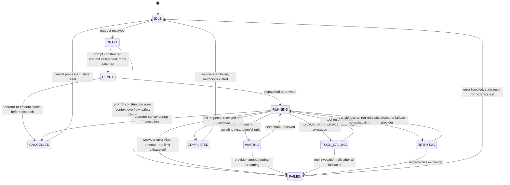

# AI State Machine

## Document type
Document type: [CONTRACT]

## Version
**Version:** 1.1.0 | **Status:** Canonical | **Last Updated:** 2026-07-27 | **Owner:** AI Team

## Purpose
Defines the complete AI orchestration state machine — states, transitions, timeouts, recovery transitions, forbidden transitions, prompt/tool/memory lifecycle state coupling, and provider routing lifecycle.

---

## 1. State Machine Definition



---

## 2. State Definitions

| State | Description | Entry Condition | Exit Condition | Timeout | Persistent? |
|-------|-------------|-----------------|----------------|---------|-------------|
| **IDLE** | No active AI request; awaiting trigger | Previous request completed or system start | Request trigger received | None (stable) | No |
| **DRAFT** | Request received; prompt being constructed | Request trigger, scheduled task, or tool chain continuation | Prompt assembled or construction fails | `ai.draft_timeout_ms` (10s) | No (transient) |
| **READY** | Prompt assembled; awaiting provider dispatch | Prompt passes validation; context within budget | Dispatch to provider or cancellation | `ai.ready_timeout_ms` (5s) | No (transient) |
| **RUNNING** | Request dispatched to provider; awaiting response | Provider selected; request submitted | Response received, tool call, failure, or cancellation | `ai.providers.timeout_ms` (30s) | No (transient) |
| **WAITING** | Provider streaming response; awaiting next chunk | Streaming mode; partial response received | Next chunk arrives or timeout | `ai.providers.streaming_timeout_ms` (5s per chunk) | No (transient) |
| **TOOL_CALLING** | Provider requested tool execution | AI response includes tool call directive | Tool result received or tool fails | `ai.tools.timeout_ms` (15s) | No (transient) |
| **COMPLETED** | Full response received and validated | Response passes validation, safety, and confidence checks | Response archived, memory updated | None (terminal for this request) | Yes |
| **FAILED** | Request failed (provider error, validation, timeout, all retries exhausted) | Error detected | Error handled; state reset for next request | `ai.failed_reset_delay_ms` (1s) | Yes (logged) |
| **RETRYING** | Retrying with fallback provider | Transient error; retry budget not exhausted | Retry dispatched or budget exhausted | `ai.providers.retry.backoff_ms` (1s initial) | No (transient) |
| **CANCELLED** | Request cancelled by operator or timeout before completion | Operator cancel command or deadline exceeded | Cancel processed; resources freed | None | Yes (logged) |

---

## 3. Transition Definitions

### Allowed Transitions

| From | To | Trigger | Precondition | Postcondition | Event Emitted |
|------|----|---------|--------------|---------------|---------------|
| IDLE | DRAFT | Request received | Authorized caller; budget not exceeded; rate limit not hit | Prompt construction begins | `ai.request.started` |
| DRAFT | READY | Prompt constructed, context assembled, tools selected | Total tokens ≤ `ai.context.max_tokens`; safety checks pass; at least one provider available | Prompt ready for dispatch | `ai.prompt.built` |
| DRAFT | FAILED | Prompt construction error | Context overflow (even after compression), safety block, or tool unavailable | Error logged; request aborted | `system.error` (AI construction) |
| READY | RUNNING | Dispatched to provider | Provider selected via routing algorithm | Request in-flight to provider | — |
| READY | CANCELLED | Cancel before dispatch | Operator cancel or timeout | Request never sent to provider | `ai.request.cancelled` |
| RUNNING | WAITING | Provider streaming, next chunk expected | Streaming mode active | Partial response buffered | — |
| RUNNING | TOOL_CALLING | Provider requests tool | Tool call in response; tool registered; tool preconditions met | Tool execution begins | `ai.tool.invoked` |
| RUNNING | FAILED | Provider error | 5xx, timeout, rate limit exhausted, or all retries failed | Error logged; fallback attempted or request aborted | `ai.provider.failed` |
| RUNNING | CANCELLED | Operator cancel during execution | Cancel command received while provider processing | Provider request cancelled if possible | `ai.request.cancelled` |
| WAITING | RUNNING | Next chunk received | Streaming continuation | Partial response updated | — |
| WAITING | FAILED | Provider timeout during streaming | No chunk received within `streaming_timeout_ms` | Streaming aborted | `ai.provider.failed` |
| TOOL_CALLING | RUNNING | Tool result injected | Tool returns result (success or handled failure) | Tool result appended to context; provider continues | `ai.tool.result` |
| TOOL_CALLING | FAILED | Tool invocation fails after all fallbacks | Primary tool + all fallbacks failed; circuit breaker open | Tool failure logged; request may continue without tool or abort | `system.error` (tool failure) |
| RUNNING | COMPLETED | Full response received and validated | Response passes: schema validation, safety check, confidence threshold, length check | Response archived; memory updated | `ai.request.completed` |
| RUNNING | RETRYING | Transient error, retry budget not exhausted | Error is retry-eligible (network, 429, 5xx); retry count < max | Fallback provider selected | `ai.provider.switched` |
| RETRYING | RUNNING | Retry dispatched to fallback provider | Fallback provider available; cooldown not active | Request re-dispatched | — |
| RETRYING | FAILED | All providers exhausted | No providers available after fallback chain | Request aborted | `ai.critical.all_providers_failed` |
| FAILED | IDLE | Error handled, state reset | Error logged; recovery action taken | Ready for next request | — |
| COMPLETED | IDLE | Response archived, memory updated | Archive written; memory entries persisted | Ready for next request | `ai.prompt.archived` |
| CANCELLED | IDLE | Cancel processed, state reset | Resources freed; partial state discarded | Ready for next request | — |

### Forbidden Transitions

| From | To | Reason |
|------|----|--------|
| FAILED | RUNNING | Cannot resume a failed request; must start fresh (IDLE → DRAFT) |
| COMPLETED | DRAFT | Completed request cannot be re-processed |
| IDLE | RUNNING | Must go through DRAFT → READY → RUNNING |
| CANCELLED | RUNNING | Cannot resume a cancelled request |
| RETRYING | COMPLETED | Retry must go through RUNNING to complete |

---

## 4. AI Prompt / Tool / Memory Lifecycle State Coupling

### Prompt Lifecycle Coupling
The AI state machine directly drives the prompt lifecycle (see `./prompts/prompt-lifecycle.md`):

| AI State | Prompt Lifecycle State | Description |
|----------|------------------------|-------------|
| IDLE | IDLE | No active prompt |
| DRAFT | CONSTRUCTING → INJECTING_MEMORY → INJECTING_CONTEXT → COMPRESSING → VALIDATING | Prompt construction pipeline |
| READY | READY | Prompt assembled, awaiting dispatch |
| RUNNING | EXECUTING | Prompt dispatched to provider |
| WAITING | EXECUTING (streaming) | Partial response being received |
| TOOL_CALLING | EXECUTING (tool execution) | Tool results being injected |
| COMPLETED | COMPLETED → ARCHIVING | Response received, archiving |
| FAILED | FAILED | Construction or execution error |

### Tool Invocation Coupling
When AI is in TOOL_CALLING state, the tool invocation contract (see `./tools/ai-tool-invocation-contract.md`) governs:
- Tool priority tiers determine selection order.
- Tool timeout is `ai.tools.timeout_ms` (15s).
- Tool fallback chain is tried before declaring failure.
- Circuit breaker may block tool if recent failures exceed threshold.
- Tool result is injected back into the RUNNING context.

### Memory Lifecycle Coupling
When AI transitions COMPLETED → IDLE, memory lifecycle (see `../../historical/ai-memory.md`, `./memory/memory-lifecycle.md`) governs:
- Response is evaluated for memory-worthy content.
- Relevant insights are stored in memory with TTL and relevance scoring.
- Memory capacity eviction applies (LRU + score-based).
- On next request (IDLE → DRAFT), relevant memories are injected during INJECTING_MEMORY phase.

---

## 5. Provider Routing and Fallback Lifecycle

### Provider Selection (in DRAFT → READY transition)
1. Determine required capabilities from request intent (chat, function-calling, streaming).
2. Query provider registry for eligible providers.
3. Score providers: `speed_weight × (1/latency_p50) + cost_weight × (1/cost_per_token) + reliability_weight × uptime_pct`.
4. Select highest-scored provider as primary.
5. Prepare fallback chain from remaining eligible providers.

### Fallback Sequence (RUNNING → RETRYING → RUNNING)
```
Primary (OpenAI) → Secondary (Anthropic) → Tertiary (Local/Ollama) → ALL_FAILED
```

- Each fallback increments retry counter.
- Provider cooldown: if provider failed in last `ai.providers.failure_cooldown_ms` (60s), skip it.
- After 3 fallback trips in 5 minutes: throttle to 1 request/min for 10 minutes.
- Circuit breaker: 5 failures in 60s → provider circuit open for 120s.

---

## 6. Timeout Semantics

| Timeout | Default | Range | Config Key | Action on Expiry |
|---------|---------|-------|------------|------------------|
| Draft timeout | 10,000 ms | 5,000–60,000 | `ai.draft_timeout_ms` | Transition to FAILED |
| Ready timeout | 5,000 ms | 1,000–30,000 | `ai.ready_timeout_ms` | Cancel request |
| Provider timeout | 30,000 ms | 5,000–120,000 | `ai.providers.timeout_ms` | Transition to RETRYING |
| Streaming chunk timeout | 5,000 ms | 1,000–30,000 | `ai.providers.streaming_timeout_ms` | Transition to FAILED |
| Tool timeout | 15,000 ms | 1,000–60,000 | `ai.tools.timeout_ms` | Tool fails, fallback or abort |
| Failed reset delay | 1,000 ms | 100–10,000 | `ai.failed_reset_delay_ms` | Return to IDLE |
| Provider cooldown | 60,000 ms | 10,000–300,000 | `ai.providers.failure_cooldown_ms` | Skip provider in routing |

---

## Cross-References

- **AI-PIPELINE.md** — AI request routing, prompt construction, provider routing, fallback policy.
- **PROMPT-LIFECYCLE.md** — Prompt construction and execution lifecycle.
- **AI-TOOL-INVOCATION-CONTRACT.md** — Tool invocation priority, fallback, timeout, retry.
- **AI-MEMORY.md** — Memory store for context injection.
- **AI-SAFETY-BOUNDARY.md** — Safety boundary enforcement.
- **CONTEXT-PRIORITY-MATRIX.md** — Context pruning hierarchy.
- **TRACEABILITY-MATRIX.md** — REQ-AI-001 through REQ-AI-007.
- **CONFIGURATION-REFERENCE.md** — `ai.*` config keys.

---

## Version History

| Version | Date | Changes | Author |
|---------|------|---------|--------|
| 1.1.0 | 2026-07-27 | Complete state machine with 10 states, prompt/tool/memory coupling, provider routing lifecycle, timeouts | AI Team |
| 1.0.0 | 2025-01-15 | Initial stub | AI Team |
