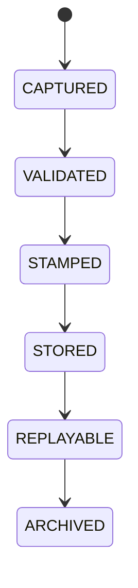

# Governance Explainability

## Document type
This document is an overview, reference, or index as noted below.

# Governance Explainability

## Purpose
Defines the compliance-heavy owner for audit lineage, rationale retention, replayability, and decision trace governance.

## Scope
All decisions, approvals, overrides, policy changes, provider changes, strategy changes, and recovery actions.

## Required fields
Decision ID, actor, timestamp, rationale, confidence, alternatives considered, gates passed, veto source, replay hash, and retention class.

## State machine

## Failure modes
Missing lineage, expired trace, tampered record, incomplete rationale.

## Recovery
Reject non-compliant traces, rebuild from source logs, and escalate to audit.

## Cross-references
- `./explainability.md`
- `../execution/decision-engine.md`
- `../execution/policy-engine.md`
- `../execution/decision-log.md`

## Operational Contract
Defines the responsibilities, invariants, and expected behavior for this component.

## Example
An input is validated before any state-changing action.
