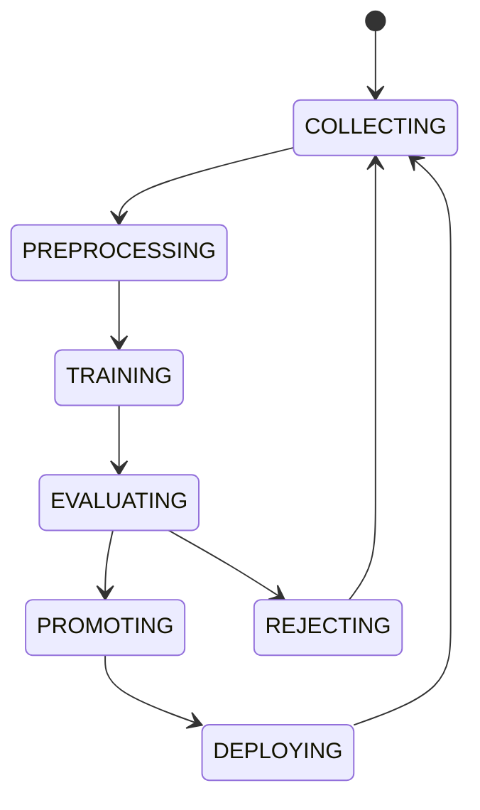

# Learning Pipeline

## Document type
This document is an overview, reference, or index as noted below.

# Learning Pipeline

## Purpose
Formalizes how operational history is converted into future model and policy improvements.

## Feature store
Market conditions, strategy parameters, execution latency, gas prices, success and failure flags.

## Reward signal
Reward = Profit - (2 * MaxDrawdown) - (0.001 * Slippage), configurable.

## Pipeline states

## Trigger policy
Retrain on daily schedule at 00:00 UTC, after 100 new trades, or after a 5% confidence degradation over 24 hours.

## A/B testing
New models go to a shadow pool for 24 hours. Roll back automatically if shadow performance is 10% below production.

## Configuration
- RETRAIN_TRIGGER_TYPE.
- MIN_TRADES_FOR_RETRAIN.
- SHADOW_DURATION_HOURS.
- ROLLBACK_THRESHOLD.

## Cross-references
- `./ai-orchestration.md`
- `./ai-memory-system.md`
- `../operations/monitoring/metrics.md`
- `../execution/simulation-engine.md`

## Operational Contract
Defines the responsibilities, invariants, and expected behavior for this component.

## Example
An input is validated before any state-changing action.

## Windows learning workflow
- Must define local storage paths and GPU/CPU training behavior on Windows.

## Required details
- Define local storage, model updates, and feedback loops.

## Learning rules
- Define feedback ingestion, model update cadence, and offline storage.
- Define how learning is blocked when evidence is insufficient.
