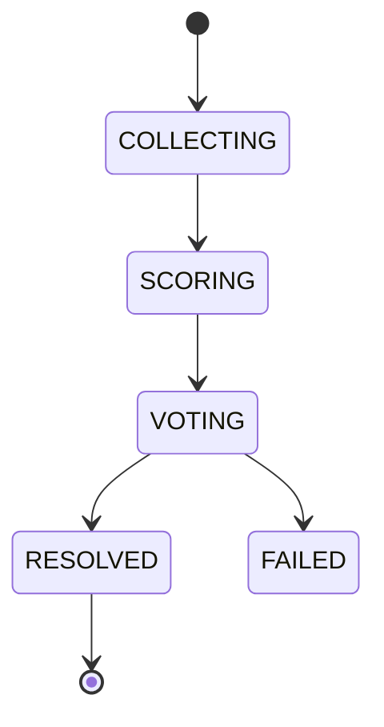

# Ai Consensus

## Document type
This document is an overview, reference, or index as noted below.

# AI Consensus

## Purpose
Defines how multiple AI agents contribute to a single decision recommendation.

## Scope
Market analysis, risk review, planning, execution recommendation, and consensus thresholds.

## Responsibilities
- Aggregate agent outputs.
- Detect disagreement and confidence gaps.
- Apply configured voting and veto policy.
- Produce a single recommendation artifact for the Decision Engine.

## Interfaces
- Input: structured opinions from participating agents.
- Output: consensus result, dissent summary, confidence score, and veto reasons.
- Events: consensus started, consensus reached, consensus failed.

## State machine

## Configuration
Participant list, quorum rules, veto rules, confidence thresholds, timeout, override policy.

## Failure handling
Missing responses, conflicting outputs, low confidence, timeout, and policy breach.

## Recovery
Extend timeout within policy, exclude failing participant, or escalate to human review.

## Security considerations
Prevent unauthorized agent injection and preserve decision trace integrity.

## Performance expectations
Consensus must complete within configured decision windows.

## Extension points
Alternative voting models, weighted quorum logic, and additional agent roles.

## Cross references
- `./ai-orchestration.md`
- `../../execution/decision-engine.md`
- `../../execution/risk-engine.md`
- `../explainability/explainability.md`

## Implementation constraints
Consensus output must remain traceable to individual agent inputs.

## Future compatibility notes
New agents must be onboarded via explicit consensus configuration.

## Decision Policy
Consensus requires configured quorum, weighted confidence, and explicit veto handling.

## Example
Market Agent + Risk Agent + Planner Agent converge before the Decision Engine accepts execution authority.

## Future compatibility notes
Additional agents may be added without changing consensus semantics.

## Required details
- Define fallback, failure, and approval behavior for consensus misses.
