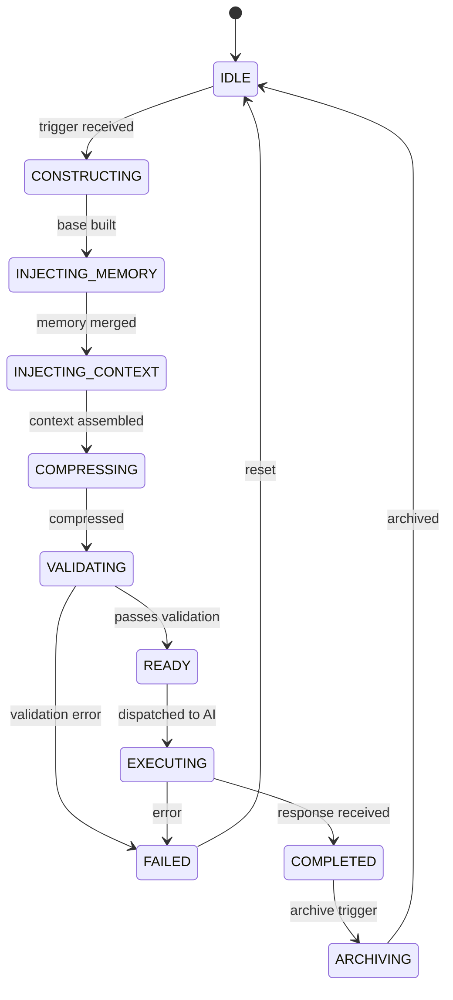

# Prompt Lifecycle

## Document type
Document type: [REFERENCE]

## Version
**Version:** 0.2.0 | **Status:** Draft | **Last Updated:** 2026-07-27 | **Owner:** AI Team

## Purpose
Defines the complete lifecycle of an AI prompt — construction, compression, memory injection, archival, and cleanup. This contract ensures deterministic, observable, and auditable prompt management.

---

## 1. Prompt Lifecycle State Machine



### State Definitions

| State | Description | Entry Condition | Exit Action |
|-------|-------------|----------------|-------------|
| `IDLE` | No active prompt | — | — |
| `CONSTRUCTING` | Building prompt from template + inputs | Task trigger, user query, or scheduled action | Assemble base prompt string |
| `INJECTING_MEMORY` | Merging memory entries | Base prompt built | Load relevant memories, append to prompt |
| `INJECTING_CONTEXT` | Merging contextual data (state, events, results) | Memory injected | Load context window state |
| `COMPRESSING` | Pruning and compressing to fit token budget | Context assembled | Apply compression strategy |
| `VALIDATING` | Checking token count, safety, completeness | Compressed | Validate against constraints |
| `READY` | Awaiting dispatch | Validation passed | Dispatch to provider |
| `EXECUTING` | Sent to AI provider, awaiting response | Dispatch confirmed | Stream/handle response |
| `COMPLETED` | Response received | Response parsed | Trigger memory update, archive |
| `ARCHIVING` | Persisting to history | Memory updated | Write to archive store |
| `FAILED` | Construction/execution error | Error raised | Log failure, notify orchestrator |

---

## 2. Prompt Construction Pipeline

### 2.1 Base Assembly Order

Prompts are assembled in the following strict order:

```
1. System prompt (template)
2. User identity / session context
3. Task instruction (from trigger)
4. Relevant memory entries (top-K by recency + relevance)
5. Current state / event context
6. Tool invocation results (from previous turns)
7. User's current message / query
8. Constraint block (token budget, timeout, allowed tools)
```

### 2.2 System Prompt Template

- Loaded from `ai.prompts.system_prompt_template` config key (or default built-in).
- Cannot be changed at runtime without restart (`Reload: No`).
- Must declare: agent role, behavioral constraints, output format expectations.

### 2.3 Memory Injection

Memory injection follows these rules:

| Rule | Description |
|------|-------------|
| **Recency bias** | Most recent `K` memories are always injected. |
| **Relevance scoring** | Memories are scored by cosine similarity to the current prompt. Top `M` by relevance are injected. |
| **Deduplication** | Memories with overlapping content are merged (dedup key = normalized text hash). |
| **TTL enforcement** | Memories older than `ai.memory.ttl_days` are excluded. |
| **Capacity** | `ai.memory.max_entries` cap enforced at injection time. Overflow evicts oldest/lowest-scored. |

Total memory tokens injected must not exceed 20% of the max context window (`ai.context.max_tokens`).

---

## 3. Compression Strategy

### 3.1 When Compression Fires

Compression is triggered when the assembled prompt exceeds `ai.context.prune_threshold` (default: 7000 tokens, or ~85% of `ai.context.max_tokens`).

### 3.2 Compression Strategies

| Strategy | Behavior | Use Case |
|----------|----------|----------|
| `priority` (default) | Rank all prompt segments by priority (system > task > user > memory > context > tool results). Drop lowest-priority segments until under threshold. | General purpose |
| `lru` | Drop segments least recently referenced. | Long-running sessions |
| `fifo` | Drop oldest segments first. | Audit / compliance contexts |

### 3.3 Segment Priority Hierarchy

| Segment | Priority | Can Be Dropped? | Drop Order |
|---------|----------|-----------------|------------|
| System prompt | 0 (highest) | Never | — |
| User current message | 1 | Never | — |
| Task instruction | 2 | Never | — |
| Constraint block | 3 | Never | — |
| Current state / context | 4 | Yes | Last |
| Tool invocation results | 5 | Yes | Middle |
| Memory entries (recent) | 6 | Yes | Early |
| Memory entries (older) | 7 | Yes | First |

### 3.4 Compression Actions

When dropping is needed:

1. **Summarize**: Replace long memory segments with LLM-generated summaries (cost: 1 extra AI call).
2. **Truncate**: Keep only the first `N` tokens of a segment (N determined by segment priority).
3. **Drop**: Remove the entire segment.
4. **Reference**: Replace segment content with a reference key (e.g., `[memory:last_session]`) that the AI can look up on demand.

The action taken is logged in the prompt lifecycle audit trail.

---

## 4. Archival

### 4.1 When Archival Fires

- **Session end**: Full prompt + response archived.
- **Turn completion**: Previous turn's prompt + response archived (for multi-turn sessions).
- **Compression**: Dropped segments are archived before deletion.

### 4.2 Archive Format

```json
{
  "archive_id": "uuid",
  "session_id": "session-uuid",
  "timestamp_utc": "2026-07-27T12:00:00Z",
  "prompt": {
    "segments": [
      {"name": "system", "tokens": 850, "compressed": false},
      {"name": "memory_injected", "tokens": 1200, "compressed": true, "original_tokens": 3400}
    ],
    "total_tokens_before_compression": 14500,
    "total_tokens_after_compression": 8192,
    "compression_strategy": "priority"
  },
  "response": {
    "model": "gpt-4",
    "tokens_in": 8192,
    "tokens_out": 1024,
    "duration_ms": 3200
  },
  "archived_at_utc": "2026-07-27T12:00:05Z"
}
```

### 4.3 Retention

- Archives are retained for 90 days (configurable via `event.retention_days` for matching event category).
- After retention, archives are compressed (gzip) and moved to cold storage.
- Cold storage retention: 365 days, then purged.

---

## 5. Cleanup

| Trigger | Action |
|---------|--------|
| Session timeout (inactivity > 30 min) | Archive full session, clear working memory |
| Session explicit close | Archive, clear, emit session end event |
| Token budget exceeded before compression | Force compression; if still over, abort with error |
| Memory capacity exceeded | Evict lowest-scored memories, log eviction |
| Error during construction | Log prompt state, abort, return error to orchestrator |

---

## 6. Observability & Audit

Every prompt lifecycle state transition emits an event:

| Transition | Event | Payload |
|------------|-------|---------|
| CONSTRUCTING → READY | `ai.prompt.built` | `{session_id, token_count, segments, strategy}` |
| READY → EXECUTING | `ai.prompt.executing` | `{session_id, model, tokens_in}` |
| EXECUTING → COMPLETED | `ai.tool.result` | `{session_id, tokens_out, duration_ms}` |
| Any → FAILED | `system.error` | `{error_code, prompt_state_snapshot}` |
| COMPLETED → ARCHIVING | `ai.prompt.archived` | `{archive_id, tokens_before, tokens_after}` |

All events have `At-least-once` delivery guarantee (see `../../interfaces/event-ownership-matrix.md`).

---

## 7. Failure Recovery

| Failure | Recovery |
|---------|----------|
| Construction timeout | Retry from `IDLE` with reduced memory budget |
| Memory injection fails | Continue without memory (log warning) |
| Compression fails | Fall back to `fifo` strategy; if still fails, truncate to hard limit |
| Validation fails | Rebuild with system prompt only, escalate error |
| Execution timeout | Return partial response if available, archive partial state |
| Archive write fails | Retry 3×; if still failing, buffer locally and retry on next turn |

---

## Cross-References

- **AI-PIPELINE.md** — Where prompts are consumed in the AI decision pipeline.
- **TRACEABILITY-MATRIX.md** — Requirement-to-document mapping and governance validation.
- **AI-MEMORY.md** — Memory storage, retrieval, and governance.
- **AI-CONTEXT-WINDOW-MANAGEMENT.md** — Token budget and context window limits.
- **AI-TOOL-INVOCATION-CONTRACT.md** — Tool invocation policy for prompt-driven tools.
- **AI-SAFETY-BOUNDARY.md** — Safety rules applied during prompt construction.
- **EVENT-OWNERSHIP-MATRIX.md** — Event ownership for prompt lifecycle events.
- **CONFIGURATION-REFERENCE.md** — Config keys for prompt behavior (`ai.prompts.*`, `ai.context.*`, `ai.memory.*`).

---

## Version History

| Version | Date | Changes | Author |
|---------|------|---------|--------|
| 0.2.0 | 2026-07-27 | Full lifecycle with state machine, compression, archival, cleanup, observability | AI Team |
| 0.1.0 | 2026-07-27 | Initial stub created | AI Team |
