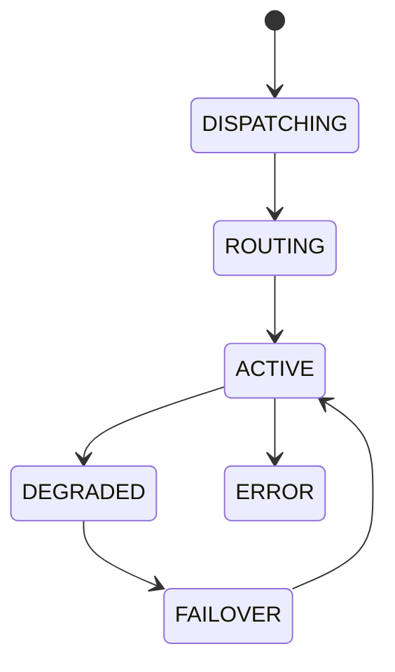

# Ai Gateway

## Document type
This document is an overview, reference, or index as noted below.

# AI Gateway

## Purpose
Defines the provider-agnostic gateway that routes AI requests through adapters and normalizes capabilities.

## Scope
OpenAI-compatible and Anthropic-compatible providers, adapter negotiation, request routing, response normalization, failover, and telemetry.

## Responsibilities
- Select provider based on capability, health, cost, and policy.
- Normalize request/response formats.
- Enforce AI reasoning policy and provider capability constraints.
- Emit gateway telemetry and failure events.

## Interfaces
- Input: structured AI request with model preferences, capability requirements, and context bundle.
- Output: normalized AI response, telemetry, and error classification.
- Events: provider selected, request dispatched, response received, failover triggered.

## State machine

## Configuration
Provider list, routing policy, capability thresholds, timeout, retry, failover policy, cost limits.

## Failure handling
Unsupported capability, provider timeout, malformed response, rate limit, and provider outage.

## Recovery
Retry within policy, route to backup provider, degrade features, or reject unsupported requests.

## Security considerations
Protect API keys, restrict tool access, sanitize prompt context, and log only approved metadata.

## Performance expectations
Low-latency dispatch, bounded retries, and predictable failover timing.

## Extension points
New provider adapters, capability detectors, response normalizers, and telemetry sinks.

## Cross references
- `../tools/ai-tools.md`
- `../providers/model-capability-negotiation.md`
- `../safety/ai-reasoning-policy.md`
- `../../operations/provider-resilience.md`

## Implementation constraints
Must not hardcode provider vendors or bypass policy checks.

## Future compatibility notes
New provider types should be added through adapters without changing gateway behavior.

## Example
A tool-calling request is routed to the provider with the required capability set and normalized response schema.

## Future compatibility notes
Capability negotiation must remain provider-neutral.
