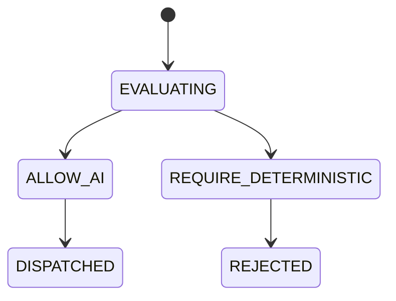

# Ai Reasoning Policy

## Document type
This document is an overview, reference, or index as noted below.

# AI Reasoning Policy

## Purpose
Defines which problems may use AI and which must remain deterministic.

## Rules
AI may advise on ranking, explanation, and configuration advice. AI must never own deterministic financial calculations or final authority where policy forbids it.

## State machine

## Failure modes
AI used in forbidden path, policy drift, ambiguous responsibility.

## Recovery
Reject the action, route to deterministic logic, and log the violation.

## Cross-references
- `../orchestration/ai-consensus.md`
- `../../execution/decision-engine.md`
- `../../execution/risk-engine.md`

## Governance Rules
Defines allowed reasoning patterns, confidence thresholds, escalation rules, and safety constraints for AI decisions.

## Example
A low-confidence plan is escalated instead of executed automatically.

## Reasoning rules
- Define when reasoning is required, how it is summarized, and when it is blocked.
- Define confidence thresholds and escalation rules.
