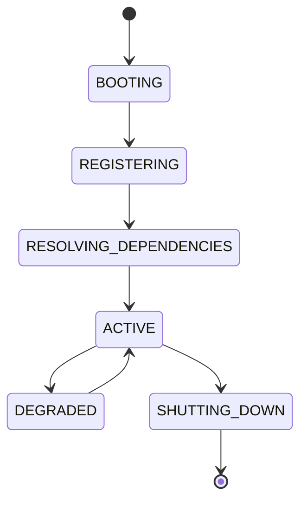

# Apex Kernel

## Document type
Document type: [CONTRACT]

## Version
**Version:** 1.0.0 | **Status:** Canonical | **Last Updated:** 2026-07-29 | **Owner:** Runtime Team

## Purpose
Defines the runtime kernel that owns service registration, lifecycle, events, health, dependency injection, configuration, and plugin loading.

## State machine

## Responsibilities
The kernel is the root coordination layer beneath the UI, orchestrator, workers, strategies, AI, and blockchain adapters.

## Inputs
Startup config, plugin manifests, service registrations, health signals, and dependency declarations.

## Outputs
Registered services, lifecycle events, dependency bindings, health state, and plugin activation results.

## Failure modes
Dependency resolution failure, plugin load failure, health degradation, and configuration corruption.

## Recovery
Retry registration, isolate failed plugins, fall back to safe defaults, and alert through the observability stack.

## Cross-references
- `../runtime/orchestrator.md`
- `../interfaces/event-bus.md`
- `../runtime/service-registry.md`
- `../operations/healthchecks.md`
- `../plugins/plugin-sdk.md`

## Operational Contract
Defines the responsibilities, invariants, and expected behavior for this component.

## Example
An input is validated before any state-changing action.

---

## Version History

| Version | Date | Changes | Author |
|---------|------|---------|--------|
| 1.0.0 | 2026-07-29 | Added formal Document type declaration, Version block, and Version History section to satisfy [CONTRACT] compliance (`architecture-tests/validate_contracts.py`, `architecture-tests/validate_ownership.py`). Substantive content unchanged. | Runtime Team |
