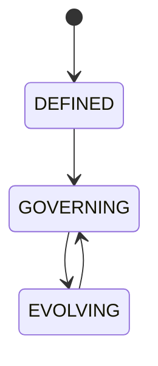

# Apex Os

## Document type
This document is an overview, reference, or index as noted below.

# APEX OS

## Purpose
Defines the constitution of the platform: vision, mission, philosophy, design principles, architecture principles, runtime principles, AI principles, security principles, extensibility principles, roadmap, non-goals, and evolution strategy.

## State machine

## Cross-references
- `./apex-kernel.md`
- `../runtime/orchestrator.md`
- `../execution/policy-engine.md`
- `../plugins/plugin-sdk.md`
- `../windows/windows-desktop.md`
- `../operations/enterprise-operations.md`

## Operational Contract
Defines the responsibilities, invariants, and expected behavior for this component.

## Example
An input is validated before any state-changing action.
