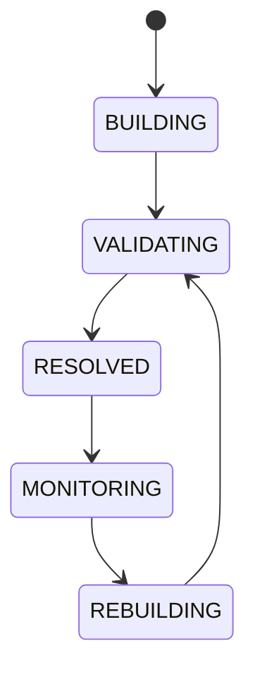

# Dependency Graph

## Document type
This document is an overview, reference, or index as noted below.

# Dependency Graph

## Purpose
Defines the system-wide dependency graph used for scheduling, upgrades, debugging, and safe startup ordering.

## Graph scope
Execution, simulation, risk, market data, chains, DEXs, wallets, providers, dashboards, notifications, and plugins.

## State machine

## Failure modes
Circular dependency, missing node, stale edge, incompatible version.

## Recovery
Break cycles through explicit ownership, reload graph, and isolate incompatible components.

## Cross-references
- `./architecture.md`
- `./apex-architecture.md`
- `../runtime/service-registry.md`
- `../runtime/orchestrator.md`

## Operational Contract
Defines the responsibilities, invariants, and expected behavior for this component.

## Example
An input is validated before any state-changing action.

## Dependency rules
- Must define runtime dependency ordering and installation prerequisites.

## Required details
- Define runtime and installer dependencies.

## Dependency rules
- Define runtime and installer dependencies plus ordering.
- Define how dependency failures block startup or install.
