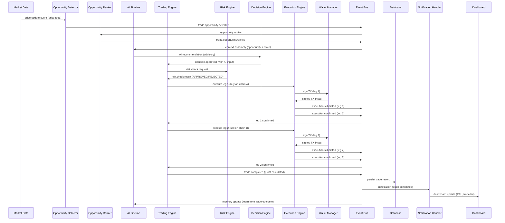
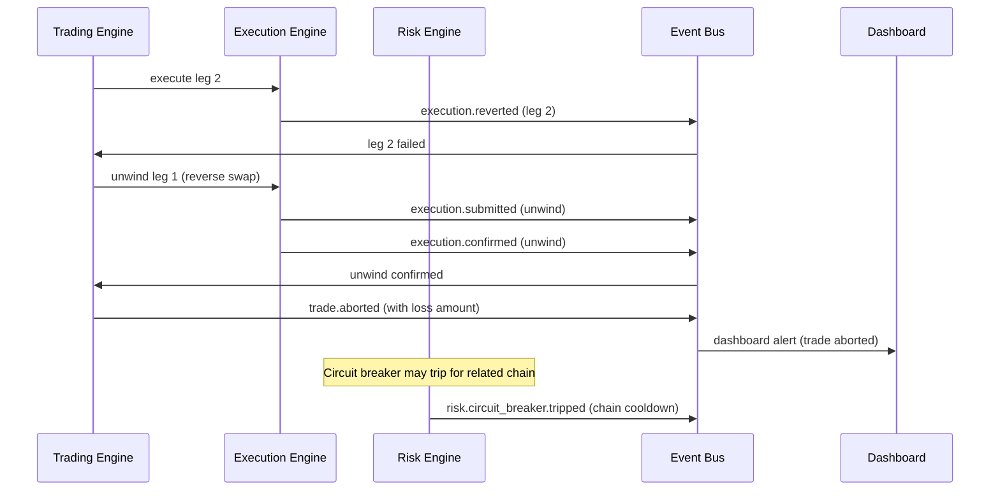

# End-to-End Wiring Contract

## Document type
Document type: [CONTRACT]

## Version
**Version:** 1.0.0 | **Status:** Canonical | **Last Updated:** 2026-07-27 | **Owner:** Architecture Team

## Purpose
Defines the single authoritative end-to-end wiring contract connecting all subsystems — from AI signal through orchestration, decision, execution, wallet, trading, notification, to dashboard — with explicit data flow, event sequencing, failure branching, and recovery coordination.

---

## 1. End-to-End Signal Flow

### 1.1 Full Opportunity-to-Dashboard Flow



### 1.2 Flow with Failure at Leg 2



---

## 2. Data Flow Contract — Per Stage

### 2.1 Market Data → Opportunity Detection

| Data | Source | Destination | Format | Delivery | Frequency |
|------|--------|-------------|--------|----------|-----------|
| Price update | Market Data Engine | Opportunity Detector | `{pair_id, chain_a_price, chain_b_price, timestamp}` | At-most-once | 1–10 Hz per pair |
| Liquidity snapshot | DEX Adapter | Opportunity Detector | `{pair_id, dex, reserve_in, reserve_out, timestamp}` | At-most-once | 0.5–2 Hz per pair |

### 2.2 Opportunity Detection → Risk Check

| Data | Source | Destination | Format | Delivery | Ordering |
|------|--------|-------------|--------|----------|----------|
| Opportunity payload | Opportunity Detector | Trading Engine → Risk Engine | `{opportunity_id, strategy_id, chains, pairs, spread_bps, estimated_profit_usd, timestamp}` | At-least-once | Key: opportunity_id |

### 2.3 Risk Check → Decision Engine

| Data | Source | Destination | Format | Delivery |
|------|--------|-------------|--------|----------|
| Risk assessment | Risk Engine | Trading Engine | `{trade_id, checks: [{name, passed, value, limit}], result: APPROVED|REJECTED}` | Exactly-once |
| AI recommendation | AI Pipeline | Decision Engine | `{opportunity_id, confidence, recommendation, reasoning}` | At-least-once |

### 2.4 Decision → Execution

| Data | Source | Destination | Format | Delivery | Ordering |
|------|--------|-------------|--------|----------|----------|
| Trade execution request | Trading Engine | Execution Engine | `{trade_id, leg, chain, pair, amount, direction, dex_address, deadline_ms}` | Exactly-once | Key: trade_id |
| Signed TX | Wallet Manager | Execution Engine | `{tx_hash, signed_bytes, nonce, chain_id}` | Exactly-once (in-process) | — |

### 2.5 Execution → Settlement

| Data | Source | Destination | Format | Delivery | Ordering |
|------|--------|-------------|--------|----------|----------|
| Leg confirmation | Execution Engine | Trading Engine | `{trade_id, leg, tx_hash, block_number, gas_used, logs, timestamp}` | Exactly-once | Key: trade_id |
| Settlement result | Trading Engine | Portfolio, Dashboard, Audit | `{trade_id, profit_usd, gas_total_usd, duration_ms, legs}` | Exactly-once | Key: trade_id |

### 2.6 Settlement → Dashboard

| Data | Source | Destination | Format | Delivery | Rate Limit |
|------|--------|-------------|--------|----------|------------|
| Trade summary | Event Bus → IPC Bridge | Dashboard | `{trade_id, profit, status, timestamp}` (anonymized) | At-most-once | 50 msg/s |
| Wallet summary | Wallet Manager → IPC Bridge | Dashboard | `{balance, pending_tx_count}` (anonymized) | At-most-once | 10 msg/s |
| Risk summary | Risk Engine → IPC Bridge | Dashboard | `{circuit_breakers, limits, status}` (anonymized) | At-most-once | 10 msg/s |
| System health | Runtime → IPC Bridge | Dashboard | `{mode, subsystem_statuses}` (anonymized) | At-most-once | 5 msg/s |

---

## 3. Event Sequencing Contract

The end-to-end flow must produce events in strict sequence per trade:

```
1. trade.opportunity.detected      (OD → EV)
2. trade.opportunity.ranked        (OR → EV)
3. trade.risk.checked              (RE → EV)
4. trade.started                   (TE → EV)
5. trade.leg.executing             (EE → EV)  [leg=1]
6. trade.leg.confirmed             (EE → EV)  [leg=1]
7. trade.leg.executing             (EE → EV)  [leg=2]
8. trade.leg.confirmed             (EE → EV)  [leg=2]
9. trade.completed                 (TE → EV)
```

All events with the same `trade_id` ordering key must be delivered in this exact sequence. A consumer receiving event 7 before event 6 must defer processing until event 6 arrives (with timeout).

### Failure Sequencing

```
Leg failure path:
5. trade.leg.executing  [leg=1]
6. trade.leg.failed     [leg=1]  → triggers partial recovery
7. trade.leg.executing  [leg=1 retry]  OR
7. trade.rollback       [unwind leg 1]
8. trade.aborted        [with reason and recovery_action]
```

---

## 4. Failure Branching Contract

### 4.1 Failure at Each Stage

| Stage | Possible Failures | Recovery Path | Event |
|-------|-------------------|---------------|-------|
| Market Data | Price feed stale/disconnected | Switch to fallback RPC; mark price as stale; skip opportunity | `network.rpc.disconnected` |
| Opportunity Detection | No opportunities detected | Continue monitoring; AI may adjust strategy parameters | — |
| Risk Check | REJECTED (loss, liquidity, slippage, timing) | Log rejection; discard opportunity; AI may learn from rejection pattern | `risk.check.failed` |
| Decision Engine | AI recommendation fails / confidence < threshold | Skip AI input; proceed with risk-only decision | `ai.provider.failed` |
| Execution (Leg 1) | TX revert, timeout, stuck | Retry with nonce replacement; if all retries fail → partial recovery | `execution.reverted` / `execution.stuck` |
| Execution (Leg 2) | TX revert after Leg 1 confirmed | Unwind Leg 1 (reverse swap); accept recovery loss | `trade.rollback` |
| Wallet | Insufficient gas/balance | Pause; attempt gas acquisition; if timeout → abort trade | `wallet.balance.changed` |
| Settlement | Profit < minimum threshold | Complete trade as marginal; flag for review | `trade.completed` (with marginal flag) |
| Notification | Delivery failure | Retry 3×; buffer locally; dashboard shows cached data | `system.warning` |
| Dashboard | IPC disconnection | Dashboard reconnects; re-subscribe to event streams | `dashboard.workspace.restored` |

### 4.2 Cascade Failure Handling

When a failure cascades across stages:

| Cascade | Handling |
|---------|----------|
| RPC failure → Market Data → Opportunity Detection → Trading | Chain circuit breaker trips; all trades on affected chain paused for cooldown |
| AI failure → Decision Engine | Decision falls back to risk-only mode (no AI input); AI advisory bypassed |
| Wallet failure → Trading → Execution | Trading halted for affected wallet; in-flight trades use crash recovery |
| Database failure → All persistence | In-memory buffer holds state (up to 1000 entries); trades continue but not persisted; paused if buffer > 1000 |
| Event bus failure → All event delivery | In-memory fallback; DLQ stored locally; replay on bus restart |

---

## 5. Trust Boundary Enforcement Along the Flow

| Data Crossing | From Domain | To Domain | Enforcement | Data Classification |
|--------------|-------------|-----------|-------------|---------------------|
| Price data | T1 (Application) | T2 (AI) | IPC typed channel | Anonymized (no wallet addresses) |
| AI recommendation | T2 (AI) | T1 (Trading) | IPC typed channel | Advisory (no execution authority) |
| Signed TX | T1 (Wallet) | T1 (Execution) | In-process (same domain) | Sensitive (but never crosses domain) |
| Trade result | T1 (Trading) | T3 (Dashboard) | IPC typed channel | Anonymized (profit amounts only) |
| Risk status | T1 (Risk) | T3 (Dashboard) | IPC typed channel | Anonymized (limit status only) |
| Plugin signal | T4 (Plugin) | T1 (Trading) | IPC typed channel + capability check | Minimal (function args only) |
| Config reload | T0 (Kernel) | All domains | IPC typed channel | All (within process) |

---

## 6. Timing Budget Along the Flow

| Stage | Budget | Config Key | Failure if Exceeded |
|-------|--------|------------|---------------------|
| Price → Opportunity detection | 50ms | `market.price_latency_budget_ms` | Skip stale price |
| Opportunity → Risk check | 100ms | `risk.check_budget_ms` | Mark opportunity as timed out |
| Risk check → Decision | 200ms | `decision.budget_ms` | Use risk-only decision |
| Decision → Leg 1 submission | 500ms | `execution.submit_budget_ms` | Abort (market window closed) |
| Leg 1 → Leg 1 confirmed | 30,000ms | `execution.mempool_timeout_ms` | Nonce replacement |
| Leg 1 confirmed → Leg 2 submission | 100ms | `execution.inter_leg_budget_ms` | Abort (window too tight) |
| Leg 2 → Leg 2 confirmed | 30,000ms | `execution.mempool_timeout_ms` | Unwind leg 1 |
| **Total end-to-end budget** | **120,000ms** | `trading.timeout_ms` | Abort entire trade + recovery |

---

## 7. Configuration Ownership Along the Flow

| Config Section | Owner | Authority Doc | Reloadable? |
|---------------|-------|--------------|-------------|
| `market.*` | Market Data Team | MARKET-DATA.md | Yes (prices, feeds) |
| `risk.*` | Risk Team | RISK-ENGINE.md | Yes (limits, thresholds) |
| `ai.*` | AI Team | AI-PIPELINE.md | Yes (providers, context) |
| `trade.*` | Trading Team | TRADING-ENGINE.md | Yes (slippage, profit min) |
| `execution.*` | Execution Team | EXECUTION-ENGINE.md | Yes (timeout, retries) |
| `wallet.*` | Wallet Team | WALLET-MANAGEMENT.md | No (addresses, networks) |
| `runtime.*` | Runtime Team | RUNTIME-OPERATIONS.md | Mixed (startup: No; health: Yes) |
| `event.*` | Runtime Team | EVENT-BUS.md | Yes (queue size, retention) |
| `dashboard.*` | Dashboard Team | DASHBOARD-RUNTIME.md | Yes (refresh, autosave) |

---

## Cross-References

- **AI-PIPELINE.md** — AI signal generation and recommendation flow.
- **TRADING-ENGINE.md** — Trade orchestration and lifecycle.
- **EXECUTION-ENGINE.md** — Transaction execution flow.
- **RISK-ENGINE.md** — Risk check pipeline.
- **DECISION-ENGINE.md** — Decision engine combining AI + risk.
- **WALLET-MANAGEMENT.md** — Wallet signing and balance flow.
- **EVENT-OWNERSHIP-MATRIX.md** — Event producer/consumer mapping.
- **TRUST-BOUNDARIES.md** — Trust domain enforcement.
- **CONFIGURATION-REFERENCE.md** — Config key ownership.
- **STATE-MACHINE-INDEX.md** — Inter-state-machine coupling.
- **TRACEABILITY-MATRIX.md** — Requirement coverage.

---

## Version History

| Version | Date | Changes | Author |
|---------|------|---------|--------|
| 1.0.0 | 2026-07-27 | New: single authoritative end-to-end wiring contract from signal to dashboard | Architecture Team |
