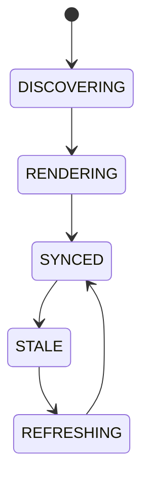

# Live Architecture Viewer

## Document type
This document is an overview, reference, or index as noted below.

# Live Architecture Viewer

## Purpose
Defines the authoritative live topology and runtime visualization layer for modules, queues, events, and health.

## Scope
Strategies, workers, AI, chains, DEXs, wallets, providers, queues, and event routes.

## State machine

## Failure modes
Stale graph, missing node, invalid edge, render failure.

## Recovery
Refresh topology from kernel, requery registries, and fall back to cached graph.

## Cross-references
- `./apex-kernel.md`
- `./dependency-graph.md`
- `../operations/health-checks.md`
- `../dashboard/ui-dashboard-spec.md`

## Operational Contract
Defines the responsibilities, invariants, and expected behavior for this component.

## Example
An input is validated before any state-changing action.

## Canonical ownership
This document defers to the canonical owners for implementation, policy, and schema details.
