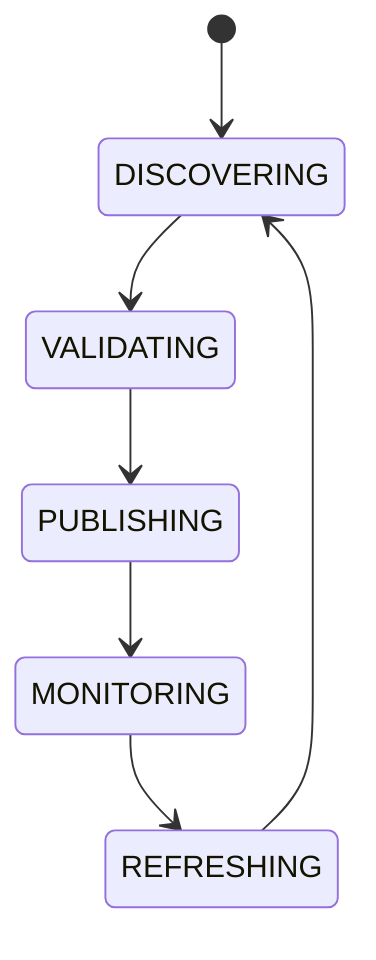

# System Capability Registry

## Document type
This document is an overview, reference, or index as noted below.

# System Capability Registry

## Purpose
Defines platform-wide capability discovery independent of implementation names.

## Examples
Supports Flash Loans, Permit2, Cross-Chain, Streaming AI, Vision Models, Tool Calling, Batch Execution.

## State machine

## Failure modes
Wrong capability label, stale capability, incompatible version.

## Recovery
Re-scan adapters, revalidate manifests, and suspend stale capabilities.

## Cross-references
- `../data/registry-system.md`
- `../plugins/plugin-sdk.md`
- `../ai/providers/ai-provider-manager.md`
- `../ai/runtime/ai-gateway.md`

## Required details
- Define platform capabilities and runtime features.

## Capability rules
- Define platform, runtime, service, and plugin capabilities explicitly.
- Define how capability checks block unsupported features.

## Capability rules
- Define discoverable capabilities, feature flags, and compatibility.
- Define capability ownership and versioning.

## Canonical ownership
This document defers to the canonical owners for implementation, policy, and schema details.
