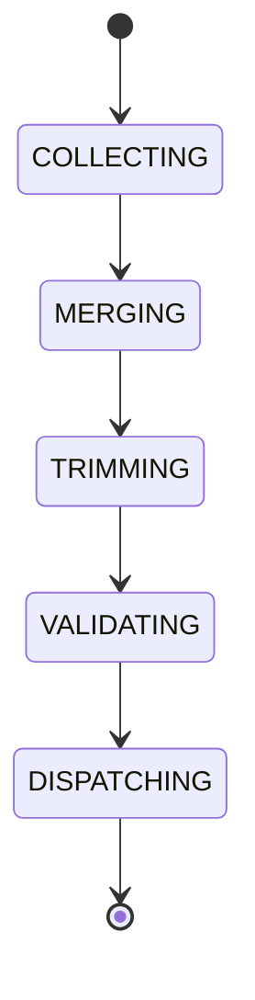

# Context Builder

## Document type
This document is an overview, reference, or index as noted below.

# Context Builder

## Purpose
Defines the component that assembles structured context before every AI request.

## Pipeline
Memory -> Knowledge Graph -> Current Market -> User Settings -> Runtime State -> Decision History -> Prompt Builder -> AI Gateway.

## State machine

## Failure modes
Missing memory, oversize context, invalid source, stale runtime state.

## Recovery
Compress context, fall back to curated memory, or refuse dispatch if policy fails.

## Cross-references
- `../ai/runtime/ai-pipeline.md`
- `../ai/memory/ai-memory-system.md`
- `./knowledge-graph.md`
- `../ai/runtime/ai-gateway.md`

## Operational Contract
Defines how user, market, wallet, and runtime context are assembled for downstream reasoning.

## Example
A prompt includes live balances, active positions, and current chain state.

## Context sources
- Must define which runtime, market, wallet, and Windows signals feed model context.
