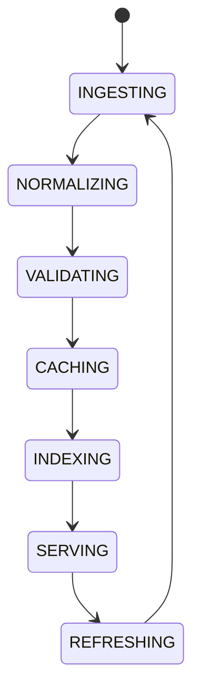

# Data Governance

## Document type
This document is an overview, reference, or index as noted below.

# Data Governance

## Purpose
Defines the central owner for data normalization, validation, provenance, caching, and graph linking.

## Scope
Market data, token metadata, chain metadata, DEX metadata, AI knowledge, execution history, and analytics inputs.

## State machine

## Failure modes
Invalid source, stale cache, broken provenance, incompatible schema.

## Recovery
Reject invalid records, refresh from source, and replay lineage from durable storage.

## Cross-references
- `../market/market-data.md`
- `./knowledge-graph.md`
- `../ai/memory/ai-memory-system.md`
- `./registry-system.md`

## Governance Rules
Defines data quality, lineage, retention, access control, and stewardship expectations.

## Example
A market dataset is rejected if provenance is missing.

## Windows storage governance
- Must define AppData/ProgramData use, retention, encryption, and backup behavior.

## Required details
- Define storage, retention, encryption, and audit rules.
