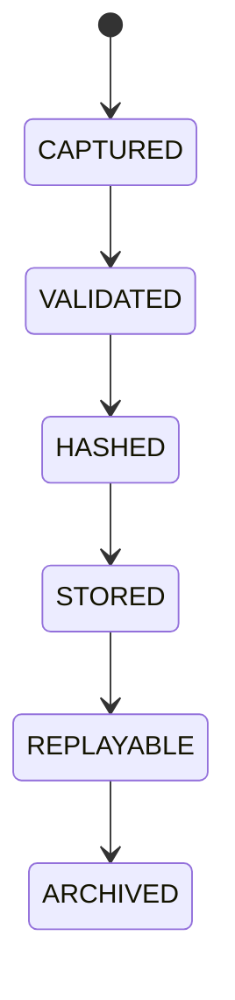

# Decision Ledger

## Document type
This document is an overview, reference, or index as noted below.

# Decision Ledger

## Purpose
Defines the immutable record of every autonomous decision and outcome.

## State machine

## Required fields
Unique Decision ID, timestamp, trigger event, market snapshot, AI recommendation, deterministic calculations, policy evaluation, risk score, simulation result, final decision, execution result, post-execution outcome.

## Failure modes
Missing record, tampered record, incomplete lineage, replay mismatch.

## Recovery
Rebuild from source logs, reject incomplete traces, escalate to audit.

## Cross-references
- `../../execution/risk-policy/decision-engine.md`
- `../../ai/explainability/governance-explainability.md`
- `../../ai/explainability/explainability.md`
- `../../execution/decision-log.md`

## Ledger Semantics
Defines the immutable trace of autonomous decisions, simulation outputs, execution results, and outcomes.

## Example
A trade decision records market snapshot, risk score, and post-execution outcome.
