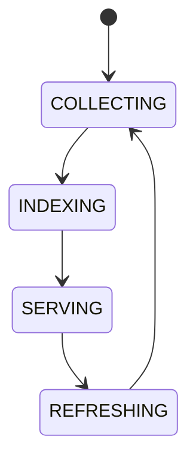

# Runtime Knowledge

## Document type
This document is an overview, reference, or index as noted below.

# Runtime Knowledge

## Purpose
Defines what the running system knows about itself at runtime.

## Contents
Active chains, loaded plugins, running workers, connected wallets, provider capabilities, health state, runtime metrics.

## State machine

## Failure modes
Stale knowledge, missing runtime state, inconsistent service view.

## Recovery
Refresh from kernel, registries, health probes, and event stream.

## Cross-references
- `../../architecture/apex-kernel.md`
- `../../operations/monitoring/health-checks.md`
- `../../operations/monitoring/monitoring-observability.md`
- `../../dashboard/dashboard-workspaces.md`

## Operational Contract
Defines the live system view of active chains, plugins, workers, wallets, provider capabilities, health, and metrics.

## Example
The dashboard reads runtime knowledge to show active workers and healthy providers.

## Windows runtime context
- Must define tray, notifications, and service state visibility.

## Required details
- Define runtime state and Windows surfaces.

## Runtime rules
- Define service state, tray state, and Windows notification visibility.
- Define how runtime knowledge survives restarts.
