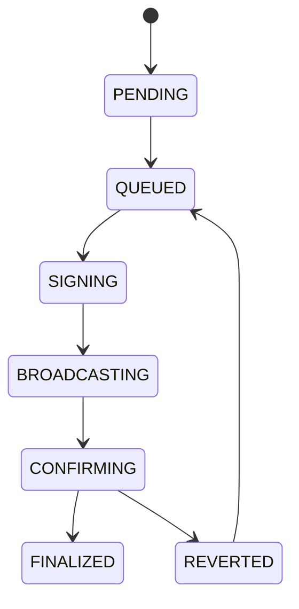

# Execution Lifecycle

## Document type
This document is a reference.

# Execution Lifecycle

## Purpose
Defines execution state transitions from queued order to final chain outcome.

## State machine

## Allowed transitions
- PENDING -> QUEUED.
- QUEUED -> SIGNING.
- SIGNING -> BROADCASTING.
- BROADCASTING -> CONFIRMING.
- CONFIRMING -> FINALIZED or REVERTED.
- REVERTED -> QUEUED.

## Forbidden transitions
- PENDING -> BROADCASTING.
- SIGNING -> FINALIZED.
- FINALIZED -> CONFIRMING.

## Recovery
- REVERTED may return to QUEUED after retry policy succeeds.

## Cross-references
- `./trading-lifecycle.md`
- `../runtime/orchestrator.md`
- `../interfaces/domain-model.md`

## Operational Contract
Defines the lifecycle from pre-checks through simulation, approval, submission, confirmation, and post-trade reconciliation.

## Example
Execution pauses if confirmations are not received within policy.

## Required details
- Define preflight, send, pending, confirm, replace, cancel, and finality rules.

## Execution flow
- Preflight, send, pending, confirm, replace, cancel, and finality must be explicit.

## Lifecycle model
- Initial state: defined by the lifecycle owner.
- Terminal state: defined by the lifecycle owner.
- Allowed transitions: explicitly listed by the lifecycle owner.
- Forbidden transitions: explicitly listed by the lifecycle owner.
- Recovery transitions: explicitly listed by the lifecycle owner.
- Failure transitions: explicitly listed by the lifecycle owner.

## Initial state
- PENDING.

## Terminal state
- FINALIZED.
- REVERTED is terminal for the failed attempt and may transition to QUEUED only via recovery.

## Recovery transitions
- REVERTED -> QUEUED.
- BROADCASTING -> QUEUED when broadcast must be retried before confirmation.

## Failure transitions
- SIGNING -> REVERTED.
- BROADCASTING -> REVERTED.
- CONFIRMING -> REVERTED.
