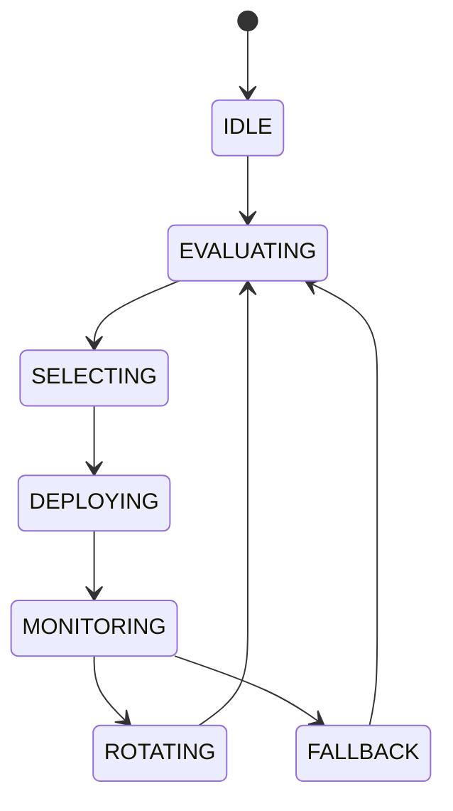

# Strategy Rotation

## Document type
This document is an overview, reference, or index as noted below.

# Strategy Rotation

## Purpose
Defines how strategies are evaluated, selected, deployed, monitored, and rotated.

## State machine

## Scoring
Score = configurable weighted combination of win rate, Sharpe ratio, recent performance, and regime alignment.

## Configuration
- ENABLED_STRATEGIES.
- MIN_PERFORMANCE_SCORE.
- ROTATION_COOLDOWN_MINUTES.

## Failure modes
If a strategy fails SLO, disable it and alert through `../operations/notification-center.md`.

## Cross-references
- `../runtime/orchestrator.md`
- `../ai/ai-consensus.md`
- `../performance/performance-slos.md`
- `../security/security-contracts.md`

## Operational Contract
Defines the responsibilities, invariants, and expected behavior for this component.

## Example
An input is validated before any state-changing action.
