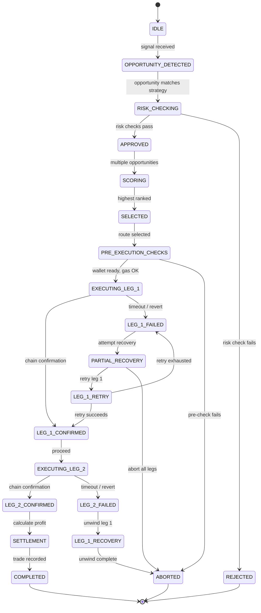

# Trading Engine

## Document type
Document type: [CONTRACT]

## Version
**Version:** 1.0.0 | **Status:** Canonical | **Last Updated:** 2026-07-29 | **Owner:** Trading Team

## Purpose
Defines the end-to-end trading decision and execution coordination layer — complete execution algorithm, order routing algorithm, risk scoring formulas, liquidity scoring, arbitrage scoring, opportunity expiry, partial fills, multi-chain execution, gas optimisation, MEV decision tree, wallet selection, retry matrices, rollback rules, position reconciliation, and cross-subsystem integration contracts.

---

## 1. Trade Lifecycle State Machine



---

## 2. Complete Execution Algorithm

### 2.1 Step-by-Step Execution Algorithm

```
1. SCAN: Market data engine emits price update for tracked pairs.
2. EVALUATE: Opportunity scanner evaluates all registered strategies against price delta.
3. CREATE: If spread exceeds strategy threshold, create opportunity:
   {opportunity_id, strategy_id, chains[], pairs[], spread_bps, estimated_profit_usd, timestamp}
4. RISK_CHECK: Opportunity payload sent to Risk Engine.
   - Evaluate max_loss, liquidity, slippage, spread integrity, timing budget.
   - Returns APPROVED or REJECTED with reason code.
   - REJECTED → log and discard.
5. SCORE: If multiple approved opportunities exist, score and rank:
   score = (profit_usd × recency_weight + confidence × trust_weight) / risk_penalty
6. SELECT: Highest-scored opportunity selected for execution.
7. ROUTE: Route Optimization Engine selects best execution route:
   - Evaluate all possible DEX combinations for the pair across chains.
   - Consider: gas costs, liquidity depth, confirmation speed, MEV risk.
8. PRE_CHECK: Pre-execution checks:
   a. Wallet balance: sufficient native token for gas.
   b. Gas price: within configured budget.
   c. Network health: RPC responsive, block height synced.
   d. Route validity: DEX liquidity, pair address, contract version.
   - Any check FAIL → ABORTED.
9. EXECUTE_LEG_1: Submit buy swap on source chain via Execution Engine.
   - Wait for confirmation: poll until confirmation_blocks pass.
   - On confirmation → proceed to LEG_2.
   - On failure → enter PARTIAL_RECOVERY.
10. EXECUTE_LEG_2: Submit sell swap on target chain via Execution Engine.
    - Wait for confirmation.
    - On confirmation → proceed to SETTLEMENT.
    - On failure → enter LEG_1_RECOVERY (unwind).
11. SETTLEMENT: Calculate actual profit:
    settlement_profit = leg_2_received - leg_1_cost - gas_total
    - Persist trade record to trade history.
    - Emit trade.completed event.
    - Send notification via configured channels.
```

---

## 3. Order Routing Algorithm

### 3.1 Route Selection Process

```
1. For each opportunity, identify all possible execution routes:
   route = {chain_A, dex_A, pair_A, chain_B, dex_B, pair_B}
2. For each route, calculate route_score:
   route_score = profit_potential × 0.3
              + liquidity_depth × 0.2
              + confirmation_speed × 0.2
              + gas_efficiency × 0.15
              + mev_safety × 0.15
3. Filter routes where any factor < minimum threshold:
   - profit_potential < execution.min_profit_usd → exclude
   - liquidity_depth < execution.min_liquidity_usd → exclude
   - gas_estimate > execution.max_gas_limit → exclude
4. Rank remaining routes by route_score.
5. Select top-ranked route for execution.
```

### 3.2 Route Scoring Components

| Component | Formula | Data Source | Min Threshold |
|-----------|---------|-------------|---------------|
| **Profit potential** | `estimated_profit_usd / max_profit_usd` | Strategy estimation | `execution.min_profit_usd` (default $0.50) |
| **Liquidity depth** | `pool_reserve_usd / max_reserve_usd` | DEX pool state (on-chain query) | `execution.min_liquidity_usd` (default $1000) |
| **Confirmation speed** | `1 / expected_confirmation_time_blocks` | Chain metadata | — |
| **Gas efficiency** | `1 / estimated_gas_cost_usd` | Gas estimation | `execution.max_gas_limit` (default 500000) |
| **MEV safety** | `mev_protection_score` (see §9) | MEV analysis | `execution.min_mev_score` (default 0.5) |

---

## 4. Risk Scoring Formulas

### 4.1 Overall Risk Score

```
risk_score = Σ(check_weight × check_result) / Σ(check_weight)

checks:
  1. max_loss: |max_loss_usd / position_size_usd| × loss_weight (0.3)
  2. liquidity: 1 - (pool_depth_usd / required_liquidity_usd) × liquidity_weight (0.2)
  3. slippage: estimated_slippage_bps / max_slippage_bps × slippage_weight (0.15)
  4. spread_integrity: spread_variance_bps / max_variance_bps × spread_weight (0.15)
  5. timing: execution_time_ms / timing_budget_ms × timing_weight (0.1)
  6. counterparty: counterparty_risk_score × counterparty_weight (0.1)

decision:
  risk_score < risk.approve_threshold (default 0.5) → APPROVED
  risk_score >= risk.approve_threshold → REJECTED with reason
```

### 4.2 Individual Check Details

| Check | Formula | Threshold | Source | Reject Action |
|-------|---------|-----------|--------|---------------|
| **Max loss** | `max_loss_usd = worst_case_exit_price - entry_price × amount` | `risk.max_loss_usd` (default $100) | Slippage model + price volatility | REJECT: `MAX_LOSS_EXCEEDED` |
| **Liquidity** | `pool_depth_usd = reserve_A × price_A + reserve_B × price_B` | `risk.min_pool_depth_usd` (default $5000) | On-chain reserve query | REJECT: `INSUFFICIENT_LIQUIDITY` |
| **Slippage** | `estimated_slippage_bps = (trade_size / pool_depth) × price_impact_factor` | `risk.max_slippage_bps` (default 50) | Slippage model calculation | REJECT: `SLIPPAGE_TOO_HIGH` |
| **Spread integrity** | `spread_variance = std_dev(spread_samples_last_60s)` | `risk.max_spread_variance_bps` (default 10) | Market data samples | REJECT: `SPREAD_UNSTABLE` |
| **Timing** | `execution_time_estimate = gas_time + confirmation_time + network_latency` | `risk.max_execution_time_ms` (default 120000) | Chain metadata + gas estimation | REJECT: `TIMING_BUDGET_EXCEEDED` |
| **Counterparty** | `counterparty_score = dex_reliability × contract_audit_score × chain_security` | `risk.min_counterparty_score` (default 0.7) | DEX registry + chain registry | REJECT: `COUNTERPARTY_RISK_HIGH` |

---

## 5. Liquidity Scoring

### 5.1 Liquidity Score Formula

```
liquidity_score = (effective_reserve_usd / trade_size_usd) × depth_multiplier
              × cross_chain_depth_factor

where:
  effective_reserve_usd = min(reserve_A_usd, reserve_B_usd) × 2
  depth_multiplier = 1.0 if reserve > 10× trade_size, 0.7 if 5×, 0.4 if 2×, 0.1 if 1×
  cross_chain_depth_factor = min(chain_A_depth, chain_B_depth) / max(chain_A_depth, chain_B_depth)

liquidity_score thresholds:
  > 1.0: excellent (execute at full speed)
  0.5-1.0: acceptable (execute with caution)
  0.2-0.5: marginal (reduce trade size by 50%)
  < 0.2: insufficient (reject trade)
```

---

## 6. Arbitrage Scoring

### 6.1 Opportunity Score Formula

```
opportunity_score = (profit_usd × recency_weight + confidence × trust_weight) / risk_penalty

where:
  profit_usd: estimated gross profit after gas and fees
  recency_weight: max(0, 1 - (age_ms / expiry_ms)) — decays over time
  confidence: strategy confidence score (0-1)
  trust_weight: chain + DEX reliability score (0-1)
  risk_penalty: 1 + risk_score (higher risk → lower score)

additional constraints:
  profit_usd < execution.min_profit_usd → opportunity excluded
  spread_bps < strategy.min_spread_bps → opportunity excluded
  age_ms > opportunity.expiry_ms → opportunity expired, excluded
```

---

## 7. Opportunity Expiry

### 7.1 Expiry Algorithm

```
opportunity.expiry_ms = base_expiry_ms × volatility_factor × congestion_factor

where:
  base_expiry_ms: strategy.default_expiry_ms (default 5000ms)
  volatility_factor: 1 / (1 + price_volatility_24h) — higher volatility = shorter expiry
  congestion_factor: 1 / (1 + gas_price / baseline_gas) — higher congestion = shorter expiry

expiry ranges:
  Low volatility, low congestion: 5000-10000ms
  Medium volatility, medium congestion: 3000-5000ms
  High volatility, high congestion: 1000-3000ms
  Extreme volatility: 500-1000ms (flash opportunity)
```

### 7.2 Expiry Decision Tree

```
1. Is opportunity age > expiry_ms?
   → YES: EXPIRED, discard opportunity
   → NO: Is opportunity age > expiry_ms × 0.8?
     → YES: WARNING, reduce confidence score by 50%
     → NO: ACTIVE, full confidence
```

---

## 8. Partial Fill Handling

### 8.1 Partial Fill Detection

A partial fill occurs when:
- Leg 1 executes but receives less tokens than expected (DEX return amount ≠ estimated amount).
- Leg 1 confirmation succeeds but Leg 2 pool cannot absorb the full received amount.

### 8.2 Partial Fill Decision Tree

```
1. Leg 1 confirmed. Compare actual_received vs estimated_received.
   a. If actual >= estimated × 0.95 → proceed with Leg 2 at full amount.
   b. If actual < estimated × 0.95 → partial fill detected.

2. Partial fill handling:
   a. Calculate adjusted Leg 2 amount = actual_received × (1 - safety_margin).
   b. Check if Leg 2 pool has sufficient liquidity for adjusted amount.
     - YES → execute Leg 2 with adjusted amount.
     - NO → split into multiple Leg 2 transactions.
       - Split into N sub-transactions where each fits pool depth.
       - Max N = execution.partial_fill.max_splits (default 3).
       - If N > max_splits → abort Leg 2, unwind Leg 1.

3. If Leg 2 cannot be executed at any amount:
   → Enter LEG_1_RECOVERY (unwind Leg 1).
```

---

## 9. MEV Decision Tree

### 9.1 MEV Protection Algorithm

```
1. Classify transaction MEV risk:
   risk_level = trade_size_usd × price_impact × chain_mev_activity

2. MEV risk classification:
   - LOW (risk_level < mev.low_threshold): standard submission
   - MEDIUM (risk_level < mev.medium_threshold): private mempool or flashbots
   - HIGH (risk_level < mev.high_threshold): flashbots + gas price bump
   - CRITICAL (risk_level >= mev.high_threshold): skip trade, MEV too risky

3. Submission strategy per level:
   LOW: submit via public RPC, standard gas price
   MEDIUM: submit via Flashbots Protect RPC, no gas bump
   HIGH: submit via Flashbots Protect RPC, gas_price × 1.3
   CRITICAL: ABORT trade, emit mev.risk_critical event

4. Additional MEV mitigations:
   - Use committed transactions where supported (Solana, Cosmos).
   - Bundle legs into atomic transaction where possible (same-chain arb).
   - Time submission during low-MEV windows (off-peak hours).
```

---

## 10. Wallet Selection Algorithm

### 10.1 Wallet Selection Process

```
1. Filter wallets by:
   a. Chain support: wallet must support leg chain.
   b. Balance: wallet must have sufficient native token for gas.
   c. Balance: wallet must have sufficient trade token for the leg direction.
   d. Health: wallet must not be in ERROR or LOCKED state.

2. Score eligible wallets:
   wallet_score = balance_score × 0.4
               + gas_efficiency × 0.2
               + speed_score × 0.2
               + security_score × 0.2

   balance_score = (available_balance / trade_size) capped at 1.0
   gas_efficiency = 1 / (gas_cost_usd / total_profit_usd) capped at 1.0
   speed_score = 1 / wallet_signing_latency_ms
   security_score = hardware_wallet ? 1.0 : 0.7

3. Select highest-scored wallet.
4. Lock wallet for this trade (prevent concurrent use).
5. On trade completion or abort, unlock wallet.
```

---

## 11. Retry Matrices

### 11.1 Leg Retry Matrix

| Failure Point | Condition | Max Retries | Backoff | Recovery |
|---------------|-----------|-------------|---------|----------|
| RPC timeout (submit) | Network error | 3 | Exponential (1s, 2s, 4s) | Fallback RPC |
| RPC timeout (confirm) | No receipt | 5 | Exponential (1s, 2s, 4s, 8s, 16s) | Fallback RPC |
| Nonce too low | Chain rejected | 1 | Immediate | Increment nonce, resubmit |
| Gas too low | Chain rejected | 3 | Incremental (+10%, +20%, +30%) | Resubmit with higher gas |
| Insufficient funds | Balance check | 0 | — | ABORT immediately |
| Known revert | On-chain revert | 0 | — | Return revert reason |
| Unknown revert | No receipt, not in mempool | 1 | Immediate | Simulate with eth_call |
| TX stuck in mempool | No confirmation after timeout | 2 | 1.5× gas price each attempt | Nonce replacement |

### 11.2 Trade-Level Retry Matrix

| Condition | Max Retries | Backoff | Recovery |
|-----------|-------------|---------|----------|
| All legs failed on first attempt | 1 | 5s | Retry entire trade from step 8 |
| Leg 1 failed, Leg 2 not attempted | 1 | 3s | Retry Leg 1 only |
| Leg 1 confirmed, Leg 2 failed | 0 | — | Enter LEG_1_RECOVERY (unwind) |
| Trade timeout exceeded | 0 | — | Force abort |

---

## 12. Rollback Rules

### 12.1 Rollback Decision Tree

```
1. Is Leg 1 confirmed on-chain?
   → NO: Trade not committed. No rollback needed. ABORT.
   → YES: Is Leg 2 confirmed on-chain?
     → YES: Trade complete. No rollback needed. COMPLETED.
     → NO: Leg 2 failed. Need rollback.

2. Leg 2 failed, Leg 1 confirmed (unwind required):
   a. Can we execute a reverse swap on Leg 1's chain?
     → YES: Submit reverse swap. Accept max_loss_bps on unwind.
       - Reverse swap confirmed → ABORTED (loss capped).
       - Reverse swap failed → HOLD_POSITION, flag for manual intervention.
     → NO: HOLD_POSITION, flag for manual intervention.

3. Reverse swap parameters:
   - Amount: actual received from Leg 1 (not estimated).
   - Max acceptable loss: risk.recovery.max_loss_bps (default 200bps = 2%).
   - Timeout: execution.recovery_timeout_ms (default 60000ms).
   - If loss exceeds max → HOLD_POSITION, operator notified.
```

### 12.2 Position Hold Rules

When a position is held (cannot unwind):
- Position is recorded in `held_positions` table with full details.
- Operator notified immediately (critical alert).
- Position monitored: price changes, liquidity changes, gas cost changes.
- Auto-unwind attempted every `execution.held_position_retry_interval_ms` (default 30000ms).
- Position is held until: successful unwind, operator manual resolution, or timeout (`execution.held_position_max_hold_ms` default 3600000ms = 1 hour).

---

## 13. Position Reconciliation

### 13.1 Reconciliation Algorithm

```
1. On startup, scan event store for trades in:
   EXECUTING_LEG_1, EXECUTING_LEG_2, LEG_1_CONFIRMED, PARTIAL_RECOVERY states.

2. For each incomplete trade, query actual chain state:
   a. Leg 1 status on chain A:
     - If confirmed → check Leg 2 status.
     - If not confirmed → check if in mempool.
     - If not found → trade not submitted, ABORT.

3. For Leg 2:
   a. If confirmed → trade complete, advance to COMPLETED.
   b. If not confirmed and Leg 1 confirmed → enter LEG_1_RECOVERY.
   c. If not found → Leg 2 not submitted, resume from Leg 2.

4. Reconcile wallet balances:
   a. Query on-chain balance for each wallet used in incomplete trades.
   b. Compare against expected balance (pre-trade + trade delta).
   c. If discrepancy > reconciliation.max_discrepancy_usd → flag for investigation.

5. Reconciliation results:
   - trades_recovered: count of trades successfully reconciled.
   - trades_lost: count of trades that could not be reconciled.
   - balance_discrepancies: list of wallets with unexpected balances.
   - critical_errors: any errors requiring operator intervention.
```

---

## 14. Cross-Subsystem Integration

### 14.1 Who Calls Trading Engine

| Caller | Purpose | Contract |
|--------|---------|----------|
| Market Data Engine | Price update signals | `market.data.*` events |
| AI Orchestration | Market/risk analysis result | `ai.orchestration.*` events |
| Dashboard Operator | Manual trade override | `dashboard.command` IPC |
| Config Manager | Strategy config change | `config.updated` event |
| Runtime Orchestrator | Mode change (pause/halt) | `system.mode.transition` event |

### 14.2 Who Trading Engine Calls

| Target | Purpose | Contract |
|--------|---------|----------|
| Risk Engine | Risk check request | `risk.check.request` event |
| Execution Engine | Submit/confirm/cancel TX | `execution.submit` / `execution.confirm` APIs |
| Opportunity Scanner | Create opportunity | `trade.opportunity.detected` event |
| Route Optimization | Select route | `route.optimize.request` API |
| Wallet Manager | Select wallet, sign TX | `wallet.select` / `wallet.sign` APIs |
| Gas Optimiser | Estimate gas | `gas.estimate` API |
| Event Bus | Emit trade events | `trade.*` events |
| AI Orchestration | Request market analysis | `ai.orchestration.request` event |

### 14.3 Events Trading Engine Emits

| Event | Payload | Consumer |
|-------|---------|----------|
| `trade.opportunity.detected` | `{opportunity_id, strategy_id, chains, pairs, spread, profit_est, ts}` | Risk Engine, Dashboard |
| `trade.started` | `{trade_id, wallet_id, strategy_id, chain_ids, amount, ts}` | Event Store, Dashboard |
| `trade.leg.executing` | `{trade_id, leg, chain, tx_hash, ts}` | Dashboard, Risk Engine |
| `trade.leg.confirmed` | `{trade_id, leg, chain, tx_hash, block, gas_used, ts}` | Risk Engine, Dashboard |
| `trade.leg.failed` | `{trade_id, leg, chain, reason, retry_count, ts}` | Risk Engine, Dashboard |
| `trade.completed` | `{trade_id, profit_usd, gas_total_usd, duration_ms, legs}` | Event Store, Dashboard, Notification |
| `trade.aborted` | `{trade_id, reason, leg_in_progress, recovery, ts}` | Event Store, Dashboard, Notification |
| `trade.reconciliation.completed` | `{scan_id, trades_recovered, trades_lost, critical_errors}` | Dashboard, Operator |

### 14.4 Configuration Trading Engine Owns

| Config Key | Default | Description |
|-----------|---------|-------------|
| `trading.timeout_ms` | `120000` | Total trade timeout |
| `execution.timeout_ms` | `30000` | Per-leg timeout |
| `execution.confirmation_blocks` | `2` | EVM confirmation threshold |
| `execution.gas.max_price_gwei` | `50` | Max gas price |
| `execution.gas.multiplier` | `1.2` | Gas estimate multiplier |
| `execution.min_profit_usd` | `0.50` | Minimum profit threshold |
| `execution.min_liquidity_usd` | `1000` | Minimum liquidity depth |
| `risk.max_loss_usd` | `100` | Maximum loss per trade |
| `risk.max_slippage_bps` | `50` | Maximum slippage |
| `risk.approve_threshold` | `0.5` | Risk score approval threshold |
| `execution.retry.max_attempts` | `3` | Max retries per leg |
| `risk.recovery.max_loss_bps` | `200` | Max loss acceptable on unwind |
| `execution.held_position.max_hold_ms` | `3600000` | Max hold time for stuck positions |

---

## Cross-References

- **EXECUTION-ENGINE.md** — Transaction-level execution, confirmation, cancellation, recovery.
- **RISK-ENGINE.md** — Risk check formulas and limits.
- **OPPORTUNITY-DETECTION.md** — Opportunity scanning and creation.
- **OPPORTUNITY-RANKING.md** — Scoring algorithm detail.
- **OPPORTUNITY-LIFECYCLE.md** — Opportunity state machine.
- **ARBITRAGE-WINDOW-MANAGER.md** — Timing window management.
- **ROUTE-OPTIMIZATION.md** — Route selection algorithm.
- **ROUTE-SCORING-MODEL.md** — Route scoring detail.
- **GAS-OPTIMISATION.md** — Gas calculation and optimization.
- **MEV-PROTECTION.md** — MEV-resistant submission strategies.
- **WALLET-MANAGEMENT.md** — Wallet selection and signing.
- **SLIPPAGE-MODEL.md** — Slippage estimation.
- **DECISION-ENGINE.md** — Decision authority hierarchy.
- **TRADING-LIFECYCLE.md** — Full trade lifecycle states.
- **TRANSACTION-LIFECYCLE.md** — Per-chain TX lifecycle.
- **ORDER-MANAGEMENT.md** — Order state management.
- **POSITION-MANAGEMENT.md** — Position tracking and reconciliation.
- **EVENT-OWNERSHIP-MATRIX.md** — Trade event producers/consumers.
- **CONFIGURATION-REFERENCE.md** — Trading config keys.
- **END-TO-END-WIRING-CONTRACT.md** — Cross-subsystem wiring.
- **TRACEABILITY-MATRIX.md** — Trade requirement coverage.

---

## Version History

| Version | Date | Changes | Author |
|---------|------|---------|--------|
| 1.0.0 | 2026-07-29 | Added formal Document type declaration, Version block, and Version History section to satisfy [CONTRACT] compliance (`architecture-tests/validate_contracts.py`, `architecture-tests/validate_ownership.py`). Substantive content unchanged. | Trading Team |
