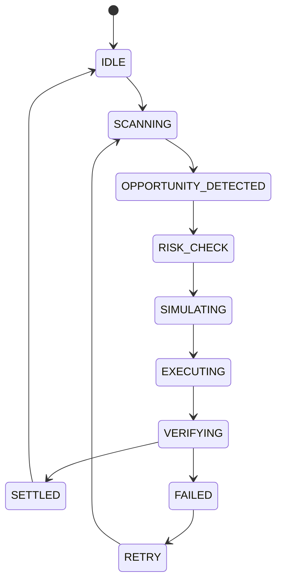

# Trading Lifecycle

## Document type
This document is a reference.

# Trading Lifecycle

## Purpose
Defines the canonical trade state machine.

## State machine

## Allowed transitions
- IDLE -> SCANNING.
- SCANNING -> OPPORTUNITY_DETECTED.
- OPPORTUNITY_DETECTED -> RISK_CHECK.
- RISK_CHECK -> SIMULATING.
- SIMULATING -> EXECUTING.
- EXECUTING -> VERIFYING.
- VERIFYING -> SETTLED or FAILED.
- FAILED -> RETRY.
- RETRY -> SCANNING.

## Forbidden transitions
- EXECUTING -> SETTLED.
- IDLE -> EXECUTING.
- SETTLED -> SCANNING.
- IDLE -> EXECUTING.
- SCANNING -> SETTLED.

## Recovery
- FAILED transitions to RETRY.
- RETRY returns to SCANNING after operator or policy approval.

## Cross-references
- `../runtime/orchestrator.md`
- `./execution-lifecycle.md`
- `./risk-engine.md`
- `./simulation-engine.md`

## Operational Contract
Defines the full trade lifecycle from opportunity to execution, confirmation, reconciliation, and closure.

## Example
Trading pauses if execution confirmation fails.

## Required details
- Define arb scan, match, execute, settle, recover, and expire states.

## Arb flow
- Scan, rank, validate, execute, reconcile, expire, and recover must be explicit states or transitions.

## Lifecycle model
- Initial state: defined by the lifecycle owner.
- Terminal state: defined by the lifecycle owner.
- Allowed transitions: explicitly listed by the lifecycle owner.
- Forbidden transitions: explicitly listed by the lifecycle owner.
- Recovery transitions: explicitly listed by the lifecycle owner.
- Failure transitions: explicitly listed by the lifecycle owner.

## Initial state
- IDLE.

## Terminal state
- SETTLED.

## Recovery transitions
- FAILED -> RETRY.
- RETRY -> SCANNING.

## Failure transitions
- VERIFYING -> FAILED.
- EXECUTING -> FAILED.
- SIMULATING -> FAILED.
