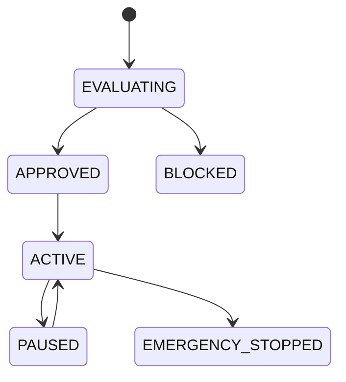

# Execution Policies

## Document type
This document is an overview, reference, or index as noted below.

# Execution Policies

## Purpose
Defines the policy layer for gas, exposure, trading windows, profit thresholds, retry policy, emergency stop, and pause policy.

## State machine

## Failure modes
Threshold breach, policy conflict, emergency stop, invalid pause state.

## Recovery
Stop execution, notify operators, and require approval to resume.

## Cross-references
- `../risk-policy/risk-engine.md`
- `../risk-policy/policy-engine.md`
- `../trading/trading-lifecycle.md`
- `./execution-lifecycle.md`

## Governance Rules
Defines execution permissions, sequencing, retries, stop conditions, and exception handling.

## Example
A policy prevents execution when risk checks fail.

## Required details
- Define risk, slippage, timing, and proxy-related policy limits.
