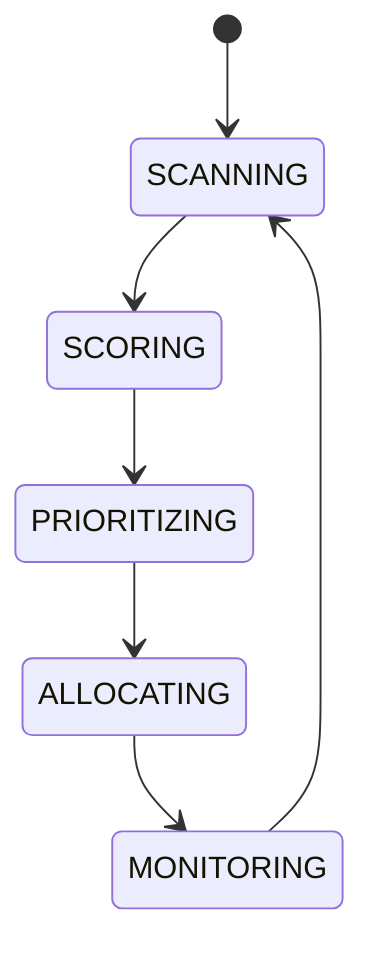

# Chain Rotation

## Document type
This document is an overview, reference, or index as noted below.

# Chain Rotation

## Purpose
Defines how configured chains are scored, prioritized, and allocated scanning capacity.

## State machine

## Scoring
Factors include gas price, latency, opportunity density, and historical reliability with configurable weights.

## Configuration
- CHAIN_WEIGHTS.
- MIN_GAS_LIMIT.
- ALLOCATION_QUANTUM.

## Failure modes
If a chain is unreachable, demote it and fallback to the next best chain.

## Cross-references
- `./chain-registry.md`
- `../../runtime/orchestrator.md`
- `../../operations/monitoring/health-checks.md`

## Operational Contract
Defines the responsibilities, invariants, and expected behavior for this component.

## Example
An input is validated before any state-changing action.
