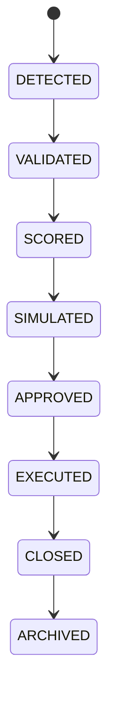

# Opportunity Lifecycle

## Document type
This document is an overview, reference, or index as noted below.

# Opportunity Lifecycle

## Purpose
Defines the lifecycle from detection to archival.

## State machine

## Cross-references
- `./opportunity-detection.md`
- `./opportunity-ranking.md`
- `../../execution/trading/trading-lifecycle.md`

## Operational Contract
Defines the lifecycle from discovery through validation, scoring, simulation, approval, execution, closure, and archive.

## Example
An opportunity moves to approval only after scoring and simulation pass configured thresholds.

## Lifecycle model
- Initial state: defined by the lifecycle owner.
- Terminal state: defined by the lifecycle owner.
- Allowed transitions: explicitly listed by the lifecycle owner.
- Forbidden transitions: explicitly listed by the lifecycle owner.
- Recovery transitions: explicitly listed by the lifecycle owner.
- Failure transitions: explicitly listed by the lifecycle owner.
