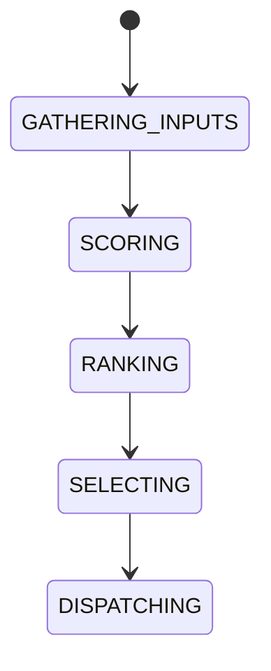

# Route Scoring Model

## Document type
This document is an overview, reference, or index as noted below.

# Route Scoring Model

## Purpose
Defines the mathematical scoring model used for route selection.

## Score factors
Profit, confidence, historical success, gas, liquidity, latency, complexity.

## State machine

## Failure modes
Invalid inputs, unstable ranking, stale market data.

## Recovery
Recompute score, refresh data, or fall back to next-best route.

## Cross-references
- `./route-optimization.md`
- `../execution/simulation-engine.md`
- `../execution/risk-engine.md`

## Operational Contract
Defines route features, weights, score calculation, and selection criteria.

## Example
A route with stronger liquidity and lower cost ranks higher.

## Required details
- Define scoring formula, weights, calibration, and drift checks.

## Scoring model
- Define the scoring formula, weights, and normalization inputs.
- Define calibration, regression, and drift detection.
