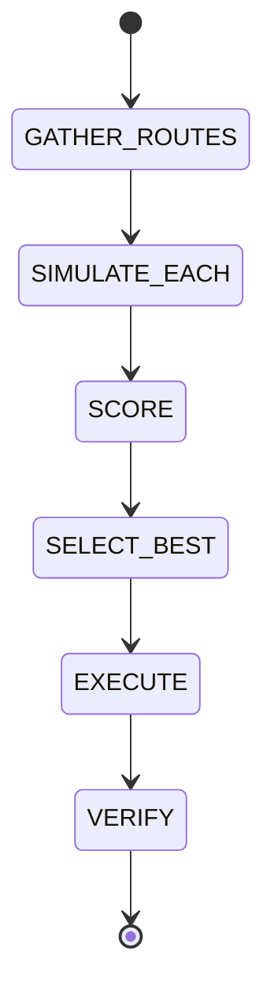

# Route Optimization

## Document type
This document is an overview, reference, or index as noted below.

# Route Optimization

## Purpose
Defines route gathering, simulation, scoring, selection, execution, and verification.

## State machine

## Scoring
Multi-objective scoring uses profit, gas, slippage, historical success, confidence, and complexity with configurable weights.

## Configuration
- ROUTE_SCORE_WEIGHTS.
- MAX_ROUTES_TO_EVALUATE.
- MIN_PROFIT_THRESHOLD.

## Failure modes
If the best route fails simulation, fallback to the second best and log the failure.

## Cross-references
- `../../execution/simulation/simulation-engine.md`
- `../../execution/transactions/execution-lifecycle.md`
- `../../execution/trading/trading-lifecycle.md`

## Operational Contract
Defines optimization objectives, constraints, scoring, and route comparison logic.

## Example
The optimizer prefers the route with the best net expected return.

## Required details
- Define scoring, validation, replay, and batch optimization behavior.

## Optimization rules
- Define route scoring inputs, validation, replay, and batch optimization behavior.
- Define stale market data handling and route rejection rules.
