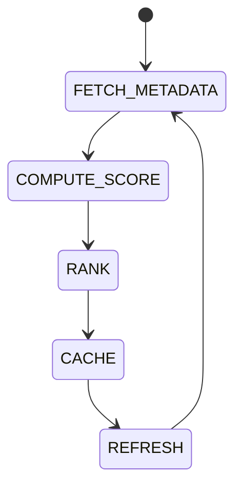

# Token Intelligence

## Document type
This document is an overview, reference, or index as noted below.

# Token Intelligence

## Purpose
Defines token metadata ingestion, scoring, ranking, caching, and refresh behavior.

## State machine

## Scoring
Combines liquidity, volatility, historical spread, protocol coverage, and DEX availability using configurable weights.

## Configuration
- SCORE_WEIGHTS.
- MIN_SCORE.
- REFRESH_INTERVAL.

## Failure modes
If metadata source fails, use cached values and log a warning.

## Cross-references
- `./market-data.md`
- `./chain-intelligence.md`
- `../interfaces/domain-model.md`

## Operational Contract
Defines token enrichment, scoring inputs, validation, metadata aggregation, and downstream usage.

## Example
An enriched token record includes symbol, chain, liquidity, risk, and discovery source.
