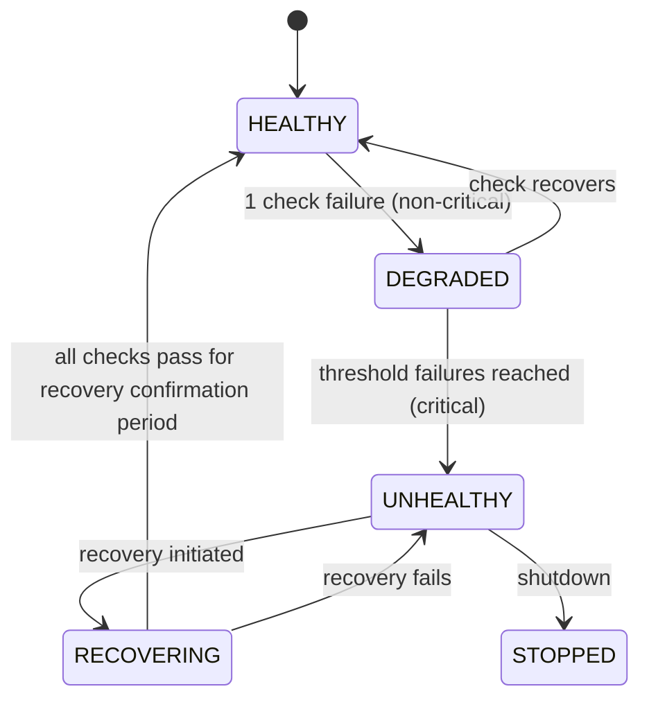

# Health Checks

## Document type
Document type: [CONTRACT]

## Version
**Version:** 1.1.0 | **Status:** Canonical | **Last Updated:** 2026-07-27 | **Owner:** Runtime Team

## Purpose
Defines concrete health probe definitions — check name, target, method, cadence, threshold, timeout, failure timing, and fail-closed behavior for every subsystem.

---

## 1. Health Check Definitions

### 1.1 Critical Subsystem Checks (Block Trading on Failure)

| Check ID | Target | Method | Cadence | Timeout | Failure Threshold | Fail-Closed Action | Recovery Check |
|----------|--------|--------|---------|---------|-------------------|--------------------|----------------|
| **HC-001** | RPC connectivity (each chain) | `eth_blockNumber` RPC call to primary endpoint | 5s (`runtime.health_check_interval_ms`) | 3s (`runtime.health_check_timeout_ms`) | 3 consecutive failures | Block trading on affected chain; switch to fallback RPC | RPC responds within timeout for 2 consecutive checks |
| **HC-002** | Wallet readiness | Check wallet key available in OS keychain; verify `eth_getBalance` > 0 for gas | 10s | 3s | Key missing or balance = 0 | Block all trading for wallet | Key present + balance > minimum gas reserve |
| **HC-003** | Database connectivity | `SELECT 1` query on SQLite/Postgres | 5s | 3s | 2 consecutive failures | Pause persistence-dependent operations; buffer in-memory | Query returns within timeout for 3 consecutive checks |
| **HC-004** | Event Bus operational | Publish + consume test event (`health.test`) | 5s | 2s | 2 consecutive failures | Block all event-dependent operations | Test event round-trip < 5ms for 3 consecutive checks |
| **HC-005** | Risk Engine ready | Verify risk policy loaded; check circuit breaker state not tripped | 10s | 3s | Policy not loaded or circuit breaker tripped | Block trading (risk is mandatory gate) | Policy loaded + circuit breaker reset for 2 consecutive checks |

### 1.2 High-Priority Checks (Degrade but Don't Block Trading)

| Check ID | Target | Method | Cadence | Timeout | Failure Threshold | Degraded Action | Recovery Check |
|----------|--------|--------|---------|---------|-------------------|-----------------|----------------|
| **HC-006** | AI provider connectivity | Ping primary provider with minimal request (`{model, latency_ms}`) | 30s | `ai.providers.timeout_ms` (30s) | Provider down for 2 consecutive checks | Degrade AI advisory; fall back to risk-only decisions | Provider responds within timeout for 2 consecutive checks |
| **HC-007** | Market Data feed freshness | Check last price update timestamp for each tracked pair | 5s | 1s | No update for `risk.price_freshness_ms` (5s) per pair | Mark pair as stale; skip opportunities for stale pairs | Price update received within freshness window |
| **HC-008** | Plugin sandbox health | Check plugin process alive; verify IPC channel responsive | 10s | 2s | Process exited or IPC timeout for any plugin | Disable specific plugin; notify operator | Plugin process alive + IPC responsive for 2 consecutive checks |
| **HC-009** | Configuration valid | Verify config schema passes; check last reload timestamp | 60s | 1s | Schema validation failure | Keep previous config; reject hot-reload changes | Schema valid for 2 consecutive checks |

### 1.3 Low-Priority Checks (Informational Only)

| Check ID | Target | Method | Cadence | Timeout | Failure Threshold | Action |
|----------|--------|--------|---------|---------|-------------------|--------|
| **HC-010** | Dashboard IPC bridge | Send test IPC message to UI process | 30s | 2s | 3 consecutive failures | Log warning; UI may show stale data | IPC round-trip successful |
| **HC-011** | Disk space available | Check available disk space at data directory | 60s | 1s | < 500 MB available | Log warning; alert operator at < 200 MB | > 500 MB available |
| **HC-012** | Memory usage | Read process RSS from OS | 5s | 1s | RSS > 80% of `resource.memory_limit_mb` | Log warning; force GC at 90%; Safe mode at 100% | RSS < 70% of limit |
| **HC-013** | CPU usage | Read process CPU % from OS | 5s | 1s | CPU > 80% for 60s | Log warning; throttle at 90% | CPU < 70% for 30s |
| **HC-014** | Windows Event Log integration | Verify app can write to Windows Event Log (service mode) | 60s | 2s | Write failure | Log warning; continue without Event Log | Write succeeds |

---

## 2. Health State Machine

Each subsystem tracks its own health state:



| Health State | Description | Trading Allowed | Auto-Recovery | Operator Alert |
|-------------|-------------|----------------|---------------|----------------|
| **HEALTHY** | All checks passing | Yes | None needed | None |
| **DEGRADED** | 1+ non-critical checks failing | Yes (with limitations) | Automatic for non-critical subsystems | Dashboard notification |
| **UNHEALTHY** | Critical check(s) failing | No (trading blocked) | Automatic attempts per playbook | All channels (Critical) |
| **RECOVERING** | Recovery in progress | No (until HEALTHY) | Coordinated recovery per RECOVERY-COORDINATION.md | Dashboard progress updates |
| **STOPPED** | Subsystem shut down | No | None (terminal) | None |

---

## 3. Health Check Events

Every health state transition emits an event:

| Event | Trigger | Payload | Delivery | Priority |
|-------|---------|---------|----------|----------|
| `runtime.health.failed` | Subsystem transitions to UNHEALTHY | `{subsystem, check_id, failures, threshold, timestamp}` | At-least-once | Critical |
| `runtime.health.restored` | Subsystem transitions back to HEALTHY | `{subsystem, check_id, recovery_duration_ms, timestamp}` | At-least-once | High |
| `runtime.health.degraded` | Subsystem transitions to DEGRADED | `{subsystem, check_id, failures, timestamp}` | At-least-once | Medium |
| `system.warning` | Low-priority check failure | `{check_id, subsystem, value, threshold}` | At-least-once | Low |

---

## 4. Aggregate Health Score

The Runtime Orchestrator computes an aggregate health score every `runtime.health_check_interval_ms`:

```
health_score = Σ (weight_i × status_i) / Σ weight_i

status_i = 1.0 if HEALTHY
status_i = 0.5 if DEGRADED
status_i = 0.0 if UNHEALTHY or STOPPED

weights: HC-001..005 = 2.0 (critical), HC-006..009 = 1.0 (high), HC-010..014 = 0.5 (low)
```

| Health Score | Platform Mode | Trading |
|-------------|---------------|---------|
| ≥ 0.9 | Active | Enabled |
| 0.7–0.9 | Degraded | Enabled (with limitations) |
| 0.5–0.7 | Degraded | Throttled |
| < 0.5 | Recovery | Paused |
| < 0.3 | Safe | Disabled |

---

## 5. Windows-Specific Checks

| Check ID | Target | Method | Failure Action |
|----------|--------|--------|----------------|
| **HC-W001** | Windows service status | Query SCM for service state | Log and notify if unexpected |
| **HC-W002** | Battery level | `GetSystemPowerStatus` API | Throttle at < 20%; shutdown at < 5% |
| **HC-W003** | Network proxy configured | Check system proxy settings | Re-verify connections on proxy change |
| **HC-W004** | Firewall rules | Verify app firewall rules present | Re-register if missing |
| **HC-W005** | Windows Defender exclusion | Verify app excluded from Defender scan | Re-register if missing (admin required) |
| **HC-W006** | Sleep/resume readiness | Verify checkpoint marker exists from last session | Trigger recovery scan on resume |

---

## Cross-References

- **RUNTIME-OPERATIONS.md** — Startup/shutdown/recovery sequencing.
- **RECOVERY-AND-FAILOVER.md** — Recovery orchestration.
- **RECOVERY-COORDINATION.md** — Multi-failure recovery coordination.
- **MONITORING-OBSERVABILITY.md** — Metric collection and alerting.
- **ENGINE-STATE-MACHINE.md** — Engine health-driven state transitions.
- **TRACEABILITY-MATRIX.md** — REQ-RUNTIME-002.
- **CONFIGURATION-REFERENCE.md** — `runtime.health_check_*` config keys.

---

## Version History

| Version | Date | Changes | Author |
|---------|------|---------|--------|
| 1.1.0 | 2026-07-27 | Full 14+ health check definitions with cadence, thresholds, health state machine, aggregate score, Windows checks | Runtime Team |
| 1.0.0 | 2025-01-15 | Initial stub (7 lines) | Runtime Team |
