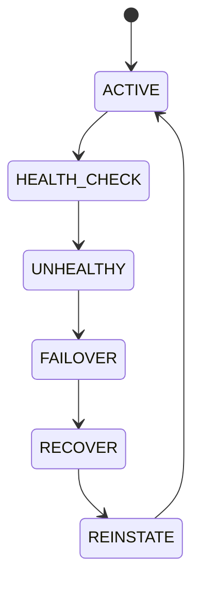

# Provider Resilience

## Document type
This document is an overview, reference, or index as noted below.

# Provider Resilience

## Purpose
Defines provider health checking, failover, capability detection, latency monitoring, and reinstatement.

## State machine

## Content
Primary and secondary provider lists are explicitly configured. Health probes run at a fixed interval and compare latency, capability, and availability.

## Configuration
- PRIMARY_PROVIDER.
- SECONDARY_PROVIDERS.
- HEALTH_CHECK_INTERVAL.
- FAILOVER_THRESHOLD.
- FAILBACK_POLICY.

## Failure modes
If all providers fail, enter degraded mode and alert operations.

## Cross-references
- `../ai/ai-provider-manager.md`
- `../ai/ai-gateway.md`
- `./healthchecks.md`
- `../performance/performance-slos.md`

## Operational Contract
Defines provider failover, redundancy, circuit breaking, and recovery behavior.

## Example
A backup provider takes over after repeated timeout errors.

## Required details
- Define provider health, latency, weighting, and circuit breaker behavior.

## Provider rules
- Define health scoring, latency weighting, circuit breakers, and fallback order.
- Define recovery timing after provider failure.
