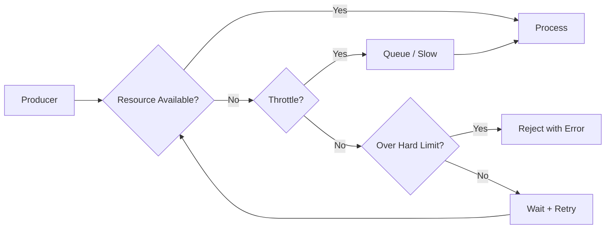

# Resource Budget Specification

## Document type
Document type: [REFERENCE]

## Version
**Version:** 0.2.0 | **Status:** Draft | **Last Updated:** 2026-07-27 | **Owner:** Ops Team

## Purpose
Defines RAM, CPU, GPU, thread, queue, cache, network, and storage budgets per subsystem — with enforcement thresholds, backpressure behavior, and observability.

---

## 1. System-Wide Budgets

| Resource | Total Budget | Unit | Config Key |
|----------|-------------|------|------------|
| RAM (process RSS) | 1024 | MB | `resource.memory_limit_mb` |
| CPU | 80 | % of one core | `resource.cpu_budget_percent` |
| GPU (optional) | 4096 | MB VRAM | — |
| Open file descriptors | 1024 | count | — |
| Network connections | 50 | concurrent | `resource.network.max_connections` |
| Disk cache | 500 | MB | `resource.disk_cache_max_mb` |

---

## 2. Per-Subsystem Budgets

| Subsystem | RAM (MB) | CPU (%) | Threads | Priority | Notes |
|-----------|----------|---------|---------|----------|-------|
| Runtime Orchestrator | 64 | 5 | 4 | Critical | Fixed allocation |
| Event Bus | 128 | 10 | 2 | Critical | Ring buffer pre-allocated |
| Trading Engine | 128 | 15 | 6 | High | Dynamic state |
| Execution Engine | 64 | 10 | 4 | High | Transaction tracking |
| Risk Engine | 32 | 5 | 2 | Critical | Real-time checks |
| Market Data | 128 | 15 | 6 | High | Price feed processing |
| AI Pipeline | 256 | 20 | 8 | High | Model inference, prompt processing |
| AI Memory | 64 | 2 | 1 | Medium | Store + retrieval |
| Dashboard/UI | 128 | 5 | 2 | Medium | Rendering + IPC |
| Plugin Per Sandbox | 64 | 10 | 2 | Low | Configurable via `plugin.sandbox.*` |
| Logging | 32 | 2 | 1 | Low | Async I/O |
| Database | 64 | 5 | 2 | High | Connection pool |
| Config Manager | 16 | 1 | 1 | Medium | Cache + validation |

---

## 3. Enforcement Thresholds

| Threshold | RAM | CPU | Action |
|-----------|-----|-----|--------|
| Warning | 80% of budget | 80% of budget | Log warning, emit `system.warning` event |
| Throttle | 90% of budget | 90% of budget | Apply backpressure; queue new submissions; emit `system.warning` (escalated) |
| Hard limit | 100% of budget | 100% of budget | Reject new work; circuit-breaker trips; emit `system.error` event |
| Recovery | Below 70% for 30s | Below 70% for 30s | Resume normal operation; clear circuit breaker |

### Enforcement by Subsystem

| Subsystem | Warning | Throttle | Hard Limit | Recovery |
|-----------|---------|----------|------------|----------|
| Worker Pool | 80% queue depth | 90% queue depth | 100% queue depth → backpressure on submit | Queue < 50% |
| AI Pipeline | 80% of token budget | 90% → compress aggressively | 100% → abort request | Next request |
| Plugin Sandbox | 80% of mem limit | 90% → pause plugin | 100% → kill plugin | Restart with reduced limit |
| Event Bus | 80% queue depth | 90% → slow producers | 100% → drop lowest priority events | Queue < 50% |

---

## 4. Backpressure Model

### Backpressure Strategies by Subsystem

| Subsystem | Strategy | Behavior |
|-----------|----------|----------|
| Worker Pool | Blocking submit | Submit blocks until queue < 80% capacity |
| AI Pipeline | Request queuing | New requests queued; oldest requests cancelled under pressure |
| Event Bus | Priority drop | Lowest-priority events dropped first |
| Network I/O | Connection pool wait | Request blocks until a connection is available |
| Plugin Sandbox | Pause + resume | Plugin execution paused; resumed when budget available |

---

## 5. Cache Budgets

| Cache | Max Size | Eviction Strategy | Config Key |
|-------|----------|-------------------|------------|
| Registry cache | 64 MB | TTL (300s) | — |
| AI memory store | 64 MB | LRU + score | `ai.memory.max_entries` |
| Price feed cache | 128 MB | TTL (10s) | — |
| Workspace state | 32 MB | LRU (saved to disk) | — |
| Asset icons / metadata | 16 MB | LRU | — |

---

## 6. Monitoring & Alerting

| Metric | Collection | Alert Threshold |
|--------|------------|-----------------|
| `process.rss_bytes` | `/proc/self/status` | > 80% of `resource.memory_limit_mb` |
| `process.cpu_percent` | `/proc/self/stat` | > 80% of `resource.cpu_budget_percent` for 60s |
| `subsystem.<name>.rss_bytes` | Built-in tracker | Per-subsystem budget warning |
| `subsystem.<name>.cpu_percent` | Built-in tracker | Per-subsystem budget warning |
| `event_bus.queue_depth` | Event bus metrics | > 80% of `event.max_queue_size` |
| `worker_pool.active_threads` | Pool metrics | > `runtime.worker.max_workers` × 0.9 |
| `plugin.<name>.rss_bytes` | Plugin monitor | > `plugin.sandbox.memory_limit_mb` × 0.9 |

---

## Cross-References

- **CAPACITY-PLANNING.md** — Maximum supported throughput and sizing.
- **TRACEABILITY-MATRIX.md** — Requirement-to-document mapping and governance validation.
- **MEMORY-LIFECYCLE.md** — Memory allocation and eviction policies.
- **CONFIGURATION-REFERENCE.md** — Resource config keys (`resource.*`, `plugin.sandbox.*`).
- **MONITORING-OBSERVABILITY.md** — Metric collection and alerting.
- **PERFORMANCE-TARGETS.md** — Performance SLOs.
- **WORKER-POOL.md** — Worker pool resource management.

---

## Version History

| Version | Date | Changes | Author |
|---------|------|---------|--------|
| 0.2.0 | 2026-07-27 | Complete budget specification with subsystem budgets, enforcement, backpressure, monitoring | Ops Team |
| 0.1.0 | 2026-07-27 | Initial stub | Ops Team |
