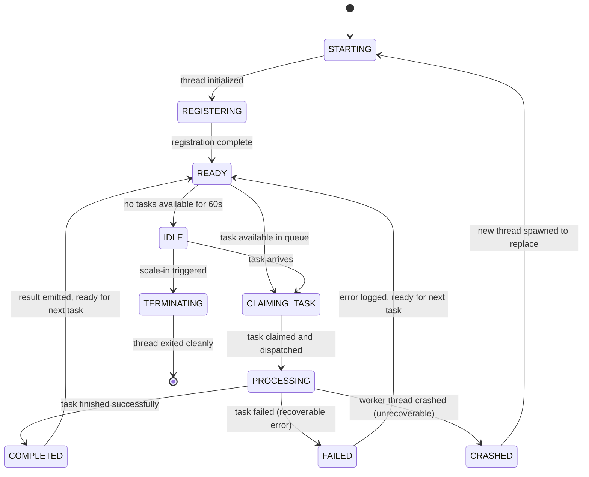

# Worker Pool

## Document type
Document type: [CONTRACT]

## Version
**Version:** 1.0.0 | **Status:** Canonical | **Last Updated:** 2026-07-29 | **Owner:** Runtime Team

## Purpose
Defines formal worker capacity, lifecycle, queue priority, scheduling behavior, scaling policy, dynamic strategy weighting, crash recovery, and cross-subsystem integration contracts.

---

## 1. Worker Lifecycle State Machine



### Lifecycle Hooks

| Hook | Purpose | Timeout | Failure Action |
|------|---------|---------|----------------|
| `onStarting()` | Initialize thread context, allocate stack | 1000ms | Abort thread creation |
| `onRegistering()` | Register with worker pool manager | 500ms | Abort thread creation |
| `onClaim(task)` | Claim task from priority queue | 100ms | Release claim, requeue task |
| `onProcess(task)` | Execute task logic | Per task type (see §3) | Emit FAILED or CRASHED |
| `onComplete(result)` | Emit result to caller | 200ms | Log result, discard if timeout |
| `onFailed(error)` | Log error, emit failure event | 200ms | Log error |
| `onIdle()` | Enter idle state, release resources | 100ms | — |
| `onTerminate()` | Clean up thread resources | 500ms | Force termination |

---

## 2. Priority Queues

### 2.1 Queue Definition

| Priority | Name | Task Types | Max Queue Size | Overflow Policy | Scheduling Policy |
|----------|------|-----------|---------------|----------------|-------------------|
| **P0 Critical** | execution | TX submission, confirmation, nonce replacement | 50 | Reject (caller gets BUSY) | FIFO + preemption for higher-priority |
| **P1 High** | trading | Opportunity scoring, risk check, route selection | 100 | Queue (wait for slot) | FIFO |
| **P2 Medium** | simulation | Backtesting, strategy simulation, risk simulation | 200 | Queue (wait for slot) | FIFO |
| **P3 Low** | learning | Strategy weight update, pattern analysis, metrics aggregation | 200 | Drop oldest | FIFO |

### 2.2 Queue Scheduling Algorithm

```
1. Worker wakes from READY → scans queues from P0 to P3.
2. First non-empty queue found → claim task from that queue.
3. If multiple tasks in same priority queue → FIFO (earliest first).
4. P0 tasks can preempt P2/P3 tasks (P2/P3 task is paused, returned to queue).
5. Preemption budget: max 5 preemptions per 60s (prevents thrashing).
6. Preempted task resumes at head of its priority queue.
```

### 2.3 Dynamic Strategy Weighting

```
strategy_weight = (recent_performance × KP) + (opportunity_density × KD)

where:
  recent_performance = success_rate × avg_profit_usd / avg_loss_usd
  opportunity_density = opportunities_per_hour × spread_avg_bps
  KP = runtime.worker.strategy_performance_weight (default 0.6)
  KD = runtime.worker.strategy_density_weight (default 0.4)

constraints:
  If success_rate < MIN_SUCCESS_RATE (default 0.3) → weight = 0 (strategy paused).
  Weight range: [0, 1], normalized across all active strategies.
  Weight used to prioritize tasks from higher-weighted strategies within same priority queue.
```

---

## 3. Task Processing Budgets

| Task Type | Priority | Expected Duration | Max Duration | Timeout Action | Retryable |
|-----------|----------|-------------------|-------------|----------------|-----------|
| **TX submission** | P0 | 2000ms | 10000ms | Mark FAILED, requeue | Yes (1 retry) |
| **TX confirmation** | P0 | 30000ms | 60000ms | Mark STUCK, emit event | Yes (nonce replacement) |
| **Nonce replacement** | P0 | 5000ms | 15000ms | Mark FAILED, escalate to operator | Yes (1 retry) |
| **Risk check** | P1 | 100ms | 500ms | Mark FAILED, reject trade | No (reject) |
| **Opportunity scoring** | P1 | 50ms | 200ms | Mark FAILED, skip opportunity | No (skip) |
| **Route selection** | P1 | 500ms | 2000ms | Mark FAILED, use default route | Yes (1 retry) |
| **Backtesting** | P2 | 5000ms | 30000ms | Mark FAILED, log warning | Yes (1 retry) |
| **Strategy simulation** | P2 | 1000ms | 5000ms | Mark FAILED, skip simulation | No (skip) |
| **Weight update** | P3 | 100ms | 500ms | Mark FAILED, skip update | No (skip) |
| **Pattern analysis** | P3 | 2000ms | 10000ms | Mark FAILED, skip analysis | No (skip) |
| **Metrics aggregation** | P3 | 500ms | 2000ms | Mark FAILED, defer to next cycle | No (defer) |

---

## 4. Scaling Policy

### 4.1 Scale-Out Rules

| Trigger | Condition | Action | Config Key |
|---------|-----------|--------|------------|
| **Queue backlog** | Any queue depth > `QUEUE_BACKLOG_THRESHOLD` (default 100) for 5s | Add 2 workers | `runtime.worker.queue_backlog_threshold` |
| **CPU utilization** | Worker Pool CPU > 70% for 10s | Add 1 worker | `runtime.worker.cpu_scale_threshold_pct` |
| **P0 queue depth** | P0 queue depth > 10 | Add 1 worker immediately (no cooldown) | `runtime.worker.p0_scale_threshold` |

### 4.2 Scale-In Rules

| Trigger | Condition | Action | Config Key |
|---------|-----------|--------|------------|
| **Idle workers** | More than 50% workers idle for 60s | Remove 1 worker | `runtime.worker.idle_scale_threshold_pct` |
| **Low CPU** | Worker Pool CPU < 20% for 120s | Remove 1 worker | `runtime.worker.cpu_scalein_threshold_pct` |
| **Min workers** | Workers at MIN_WORKERS → no scale-in | Maintain minimum | `runtime.worker.min_workers` |

### 4.3 Scaling Constraints

- **Min workers**: `runtime.worker.min_workers` (default 2)
- **Max workers**: `runtime.worker.max_workers` (default 20)
- **Scale cooldown**: `runtime.worker.scale_cooldown_ms` (default 30000ms) between scale operations
- **Scale rate**: Max 2 workers added per cooldown period; max 1 removed per cooldown period
- **P0 exception**: P0 scale-out bypasses cooldown (immediate)

---

## 5. Crash Recovery

### 5.1 Worker Crash Protocol

```
1. Worker thread crashes (CRASHED state).
2. Pool manager detects crash via missing heartbeat (every 5s).
3. Crash handling:
   a. Mark crashed worker's task as FAILED (requeue if retryable).
   b. Emit runtime.worker.crashed event.
   c. Spawn replacement thread (STARTING → REGISTERING → READY).
   d. Replacement completes within 2000ms.
   e. If replacement also crashes within 10s → escalate:
      - Emit system.error (severity HIGH).
      - Reduce pool max by 1 (permanent until manual reset).
      - If pool at min_workers → emit system.critical event.
```

---

## 6. Cross-Subsystem Integration

### 6.1 Who Calls Worker Pool

| Caller | Purpose | Contract |
|--------|---------|----------|
| Trading Engine | Submit execution/trading tasks | `runtime.worker.submit` API |
| AI Pipeline | Submit AI processing tasks | `runtime.ai.submit` → Worker for local inference |
| Risk Engine | Submit risk check tasks | `runtime.worker.submit` API |
| Simulation Engine | Submit backtest tasks | `runtime.worker.submit` API |
| Runtime Orchestrator | Resize pool | `runtime.worker.resize` API |
| Task Scheduler | Submit scheduled tasks | `runtime.worker.submit` API |

### 6.2 Events Worker Pool Emits

| Event | Payload | Consumer |
|-------|---------|----------|
| `runtime.worker.scaled` | `{pool_name, old_size, new_size, trigger, direction}` | Dashboard, Health |
| `runtime.worker.crashed` | `{worker_id, task_id, last_error, replacement_started}` | Health, Dashboard |
| `runtime.worker.task.completed` | `{task_id, task_type, duration_ms, result}` | Task caller |
| `runtime.worker.task.failed` | `{task_id, task_type, error, retryable, retry_count}` | Task caller, Health |
| `runtime.worker.queue.backlog` | `{priority, depth, max_depth, action}` | Dashboard, Health |

### 6.3 Configuration Worker Pool Owns

| Config Key | Default | Description |
|-----------|---------|-------------|
| `runtime.worker.min_workers` | `2` | Minimum worker threads |
| `runtime.worker.max_workers` | `20` | Maximum worker threads |
| `runtime.worker.queue_backlog_threshold` | `100` | Scale-out trigger queue depth |
| `runtime.worker.scale_cooldown_ms` | `30000` | Cooldown between scale operations |
| `runtime.worker.strategy_performance_weight` | `0.6` | KP for strategy weighting |
| `runtime.worker.strategy_density_weight` | `0.4` | KD for strategy weighting |
| `runtime.worker.min_success_rate` | `0.3` | Strategy pause threshold |
| `runtime.worker.p0_scale_threshold` | `10` | P0 immediate scale trigger |

---

## Cross-References

- **THREADING-MODEL.md** — Thread architecture, ownership, priority inversion.
- **CONCURRENCY-MODEL.md** — Locks, queues, cancellation.
- **TASK-SCHEDULER.md** — Task scheduling and cron jobs.
- **ORCHESTRATOR.md** — Platform-level orchestration.
- **PERFORMANCE-SLOS.md** — Worker performance SLOs.
- **WORKER-STATE-MACHINE.md** — Worker state machine contract.
- **WORKER-ARCHITECTURE.md** — Worker architecture overview.
- **RESOURCE-BUDGET-SPECIFICATION.md** — Worker resource budgets.
- **CONFIGURATION-REFERENCE.md** — Worker config keys.
- **END-TO-END-WIRING-CONTRACT.md** — Cross-subsystem wiring.
- **TRACEABILITY-MATRIX.md** — REQ-RUNTIME-004, REQ-RESOURCE-002.

---

## Version History

| Version | Date | Changes | Author |
|---------|------|---------|--------|
| 1.0.0 | 2026-07-29 | Added formal Document type declaration, Version block, and Version History to satisfy [CONTRACT] compliance (`architecture-tests/validate_contracts.py`). Content (lifecycle state machine, priority queues, scaling policy, crash recovery, cross-subsystem integration) unchanged from initial authoring. | Runtime Team |

---
