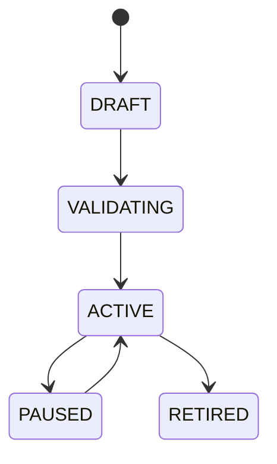

# Workflow Builder

## Document type
This document is an overview, reference, or index as noted below.

# Workflow Builder

## Purpose
Defines user-authored automation workflows that connect events, gates, actions, and notifications.

## State machine

## Contract
Workflows are event-driven and policy-checked before activation.

## Failure modes
Invalid graph, policy violation, missing action handler, loop detection.

## Recovery
Pause workflow, require correction, or route to fallback manual operation.

## Cross-references
- `../interfaces/event-bus.md`
- `../execution/policy-engine.md`
- `./orchestrator.md`
- `../dashboard/ui-dashboard-spec.md`

## Operational Contract
Defines the responsibilities, invariants, and expected behavior for this component.

## Example
An input is validated before any state-changing action.
