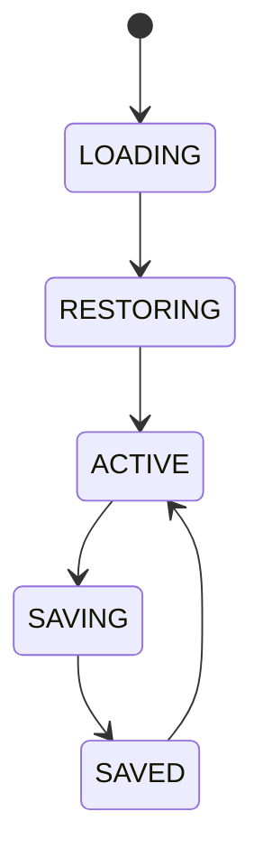

# Workspace Manager

## Document type
[REFERENCE]. This document is a short reference pointer. It is not a
[CONTRACT] and must not be treated as one — the front-matter `type` was
previously set to `CONTRACT` while the body explicitly stated "This
document is an overview, reference, or index", which is a direct
Prime-Directive violation (short docs must declare their type
consistently). The authoritative Workspace Manager service CONTRACT —
state machine, schema, API, events, configuration ownership, and
cross-subsystem wiring — is owned exclusively by
**`../dashboard/dashboard-workspaces.md`**. This file exists only as a stable,
short-form entry point referenced elsewhere in the documentation set
(see `../../repository-operating-model/documentation-lifecycle/documentation-map.md`, `../../../README.md`).

## Purpose
Defines workspace ownership, layout, settings, providers, dashboards, strategies, and wallets for each workspace.

## State machine

## Cross-references
- `../dashboard/dashboard-workspaces.md`
- `../windows/windows-desktop.md`
- `../configuration/configuration-profiles.md`

## Operational Contract
Defines workspace composition, layout, settings, dashboard bindings, provider selection, and recovery state.

## Example
A simulation workspace restores its selected chain, wallet, and layout on reopen.
