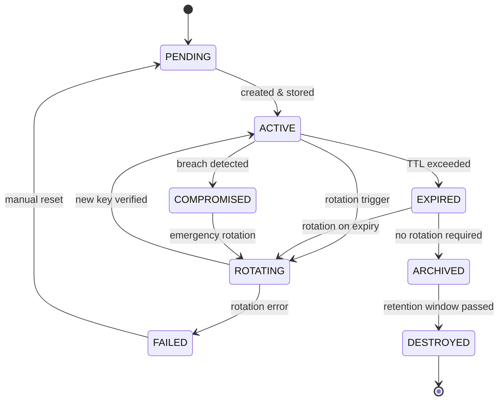

# Secret Lifecycle

## Document type
Document type: [REFERENCE]

## Version
**Version:** 0.2.0 | **Status:** Draft | **Last Updated:** 2026-07-27 | **Owner:** Security Team

## Purpose
Defines the complete lifecycle of secrets — creation, storage, rotation, expiration, destruction, backup, and audit — for API keys, wallet private keys, provider credentials, and other sensitive material.

---

## 1. Secret Classification

| Class | Examples | Storage Backend | Encryption at Rest | Rotation Required |
|-------|----------|-----------------|-------------------|-------------------|
| **Critical** | Wallet private keys, master encryption key | OS keychain / HSM | AES-256-GCM | Yes (every 90 days) |
| **High** | API keys (exchange, RPC, AI providers) | Encrypted file + OS keychain | AES-256-GCM | Yes (every 90 days) |
| **Medium** | Database passwords, service tokens | Encrypted config file | AES-256-CBC | Yes (every 180 days) |
| **Low** | Public API tokens, rate limit keys | Config file (plaintext allowed) | None | No |

---

## 2. Secret Lifecycle State Machine

---

## 3. Secret Creation

| Step | Action | Validation |
|------|--------|------------|
| 1 | Generate secret (cryptographically random, min `security.secret.min_length`: 16) | Passes entropy test |
| 2 | Encrypt with master key | AES-256-GCM for Critical/High, AES-256-CBC for Medium |
| 3 | Store in configured backend (`security.secret.storage_backend`) | Write verification |
| 4 | Record creation in audit log | Entry includes: secret ID, classification, creation time, owner |
| 5 | Return reference handle (not the secret value) to caller | Handle is a UUID mapping to the stored entry |

### Secret Generation Rules

- All secrets must use a CSPRNG (cryptographically secure pseudo-random number generator).
- Default minimum length: 16 characters (configurable via `security.secret.min_length`).
- Wallet private keys must be generated by the wallet's HD key derivation path, never by the application.
- Provider API keys are never generated by the application — they are user-supplied at configuration time.

---

## 4. Secret Storage

| Backend | Supported | Critical | High | Medium | Low |
|---------|-----------|----------|------|--------|-----|
| OS keychain (Windows Credential Manager, macOS Keychain, Linux libsecret) | Yes | ✓ | ✓ | ✓ | Optional |
| Encrypted file (`security.secret.storage_backend: encrypted_file`) | Yes | Fallback | ✓ | ✓ | ✓ |
| HashiCorp Vault | Yes | ✓ | ✓ | ✓ | ✓ |
| Environment variables | Yes | No | No | Fallback | ✓ |

### In-Memory Rules

- Secrets must not be stored in plaintext on the heap.
- Secrets must use `mlock` / `VirtualLock` to prevent swapping to disk.
- Secrets must be zeroed (`memset_s` / `SecureZeroMemory`) after use.
- Secret fragments in logs are automatically redacted (regex pattern matching).

---

## 5. Secret Rotation

### Scheduled Rotation

| Classification | Interval | Automation |
|----------------|----------|------------|
| Critical | `security.secret.rotation_interval_days`: 90 | Automated, with 7-day warning window |
| High | 90 days | Automated, with 7-day warning window |
| Medium | 180 days | Automated, with 14-day warning window |
| Low | Not rotated | Manual if needed |

### Rotation Process

1. **Warning phase** (7–14 days before expiry): `security.violation` event logged, dashboard notification shown.
2. **Rotation trigger**: New secret generated, encrypted, stored alongside old secret (dual validity window).
3. **Verification**: New secret is tested against its service (e.g., API call with new key returns 200).
4. **Cutover**: The reference handle is updated to point to the new secret; old secret is flagged for archival.
5. **Archival**: Old secret is retained for 30 days (rollback window), then destroyed.

### Emergency Rotation

On compromise detection:
1. Immediate `security.violation` event (Critical severity).
2. New secret generated and deployed within 30 seconds.
3. Old secret immediately invalidated (no dual validity window).
4. All subsystems that use the old secret are notified to refresh their handle.
5. Incident report generated.

---

## 6. Secret Expiration & Destruction

| Phase | Duration | Action |
|-------|----------|--------|
| Active | Varies by classification | Normal operation |
| Dual validity | 24 hours during rotation | Both old and new secrets are valid |
| Archival | 30 days after rotation | Old secret retained for rollback |
| Destruction | After archival period | Secret securely deleted: multiple overwrite passes + truncation |

### Secure Deletion

- **File-based storage**: Overwrite with random data (3 passes), truncate, then delete.
- **OS keychain**: Use platform API's delete function.
- **Memory**: `memset_s` with zeroes + compiler barrier to prevent optimization.
- **Disk (swapped)**: Prevent via `mlock`; if swap is suspected, trigger secure swap scrub on next reboot.

---

## 7. Secret Backup

| Backend | Backup Strategy | Encryption |
|---------|-----------------|------------|
| OS keychain | Platform backup (iCloud, Google Drive, Windows Backup) | Platform-managed |
| Encrypted file | Manual export as `.apex-secrets` archive | Password-protected AES-256-GCM |
| Vault | Vault's built-in DR/replication | Vault-managed |

Backups are encrypted with a user-provided master password (not stored in the system).

---

## 8. Audit & Observability

Every secret lifecycle transition produces an event:

| Event | Trigger | Payload |
|-------|---------|---------|
| `secret.created` | New secret stored | `{secret_id, classification, owner}` |
| `secret.rotated` | Rotation completed | `{secret_id, classification, old_id, new_id}` |
| `secret.expired` | TTL exceeded | `{secret_id, classification}` |
| `secret.destroyed` | Secure deletion | `{secret_id, classification, destruction_method}` |
| `secret.compromised` | Breach detected | `{secret_id, classification, severity}` |
| `secret.backup` | Backup created | `{backup_id, size_bytes, classification_count}` |

All events use `Exactly-once` delivery (see `../interfaces/event-ownership-matrix.md`).

---

## Cross-References

- **SECURITY.md** — Overall security architecture and trust model.
- **TRACEABILITY-MATRIX.md** — Requirement-to-document mapping and governance validation.
- **TRUST-BOUNDARIES.md** — Trust domain enforcement for secret access.
- **EVENT-OWNERSHIP-MATRIX.md** — Secret event ownership.
- **CONFIGURATION-REFERENCE.md** — Secret config keys (`security.secret.*`).
- **WALLET-MANAGEMENT.md** — Wallet key management and derivation.
- **AI-PROVIDER-MANAGER.md** — Provider API key handling.
- **ERROR-CODES.md** — Secret-related error codes.

---

## Version History

| Version | Date | Changes | Author |
|---------|------|---------|--------|
| 0.2.0 | 2026-07-27 | Complete lifecycle with state machine, rotation, expiration, destruction, backup, audit | Security Team |
| 0.1.0 | 2026-07-27 | Initial stub | Security Team |
