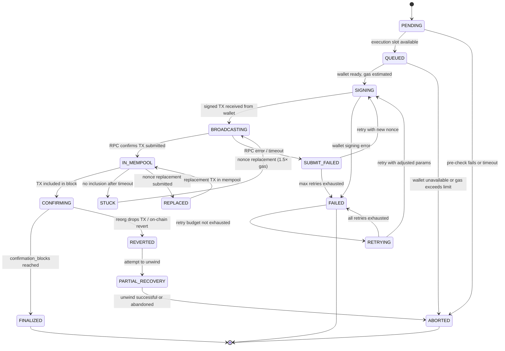

# Execution State Machine

## Document type
Document type: [CONTRACT]

## Version
**Version:** 1.1.0 | **Status:** Canonical | **Last Updated:** 2026-07-27 | **Owner:** Execution Team

## Purpose
Defines the complete execution lifecycle state machine — states, transitions, timeouts, recovery transitions, forbidden transitions, failure transitions, and crash resume behavior for chain transaction execution.

---

## 1. State Machine Definition

---

## 2. State Definitions

| State | Description | Entry Condition | Exit Condition | Timeout | Persistent? |
|-------|-------------|-----------------|----------------|---------|-------------|
| **PENDING** | Execution request received, awaiting slot | Trade leg submission | Slot available or pre-check fails | `execution.pending_timeout_ms` (10s) | Yes |
| **QUEUED** | Waiting for wallet signing slot | Execution slot available | Wallet ready, gas estimated | `execution.queue_timeout_ms` (30s) | Yes |
| **SIGNING** | Wallet is signing the transaction | Wallet accepts signing request | Signed TX returned or signing error | `execution.signing_timeout_ms` (5s) | No (transient) |
| **BROADCASTING** | Signed TX being submitted to RPC | Signed TX available | RPC confirms submission or error | `execution.broadcast_timeout_ms` (10s) | Yes |
| **IN_MEMPOOL** | TX is in mempool, awaiting inclusion | RPC confirms `eth_sendRawTransaction` success | Block includes TX or stuck timeout | `execution.mempool_timeout_ms` (30s) | Yes |
| **STUCK** | TX in mempool but no inclusion after timeout | Mempool timeout exceeded | Nonce replacement submitted | `execution.stuck_grace_ms` (60s) | Yes |
| **REPLACED** | Nonce replacement TX submitted | Higher-gas replacement broadcast | Replacement in mempool | `execution.broadcast_timeout_ms` (10s) | Yes |
| **CONFIRMING** | TX included in block, awaiting confirmations | Block includes TX | `confirmation_blocks` reached or reorg | `execution.confirmation_timeout_ms` (60s) | Yes |
| **FINALIZED** | TX confirmed with safe depth | `confirmation_blocks` reached | Terminal state | None | Yes (permanent) |
| **REVERTED** | TX reverted on-chain (reorg or execution revert) | Reorg drops below safe depth or on-chain revert | Recovery attempt | None | Yes |
| **FAILED** | Execution failed after all retries | All retries exhausted or unrecoverable error | Terminal state | None | Yes |
| **RETRYING** | Retrying execution with adjusted params | Retry budget not exhausted | Re-attempt signing or fail | `execution.retry_budget_ms` (60s cumulative) | No (transient) |
| **PARTIAL_RECOVERY** | Attempting to unwind a reverted leg | Leg reverted but prior leg confirmed | Unwind success or abandon | `execution.recovery_timeout_ms` (120s) | Yes |
| **ABORTED** | Execution intentionally cancelled | Pre-check fail, operator cancel, or recovery abandon | Terminal state | None | Yes |

---

## 3. Transition Definitions

### Allowed Transitions

| From | To | Trigger | Precondition | Postcondition | Event Emitted |
|------|----|---------|--------------|---------------|---------------|
| PENDING | QUEUED | Execution slot available | Wallet ID valid; chain ID valid; trade ID valid | Execution queued in work queue | `execution.submitted` |
| PENDING | ABORTED | Pre-check fails | Gas insufficient, wallet unavailable, or timeout | Trade marked as aborted with reason | `trade.aborted` |
| QUEUED | SIGNING | Wallet ready, gas estimated | Gas estimate ≤ `execution.gas.max_gas_limit` | Signing request sent to wallet | — |
| QUEUED | ABORTED | Wallet unavailable or gas exceeds limit | Gas > max or wallet error | Trade aborted with `GAS_LIMIT_EXCEEDED` or `WALLET_UNAVAILABLE` | `trade.aborted` |
| SIGNING | BROADCASTING | Signed TX received | Valid signature, correct nonce | TX submitted to RPC | — |
| SIGNING | FAILED | Wallet signing error | Wallet returns error or timeout | Signing error logged | `system.error` |
| BROADCASTING | IN_MEMPOOL | RPC confirms submission | `eth_sendRawTransaction` returns TX hash | TX hash recorded, nonce tracked | `execution.submitted` (with tx_hash) |
| BROADCASTING | SUBMIT_FAILED | RPC error / timeout | RPC returns error or no response after timeout | Fallback RPC tried; if all fail → SUBMIT_FAILED | `system.error` |
| IN_MEMPOOL | CONFIRMING | TX included in block | `eth_getTransactionReceipt` returns receipt | Block number, gas used, logs extracted | `execution.confirmed` |
| IN_MEMPOOL | STUCK | No inclusion after `mempool_timeout_ms` | No receipt after timeout | Nonce replacement triggered | `execution.stuck` |
| IN_MEMPOOL | REPLACED | Nonce replacement submitted | Replacement TX broadcast with higher gas | Original TX effectively cancelled | `execution.retried` |
| STUCK | BROADCASTING | Nonce replacement (1.5× gas) | Replacement TX prepared | Replacement submitted to RPC | `execution.retried` |
| CONFIRMING | FINALIZED | `confirmation_blocks` reached | Enough blocks confirm the TX | TX considered permanent; emit logs to downstream | `trade.leg.confirmed` |
| CONFIRMING | REVERTED | Reorg drops TX or on-chain revert | Block reorg > `reorg_safe_depth` or receipt shows revert | Revert reason extracted; recovery triggered | `execution.reverted` |
| SUBMIT_FAILED | SIGNING | Retry with new nonce | Retry count < max | New nonce assigned | — |
| SUBMIT_FAILED | FAILED | Max retries exhausted | Retry count ≥ `execution.retry_max_attempts` | Terminal failure | `trade.leg.failed` |
| FAILED | RETRYING | Retry budget not exhausted | Cumulative retry time < `execution.retry_budget_ms` | Re-attempt with adjusted params | — |
| RETRYING | SIGNING | Retry with adjusted params | New nonce, adjusted gas | Re-signing requested | `execution.retried` |
| RETRYING | FAILED | All retries exhausted | Retry budget exhausted | Terminal failure | `trade.leg.failed` |
| REVERTED | PARTIAL_RECOVERY | Attempt unwind | Prior leg confirmed on-chain | Unwind attempt started | `trade.rollback` |
| PARTIAL_RECOVERY | ABORTED | Unwind successful or abandoned | Unwind completed or max recovery time exceeded | Trade fully aborted | `trade.aborted` |
| REPLACED | IN_MEMPOOL | Replacement TX in mempool | RPC confirms replacement submission | Replacement tracked | `execution.retried` |

### Forbidden Transitions

| From | To | Reason |
|------|----|--------|
| FINALIZED | IN_MEMPOOL | Cannot re-enter mempool after confirmation |
| ABORTED | QUEUED | Cannot resume after intentional abort |
| FAILED | CONFIRMING | Cannot confirm after all retries failed |
| REVERTED | FINALIZED | Cannot finalize a reverted TX |

---

## 4. Crash Resume Behavior

On platform restart after crash:
1. Load all executions in states PENDING, QUEUED, SIGNING, BROADCASTING, IN_MEMPOOL, STUCK, CONFIRMING from persistent store.
2. For each, query on-chain state:
   - If TX is confirmed on-chain → advance to FINALIZED.
   - If TX is reverted on-chain → advance to REVERTED.
   - If TX not found on-chain → treat as never submitted → advance to ABORTED.
   - If TX in mempool → resume waiting (IN_MEMPOOL state).
3. Resume timeout countdowns from crash timestamp + elapsed.
4. Re-establish nonce sequences by scanning chain for wallet's last TX.

---

## 5. Timeout Semantics

| Timeout | Default | Range | Config Key | Action on Expiry |
|---------|---------|-------|------------|------------------|
| Pending timeout | 10,000 ms | 5,000–60,000 | `execution.pending_timeout_ms` | Abort with `EXECUTION_TIMEOUT` |
| Queue timeout | 30,000 ms | 10,000–120,000 | `execution.queue_timeout_ms` | Abort with `QUEUE_TIMEOUT` |
| Signing timeout | 5,000 ms | 2,000–30,000 | `execution.signing_timeout_ms` | Mark FAILED |
| Broadcast timeout | 10,000 ms | 5,000–60,000 | `execution.broadcast_timeout_ms` | Fallback RPC → SUBMIT_FAILED |
| Mempool timeout | 30,000 ms | 10,000–120,000 | `execution.mempool_timeout_ms` | Mark STUCK, nonce replacement |
| Stuck grace | 60,000 ms | 30,000–300,000 | `execution.stuck_grace_ms` | Escalate to operator |
| Confirmation timeout | 60,000 ms | 30,000–300,000 | `execution.confirmation_timeout_ms` | Mark REVERTED |
| Total execution timeout | 120,000 ms | 60,000–360,000 | `execution.total_timeout_ms` | Force abort all retries |
| Recovery timeout | 120,000 ms | 60,000–300,000 | `execution.recovery_timeout_ms` | Abandon recovery, ABORTED |

---

## Cross-References

- **EXECUTION-ENGINE.md** — Execution sequencing, retry, and resume.
- **TRADING-ENGINE.md** — Trade-level coordination.
- **TRANSACTION-LIFECYCLE.md** — Per-chain TX lifecycle detail.
- **TRACEABILITY-MATRIX.md** — REQ-EXEC-001, REQ-EXEC-002.
- **CONFIGURATION-REFERENCE.md** — `execution.*` config keys.

---

## Version History

| Version | Date | Changes | Author |
|---------|------|---------|--------|
| 1.1.0 | 2026-07-27 | Complete state machine with 14 states, transitions, forbidden paths, crash resume, timeouts | Execution Team |
| 1.0.0 | 2025-01-15 | Initial stub | Execution Team |
