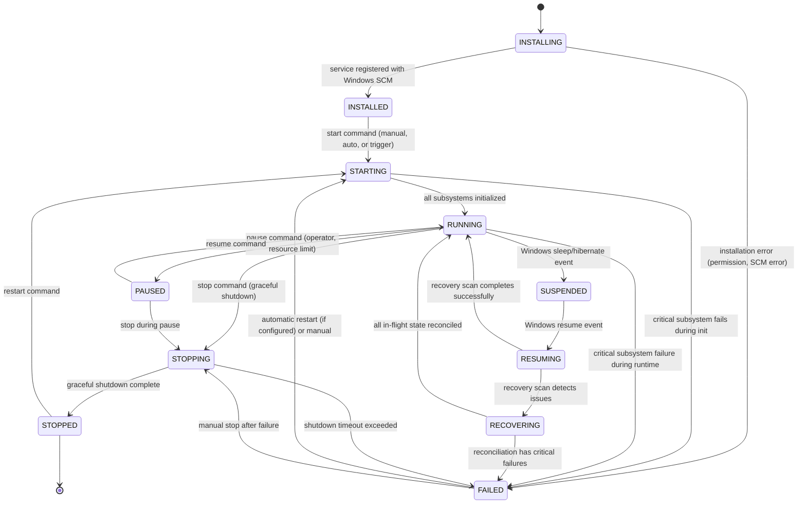

# Service State Machine

## Document type
Document type: [CONTRACT]

## Version
**Version:** 1.1.0 | **Status:** Canonical | **Last Updated:** 2026-07-27 | **Owner:** Runtime Team

## Purpose
Defines the complete Windows service lifecycle state machine — states, transitions, timeouts, recovery transitions, forbidden transitions, and Windows-specific behavior (service mode, tray mode, power events, sleep/resume).

---

## 1. State Machine Definition

---

## 2. State Definitions

| State | Description | Entry Condition | Exit Condition | Timeout | Persistent? |
|-------|-------------|-----------------|----------------|---------|-------------|
| **INSTALLING** | Service being registered with Windows Service Control Manager | Installer runs `sc create` or equivalent | Service registered or error | `service.install_timeout_ms` (30s) | No |
| **INSTALLED** | Service registered but not running | SCM registration confirmed | Start command received | None (waits for trigger) | Yes (SCM) |
| **STARTING** | Service process launching, subsystems initializing | Start command (auto-start, manual, or trigger start) | All subsystems ready or critical failure | `runtime.startup_timeout_ms` (60s) | No (transient) |
| **RUNNING** | Service fully operational | All subsystems initialized | Pause, stop, failure, or suspend | None (stable) | Yes |
| **PAUSED** | Service intentionally paused by operator | Pause command via SCM or dashboard | Resume or stop | None (waits for command) | Yes (SCM) |
| **STOPPING** | Service shutting down gracefully | Stop command or Windows shutdown event | Shutdown complete or timeout | `runtime.shutdown_timeout_ms` (30s) | No (transient) |
| **STOPPED** | Service fully stopped | Shutdown complete | Restart command | None (waits for command) | Yes (SCM) |
| **FAILED** | Critical failure detected | Subsystem crash or unrecoverable error | Automatic restart or manual recovery | `service.auto_restart_delay_ms` (10s) | Yes (logged) |
| **SUSPENDED** | Windows sleep/hibernate — operations paused | OS power event (sleep, hibernate) | Windows resume event | None (OS-dependent) | Yes |
| **RESUMING** | Recovering after Windows resume | Windows resume event | Recovery scan completes | `runtime.startup_timeout_ms` (60s) | No (transient) |
| **RECOVERING** | Active reconciliation after resume | Recovery scan detected incomplete state | All state reconciled or critical failure | `runtime.recovery_timeout_ms` (120s) | No (transient) |

---

## 3. Transition Definitions

### Allowed Transitions

| From | To | Trigger | Precondition | Postcondition | Event Emitted |
|------|----|---------|--------------|---------------|---------------|
| INSTALLING | INSTALLED | SCM registration confirmed | Service name registered; binary path set | SCM reports `INSTALLED` | — |
| INSTALLING | FAILED | Installation error | Permission denied, SCM error, binary path invalid | Error logged; installation aborted | `system.error` |
| INSTALLED | STARTING | Start command | SCM `Start` command or auto-start policy | Process launched; subsystem init begins | `runtime.starting` |
| STARTING | RUNNING | All subsystems initialized | Startup latch countdown complete | All subsystems operational | `runtime.started` |
| STARTING | FAILED | Critical subsystem fails | Any subsystem fails within startup timeout | Failed subsystem isolated; startup abort logged | `system.error` |
| RUNNING | PAUSED | Pause command | Operator pause via SCM or dashboard | New opportunities rejected; in-flight trades complete | `runtime.mode.transition` (Active → Paused) |
| RUNNING | STOPPING | Stop command | SCM `Stop` command or Windows shutdown | Graceful drain begins | `runtime.shutting_down` |
| RUNNING | FAILED | Critical subsystem failure | Health check detects critical failure | Affected subsystem isolated | `system.error` |
| RUNNING | SUSPENDED | Windows sleep/hibernate event | OS power management signals sleep | All operations checkpointed; connections closed | `runtime.mode.transition` (Active → Suspended) |
| PAUSED | RUNNING | Resume command | Operator resume via SCM or dashboard | Operations resume | `runtime.mode.transition` (Paused → Active) |
| PAUSED | STOPPING | Stop during pause | Stop command received while paused | Shutdown sequence begins | `runtime.shutting_down` |
| SUSPENDED | RESUMING | Windows resume event | OS signals wake from sleep/hibernate | Recovery scan begins | `runtime.mode.transition` (Suspended → Resuming) |
| RESUMING | RUNNING | Recovery scan clean | No incomplete state detected | Normal operation resumes | `runtime.health.restored` |
| RESUMING | RECOVERING | Recovery scan detects issues | Incomplete trades, stuck connections, stale data | Reconciliation begins | `system.warning` |
| RECOVERING | RUNNING | Reconciliation successful | All in-flight state reconciled | Normal operation resumes | `runtime.recovery.completed` |
| RECOVERING | FAILED | Critical reconciliation failure | Cannot resolve in-flight state | Service enters FAILED; operator intervention needed | `system.error` |
| FAILED | STARTING | Automatic restart | `service.auto_restart_enabled` = true; restart delay elapsed | Fresh startup sequence | `runtime.starting` |
| FAILED | STARTING | Manual restart | Operator restart command | Fresh startup sequence | `runtime.starting` |
| FAILED | STOPPING | Manual stop after failure | Operator stop command after failure | Process terminates | `runtime.shutting_down` |
| STOPPING | STOPPED | Graceful shutdown complete | All subsystems stopped; resources released | SCM reports `STOPPED` | `runtime.stopped` |
| STOPPING | FAILED | Shutdown timeout exceeded | `runtime.shutdown_timeout_ms` exceeded | Force terminate; cleanup deferred to next startup | `system.error` (forced shutdown) |
| STOPPED | STARTING | Restart command | SCM `Start` command | Process launched | `runtime.starting` |

### Forbidden Transitions

| From | To | Reason |
|------|----|--------|
| STOPPED | RUNNING | Must go through STARTING |
| FAILED | RUNNING | Must re-initialize through STARTING |
| SUSPENDED | RUNNING | Must go through RESUMING/RECOVERING |
| STOPPED | PAUSED | Cannot pause a stopped service |
| RUNNING | INSTALLED | Cannot re-register while running |

---

## 4. Windows-Specific Behavior

### Service Mode
- Registered with Windows SCM as a Win32 service.
- Supports auto-start on boot (configurable: `service.start_type: auto|manual|disabled`).
- SCM controls start/stop/pause via standard Win32 service API.
- Logs to Windows Event Log in service mode.
- No interactive desktop session in service mode.

### Tray Mode
- Runs as a user process (not SCM-registered).
- Minimizes to system tray on close.
- Tray icon shows: trade count, balance summary, health status (color-coded).
- Right-click menu: Resume/Pause, Open Dashboard, View Logs, Exit.
- Exit triggers graceful shutdown sequence.

### Power Events
| Event | Action |
|-------|--------|
| **Sleep** (WM_POWERBROADCAST: PBT_APMSUSPEND) | Save checkpoint → SUSPENDED: close all network connections, persist in-flight state, stop timers |
| **Resume** (WM_POWERBROADCAST: PBT_APMRESUMEAUTOMATIC) | RESUMING → recovery scan: re-establish RPC connections, check chain state, reconcile trades |
| **Hibernate** | Same as sleep (longer downtime expected) |
| **Battery Low** (< 20%) | Throttle: reduce AI calls, pause low-priority plugins, increase health check interval |
| **Battery Critical** (< 5%) | Emergency: save checkpoint → STOPPING (graceful shutdown) |
| **AC Power Restored** | Resume normal operation from throttled state |

### Restart Policy
| Policy | Setting | Behavior |
|--------|---------|----------|
| **No auto-restart** | `service.auto_restart_enabled: false` | FAILED state requires manual operator restart |
| **Single auto-restart** | `service.auto_restart_enabled: true`, `service.auto_restart_max_attempts: 1` | One automatic restart after 10s delay; then manual required |
| **Multiple auto-restart** | `service.auto_restart_enabled: true`, `service.auto_restart_max_attempts: 3` | Up to 3 restarts with escalating delay (10s, 30s, 60s); then manual required |

### Windows Update Behavior
- Before OS restart for update: checkpoint save, graceful shutdown.
- After update: auto-start (if configured) → STARTING → RUNNING (with recovery scan).

---

## 5. Timeout Semantics

| Timeout | Default | Range | Config Key | Action on Expiry |
|---------|---------|-------|------------|------------------|
| Install timeout | 30,000 ms | 10,000–60,000 | `service.install_timeout_ms` | Installation FAILED |
| Startup timeout | 60,000 ms | 10,000–300,000 | `runtime.startup_timeout_ms` | Transition to FAILED |
| Shutdown timeout | 30,000 ms | 10,000–120,000 | `runtime.shutdown_timeout_ms` | Force terminate |
| Recovery timeout | 120,000 ms | 30,000–360,000 | `runtime.recovery_timeout_ms` | Transition to FAILED |
| Auto-restart delay | 10,000 ms | 5,000–120,000 | `service.auto_restart_delay_ms` | Begin STARTING |
| Degraded timeout | 300,000 ms | 60,000–600,000 | `runtime.degraded_timeout_ms` | Transition to RECOVERING |

---

## Cross-References

- **WINDOWS-SERVICE-INTEGRATION.md** — Windows service integration details.
- **WINDOWS-DESKTOP.md** — Desktop shell and tray behavior.
- **RUNTIME-OPERATIONS.md** — Startup/shutdown/recovery sequencing.
- **ENGINE-STATE-MACHINE.md** — Engine lifecycle states.
- **RECOVERY-AND-FAILOVER.md** — Recovery orchestration.
- **TRACEABILITY-MATRIX.md** — REQ-RUNTIME-001, REQ-RUNTIME-002.
- **CONFIGURATION-REFERENCE.md** — `runtime.*`, `service.*` config keys.

---

## Version History

| Version | Date | Changes | Author |
|---------|------|---------|--------|
| 1.1.0 | 2026-07-27 | Complete state machine with Windows power events, tray mode, service mode, restart policy | Runtime Team |
| 1.0.0 | 2025-01-15 | Initial stub | Runtime Team |
