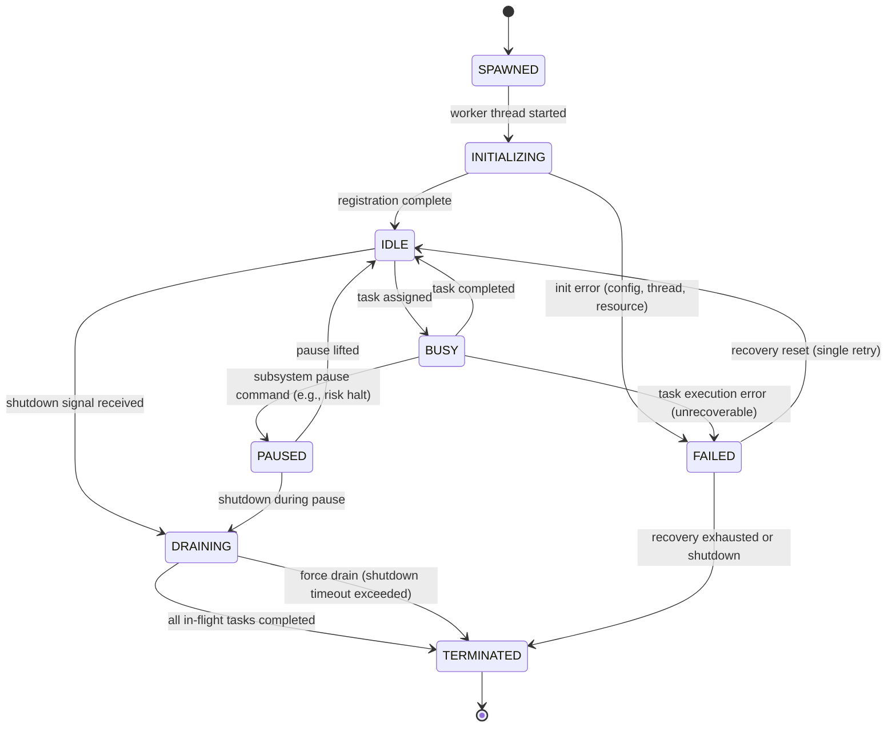

# Worker State Machine

## Document type
Document type: [CONTRACT]

## Version
**Version:** 1.1.0 | **Status:** Canonical | **Last Updated:** 2026-07-27 | **Owner:** Runtime Team

## Purpose
Defines the complete worker lifecycle state machine — states, transitions, timeouts, recovery transitions, forbidden transitions, and creation/shutdown flow.

---

## 1. State Machine Definition



---

## 2. State Definitions

| State | Description | Entry Condition | Exit Condition | Timeout | Persistent? |
|-------|-------------|-----------------|----------------|---------|-------------|
| **SPAWNED** | Worker thread created, not yet initialized | Pool scaling creates thread | Thread begins initialization | `runtime.worker.init_timeout_ms` (5s) | No (transient) |
| **INITIALIZING** | Worker loading config, registering with pool | Thread start | Registration complete or error | `runtime.worker.init_timeout_ms` (5s) | No (transient) |
| **IDLE** | Worker available for task assignment | Registration complete; no task assigned | Task assigned or shutdown signal | `runtime.worker.idle_timeout_ms` (30s) — terminates if pool over-sized | Yes (tracked) |
| **BUSY** | Worker executing assigned task | Task dequeued from work queue | Task completed, paused, or failed | Task-specific timeout (inherited from task) | Yes (tracked) |
| **PAUSED** | Worker temporarily suspended from processing | Subsystem pause command (risk halt, operator pause) | Pause lifted or shutdown | None (waits for unpause) | Yes (tracked) |
| **DRAINING** | Worker finishing current task before termination | Shutdown signal received | Current task completes or force drain | `runtime.shutdown_timeout_ms` (30s) | No (transient) |
| **FAILED** | Worker encountered unrecoverable error | Task execution error | Recovery reset or termination | `runtime.worker.recovery_timeout_ms` (10s) | Yes (logged) |
| **TERMINATED** | Worker thread exited, resources released | Drain complete or force terminate | Terminal state | None | Yes (logged) |

---

## 3. Transition Definitions

### Allowed Transitions

| From | To | Trigger | Precondition | Postcondition | Event Emitted |
|------|----|---------|--------------|---------------|---------------|
| SPAWNED | INITIALIZING | Thread starts | Thread resources allocated | Config loaded, pool registration started | — |
| INITIALIZING | IDLE | Registration complete | Config valid, pool slot available | Worker tracked in pool as available | `runtime.worker.ready` |
| INITIALIZING | FAILED | Init error | Config missing, thread allocation failure, resource limit | Worker slot released, error logged | `system.error` |
| IDLE | BUSY | Task assigned | Task in work queue; worker is next available | Task assigned; worker marked as BUSY | — |
| IDLE | DRAINING | Shutdown signal | Pool is scaling down or process shutdown | Worker will not accept new tasks | — |
| BUSY | IDLE | Task completed | Task result returned successfully | Worker available for next task | — |
| BUSY | PAUSED | Subsystem pause command | Risk halt, operator pause, or circuit breaker | Worker stops processing; task paused | `runtime.worker.paused` |
| BUSY | FAILED | Task execution error (unrecoverable) | Error is non-retryable (OOM, invariant violation) | Task marked as failed; worker enters recovery | `system.error` |
| PAUSED | IDLE | Pause lifted | Risk halt cleared, operator resume | Worker available for new tasks | `runtime.worker.resumed` |
| PAUSED | DRAINING | Shutdown during pause | Shutdown signal while paused | Worker will terminate after drain | — |
| DRAINING | TERMINATED | All in-flight tasks completed | No remaining tasks | Thread joined; resources freed | `runtime.worker.terminated` |
| DRAINING | TERMINATED | Force drain (shutdown timeout exceeded) | `runtime.shutdown_timeout_ms` exceeded | Thread detached; resources freed | `system.warning` (forced termination) |
| FAILED | IDLE | Recovery reset | Single retry allowed | Worker re-initialized | `runtime.worker.recovered` |
| FAILED | TERMINATED | Recovery exhausted or shutdown | Second failure or shutdown signal | Thread terminated | `system.error` (worker unrecoverable) |

### Forbidden Transitions

| From | To | Reason |
|------|----|--------|
| TERMINATED | IDLE | Dead worker cannot re-enter pool |
| TERMINATED | BUSY | Dead worker cannot execute tasks |
| FAILED | BUSY | Must recover to IDLE first |
| IDLE | FAILED | Idle worker cannot fail without a task |
| SPAWNED | BUSY | Must initialize before accepting tasks |

---

## 4. Worker Creation and Shutdown Flow

### Creation Flow
```
1. Pool detects need for new worker (queue depth > threshold or scaling policy)
2. Allocate thread resources (stack, config context)
3. Spawn thread → SPAWNED
4. Thread loads config, registers with pool → INITIALIZING
5. Registration confirmed → IDLE (available for tasks)
6. If init fails → FAILED (single retry → IDLE or TERMINATED)
```

### Shutdown Flow
```
1. Shutdown signal received by pool
2. Pool signals all IDLE workers → DRAINING (immediate termination)
3. Pool signals all BUSY workers → DRAINING (wait for task completion)
4. Workers in PAUSED → DRAINING (resume then drain)
5. Each draining worker completes current task
6. Worker → TERMINATED (thread joined, resources freed)
7. If shutdown timeout exceeded → force TERMINATED (thread detached)
8. Pool verifies all workers TERMINATED before pool shutdown complete
```

### Idle Timeout Termination
If a worker stays in IDLE for `runtime.worker.idle_timeout_ms` (30s) and the pool has more than `runtime.worker.min_workers` workers:
- Worker transitions to DRAINING → TERMINATED (pool scaling down).

---

## 5. Timeout Semantics

| Timeout | Default | Range | Config Key | Action on Expiry |
|---------|---------|-------|------------|------------------|
| Init timeout | 5,000 ms | 1,000–30,000 | `runtime.worker.init_timeout_ms` | Transition to FAILED |
| Idle timeout | 30,000 ms | 5,000–300,000 | `runtime.worker.idle_timeout_ms` | Scale down (TERMINATED) |
| Task timeout | Inherited from task | — | Per-task | Task marked FAILED |
| Recovery timeout | 10,000 ms | 5,000–60,000 | `runtime.worker.recovery_timeout_ms` | TERMINATED if recovery fails |
| Shutdown drain timeout | 30,000 ms | 10,000–120,000 | `runtime.shutdown_timeout_ms` | Force TERMINATED |

---

## Cross-References

- **WORKER-POOL.md** — Pool orchestration and scaling policies.
- **WORKER-ARCHITECTURE.md** — Worker design and task execution.
- **THREADING-MODEL.md** — Thread lifecycle and safety.
- **CONCURRENCY-MODEL.md** — Queue architecture and cancellation.
- **RUNTIME-OPERATIONS.md** — Startup/shutdown sequencing.
- **TRACEABILITY-MATRIX.md** — REQ-RUNTIME-004.
- **CONFIGURATION-REFERENCE.md** — `runtime.worker.*` config keys.

---

## Version History

| Version | Date | Changes | Author |
|---------|------|---------|--------|
| 1.1.0 | 2026-07-27 | Complete state machine with 8 states, transitions, creation/shutdown flow, timeouts | Runtime Team |
| 1.0.0 | 2025-01-15 | Initial stub | Runtime Team |
