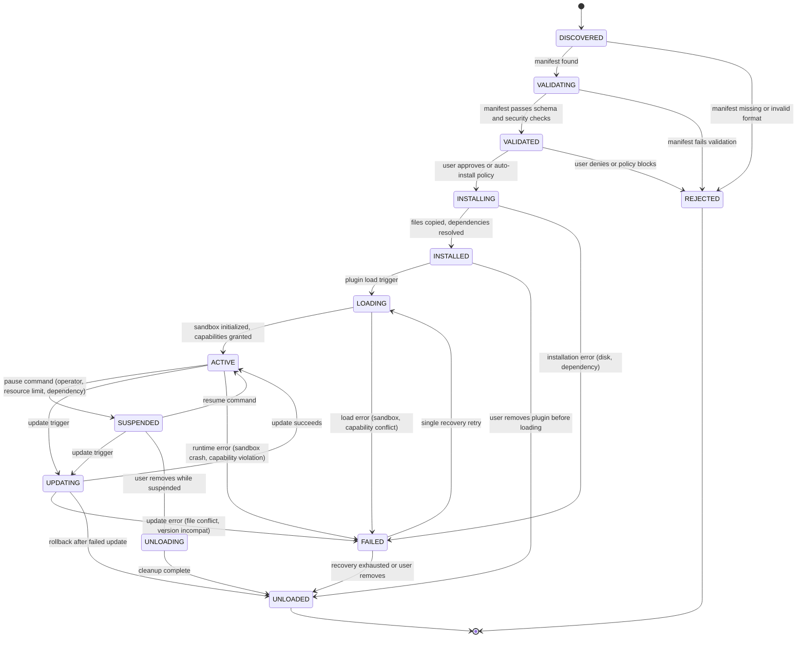

# Plugin State Machine

## Document type
Document type: [CONTRACT]

## Version
**Version:** 1.1.0 | **Status:** Canonical | **Last Updated:** 2026-07-27 | **Owner:** Plugin Team

## Purpose
Defines the complete plugin lifecycle state machine — discovery, validation, installation, loading, activation, suspension, updating, failure, unloading — with transitions, timeouts, recovery paths, and forbidden transitions.

---

## 1. State Machine Definition



---

## 2. State Definitions

| State | Description | Entry Condition | Exit Condition | Timeout | Persistent? |
|-------|-------------|-----------------|----------------|---------|-------------|
| **DISCOVERED** | Plugin directory or package detected | Plugin directory found / marketplace entry scanned | Manifest validation triggered | `plugin.discovery.scan_interval_ms` (60s) | No (transient) |
| **VALIDATING** | Manifest being validated against schema and security rules | Manifest file found | Validation pass or fail | `plugin.validation_timeout_ms` (5s) | No (transient) |
| **VALIDATED** | Manifest passes all checks; awaiting installation approval | Schema valid, security rules pass, capabilities declared | User approval or auto-install policy | None (waits for trigger) | Yes |
| **REJECTED** | Plugin rejected during discovery or validation | Manifest missing, invalid, or security violation | Terminal state | None | Yes (logged) |
| **INSTALLING** | Plugin files being copied, dependencies resolved | Installation approved | Files installed or error | `plugin.install_timeout_ms` (30s) | No (transient) |
| **INSTALLED** | Plugin files present on disk; not yet loaded | Installation complete | Load trigger or removal | None (waits for trigger) | Yes |
| **LOADING** | Plugin sandbox being initialized, capabilities being granted | Load trigger (startup, user request, auto-load policy) | Sandbox ready or load error | `plugin.load_timeout_ms` (15s) | No (transient) |
| **ACTIVE** | Plugin is running in sandbox, capabilities granted | Sandbox initialized, IPC channels open | Pause, update, crash, or removal | None (stable) | Yes |
| **SUSPENDED** | Plugin temporarily paused | Operator pause, resource throttle, dependency failure | Resume or removal | `plugin.suspend_max_duration_ms` (300s) | Yes |
| **UPDATING** | Plugin being updated (new version installation) | Update trigger (auto-update, marketplace, manual) | Update succeeds or fails | `plugin.update_timeout_ms` (60s) | No (transient) |
| **FAILED** | Plugin encountered runtime or initialization error | Sandbox crash, capability violation, load error | Recovery retry or removal | `plugin.recovery_timeout_ms` (10s) | Yes (logged) |
| **UNLOADING** | Plugin being removed, sandbox shutdown | User removal or failed update rollback | Cleanup complete | `plugin.unload_timeout_ms` (10s) | No (transient) |
| **UNLOADED** | Plugin removed from system | Cleanup complete | Terminal state | None | Yes (logged) |

---

## 3. Transition Definitions

### Allowed Transitions

| From | To | Trigger | Precondition | Postcondition | Event Emitted |
|------|----|---------|--------------|---------------|---------------|
| DISCOVERED | VALIDATING | Manifest found | Manifest file exists in expected location | Schema validation begins | — |
| DISCOVERED | REJECTED | Manifest missing or invalid format | No manifest, wrong extension, or format error | Plugin logged as rejected | `plugin.error` |
| VALIDATING | VALIDATED | All checks pass | Schema valid; capabilities declared; security rules met (no blocked capabilities); API version compatible | Plugin approved for installation | — |
| VALIDATING | REJECTED | Validation fails | Schema invalid, blocked capability, incompatible API version, security violation | Plugin logged as rejected with reason | `plugin.error` |
| VALIDATED | INSTALLING | User approves or auto-install | Auto-install policy allows, or user clicks "Install" | File copy begins | `plugin.installed` (on completion) |
| VALIDATED | REJECTED | User denies or policy blocks | User clicks "Reject" or policy blocks (e.g., unsigned plugin) | Plugin rejected | — |
| INSTALLING | INSTALLED | Files copied, dependencies resolved | All files present, dependencies available | Plugin ready for loading | `plugin.installed` |
| INSTALLING | FAILED | Installation error | Disk full, dependency missing, file corruption | Error logged; installation aborted | `plugin.error` |
| INSTALLED | LOADING | Load trigger | Startup auto-load or user request | Sandbox initialization begins | — |
| INSTALLED | UNLOADED | User removes before loading | User clicks "Remove" before enabling | Files deleted, registry entry removed | `plugin.removed` |
| LOADING | ACTIVE | Sandbox initialized, capabilities granted | Sandbox process started; IPC channels open; capability grants verified | Plugin operational | `plugin.loaded` |
| LOADING | FAILED | Load error | Sandbox process fails to start; capability conflict; IPC error | Plugin in error state | `plugin.error` |
| ACTIVE | SUSPENDED | Pause command | Operator pause, resource throttle (memory/CPU budget exceeded), dependency failure | Plugin paused; IPC channels preserved but blocked | `plugin.crashed` (if due to resource) |
| ACTIVE | UPDATING | Update trigger | New version available; auto-update enabled or manual trigger | Old version archived; new version installed | — |
| ACTIVE | FAILED | Runtime error | Sandbox crash (process exit), capability violation (security.violation), unrecoverable error | Plugin in error state | `plugin.crashed` or `plugin.violation` |
| SUSPENDED | ACTIVE | Resume command | Operator resume, resource available, dependency restored | Plugin operational again | `plugin.loaded` |
| SUSPENDED | UPDATING | Update trigger during pause | Update available while plugin suspended | Update proceeds (plugin resumes after) | — |
| SUSPENDED | UNLOADING | User removes while suspended | User removes plugin while paused | Plugin unloaded | `plugin.removed` |
| UPDATING | ACTIVE | Update succeeds | New version loaded and verified | Plugin operational with new version | `plugin.loaded` (with new version) |
| UPDATING | FAILED | Update error | File conflict, version incompatibility, sandbox failure | Plugin rolled back | `plugin.error` |
| UPDATING | UNLOADED | Rollback after failed update | Update fails, rollback to previous version fails too | Plugin removed entirely | `plugin.removed` |
| FAILED | LOADING | Single recovery retry | First failure only; recovery budget not exhausted | Re-attempt loading | `plugin.loaded` (if succeeds) |
| FAILED | UNLOADED | Recovery exhausted or user removes | Second failure or user manually removes | Plugin removed | `plugin.removed` |
| UNLOADING | UNLOADED | Cleanup complete | Files deleted, sandbox stopped, registry entry removed | Plugin fully removed | `plugin.removed` |

### Forbidden Transitions

| From | To | Reason |
|------|----|--------|
| UNLOADED | ACTIVE | Must go through DISCOVERED → VALIDATED → INSTALLING → LOADING → ACTIVE |
| REJECTED | INSTALLING | Rejected plugins cannot be installed |
| FAILED | ACTIVE | Must recover via LOADING first |
| ACTIVE | DISCOVERED | Active plugin cannot re-enter discovery |
| TERMINATED (any) | LOADING | Must start from INSTALLED |

---

## 4. Plugin Discovery, Load, Unload, and Update Flow

### Discovery Flow
```
1. Plugin scanner runs on startup and periodically (interval: 60s).
2. Scans plugin directory for manifest.json files.
3. For each found: DISCOVERED → VALIDATING → VALIDATED or REJECTED.
4. If auto-install policy allows: VALIDATED → INSTALLING → INSTALLED.
5. If auto-load policy allows: INSTALLED → LOADING → ACTIVE.
```

### Load Flow
```
1. Plugin Manager receives load request.
2. Sandbox process spawned (isolated, limited resources).
3. IPC channels established between sandbox and host.
4. Capability grants verified against manifest declaration.
5. Plugin init function called within sandbox.
6. If init succeeds → ACTIVE.
7. If init fails → FAILED (single retry → LOADING or UNLOADED).
```

### Unload Flow
```
1. Plugin Manager receives remove request.
2. If ACTIVE: send stop signal → wait for graceful exit → UNLOADING.
3. If SUSPENDED: resume briefly for cleanup → UNLOADING.
4. UNLOADING: sandbox process terminated, IPC channels closed, files deleted.
5. Registry entry removed → UNLOADED.
```

### Update Flow
```
1. Update Manager detects new version.
2. If plugin is ACTIVE: SUSPENDED (brief pause) → UPDATING.
3. Old version files archived; new version files installed.
4. New sandbox spawned with new version → LOADING → ACTIVE.
5. If update fails: rollback to archived version → ACTIVE (or UNLOADED if rollback fails).
```

---

## 5. Timeout Semantics

| Timeout | Default | Range | Config Key | Action on Expiry |
|---------|---------|-------|------------|------------------|
| Discovery scan interval | 60,000 ms | 10,000–360,000 | `plugin.discovery.scan_interval_ms` | Re-scan directory |
| Validation timeout | 5,000 ms | 1,000–30,000 | `plugin.validation_timeout_ms` | Reject with `VALIDATION_TIMEOUT` |
| Install timeout | 30,000 ms | 10,000–120,000 | `plugin.install_timeout_ms` | Mark FAILED |
| Load timeout | 15,000 ms | 5,000–60,000 | `plugin.load_timeout_ms` | Mark FAILED |
| Suspend max duration | 300,000 ms | 60,000–3,600,000 | `plugin.suspend_max_duration_ms` | Auto-unload if suspended too long |
| Update timeout | 60,000 ms | 30,000–180,000 | `plugin.update_timeout_ms` | Rollback |
| Recovery timeout | 10,000 ms | 5,000–60,000 | `plugin.recovery_timeout_ms` | UNLOADED if second failure |
| Unload timeout | 10,000 ms | 5,000–30,000 | `plugin.unload_timeout_ms` | Force kill sandbox |

---

## Cross-References

- **PLUGIN-LIFECYCLE.md** — Plugin lifecycle management.
- **PLUGIN-SANDBOX-CONTRACT.md** — Sandbox isolation and resource limits.
- **APP-BUILDER-PLUGIN-SYSTEM.md** — Plugin manifest and API governance.
- **PLUGIN-SDK.md** — Plugin API stability and versioning.
- **TRACEABILITY-MATRIX.md** — REQ-PLUGIN-001, REQ-PLUGIN-002, REQ-PLUGIN-003.
- **CONFIGURATION-REFERENCE.md** — `plugin.*` config keys.

---

## Version History

| Version | Date | Changes | Author |
|---------|------|---------|--------|
| 1.1.0 | 2026-07-27 | Complete state machine with 13 states, discovery/load/unload/update flow, timeouts | Plugin Team |
| 1.0.0 | 2025-01-15 | Initial stub | Plugin Team |
