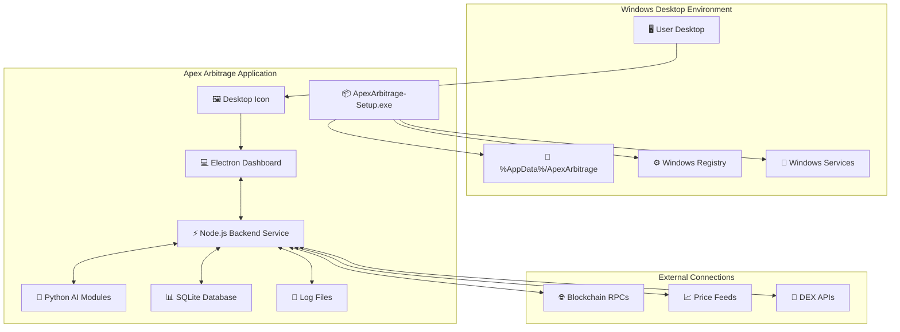
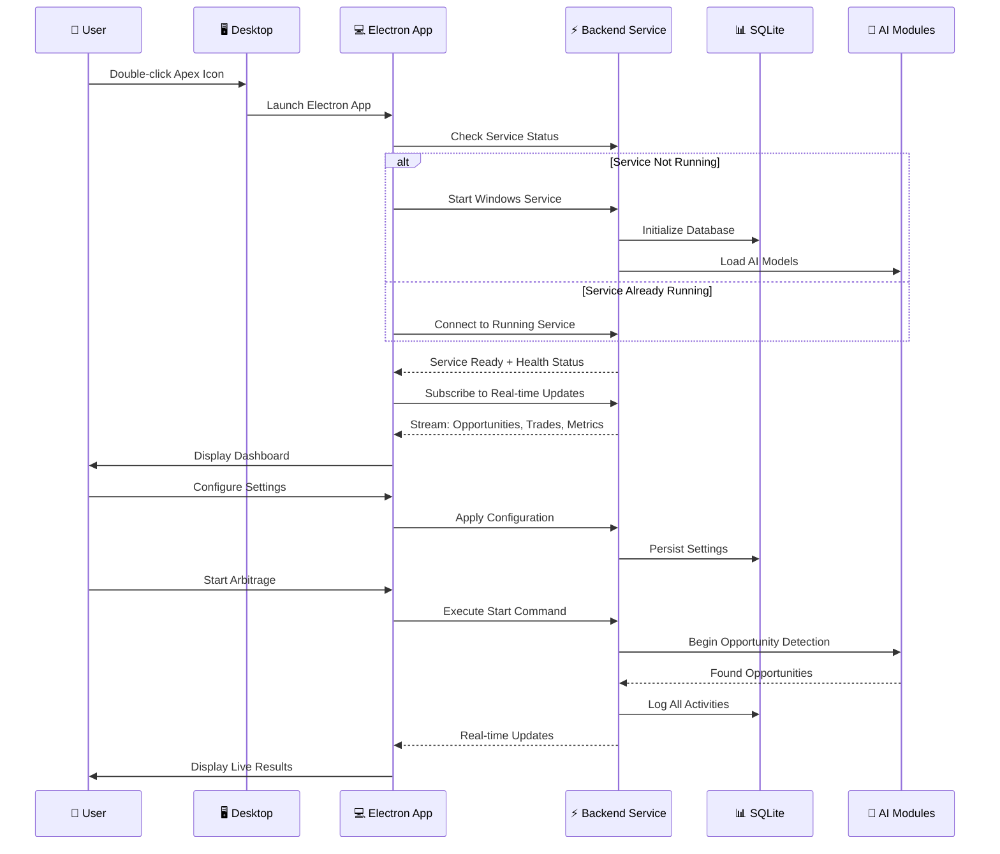
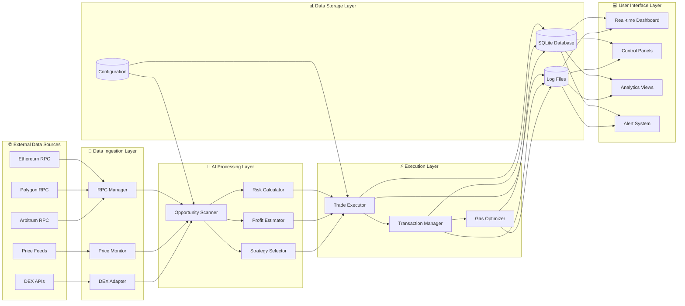
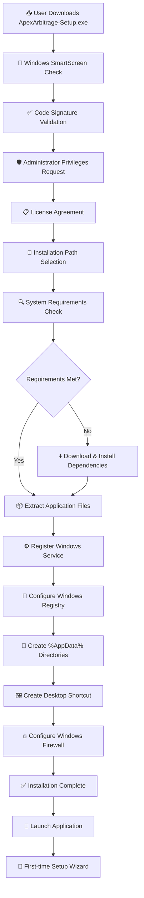
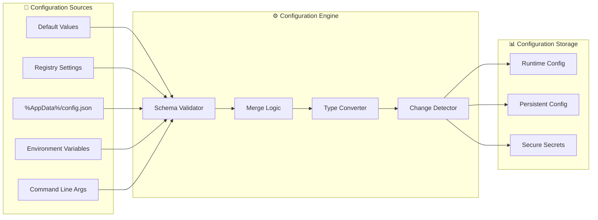
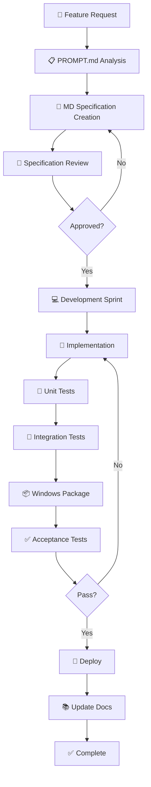

# 🏦 Apex Arbitrage Windows Desktop - Features Blueprint

**MASTER ARCHITECTURAL COMMAND CENTER**
*Complete Windows-Native Desktop Application Development Framework*

---

## ⚡ Quick Start (TL;DR)

> **Note:** This project is currently in the documentation phase. No releases are available yet.

**What is this?**
A Windows desktop application for automated cryptocurrency arbitrage across multiple blockchains (Ethereum, Polygon, Arbitrum).

**Current Status:**
📝 Architecture & feature documentation in progress (842 legacy folders being analyzed)

**For Developers:**
1. Clone: `git clone https://github.com/pavan53732/Apex-Arbitrage-Multichain-bot-for-windows.git`
2. Generate prompts: `powershell -ExecutionPolicy Bypass -File generate-prompts.ps1`
3. Review `features/` for specifications
4. Read `PROMPT.md` for documentation workflow

**For Users:**
⏳ Not ready yet. Star the repo to get notified of releases.

---

## 📑 Table of Contents

- [Quick Start](#-quick-start-tldr)
- [Current Project Status](#-current-project-status)
- [Mission Statement](#-mission-statement)
- [System Requirements](#-system-requirements)
- [Feature Architecture](#-complete-feature-architecture)
- [Windows Desktop Architecture](#️-windows-desktop-architecture-deep-dive)
- [Windows Implementation Details](#-windows-implementation-details)
- [Development Workflow](#-development-workflow-diagrams)
- [Documentation Automation](#-documentation-automation)
- [Contributing](#-contributing)

---

## 📍 Current Project Status

**Phase:** Architecture & Documentation
**Progress:** Feature mapping from 842 legacy folders
**Version:** 0.0.0 (Pre-Alpha)

### Development Roadmap

| Phase | Status | Timeline | Deliverables |
|-------|--------|----------|-------------|
| **Phase 0: Documentation** | 🟡 In Progress | Current | Feature specs, 842 prompts, architecture diagrams |
| **Phase 1: MVP (P0)** | ⚪ Not Started | TBA | Installer, config, backend, dashboard |
| **Phase 2: Core Features (P1)** | ⚪ Not Started | TBA | AI modules, security, contracts |
| **Phase 3: Polish (P2-P3)** | ⚪ Not Started | TBA | Testing, deployment, documentation |

**Legend:** 🟢 Complete | 🟡 In Progress | ⚪ Not Started | 🔴 Blocked

---

## 🎯 Mission Statement

This directory contains the **complete technical specifications** for building the Apex Arbitrage Multichain Bot as a **professional Windows desktop application**. Every feature is designed from the ground up for Windows users who want **one-click installation** and **desktop control** of sophisticated arbitrage operations.

**Key Principle**: Transform complex blockchain arbitrage into **simple desktop software** that anyone can install and operate.

---

## 💻 System Requirements

### For End Users (When Released)
- **OS:** Windows 10 (64-bit) or Windows 11
- **RAM:** 8GB minimum, 16GB recommended
- **Storage:** 2GB free space
- **Network:** Stable internet for blockchain RPC access

### For Developers
- **OS:** Windows 10/11 (required for Windows-specific testing)
- **Node.js:** v18.0.0 or higher
- **Python:** v3.9.0 or higher
- **Git:** Latest version
- **IDE:** Visual Studio Code (recommended)
- **Additional Tools:**
  - Windows SDK (for native modules)
  - Visual Studio Build Tools (for node-gyp)
  - SQLite3 command-line tools

### Blockchain Requirements
- Ethereum RPC endpoint (Infura, Alchemy, or self-hosted)
- Polygon RPC endpoint
- Arbitrum RPC endpoint
- Wallet with private keys (for trading)

---

## 📊 Complete Feature Architecture

### **🔥 Critical Features (P0) - MVP Foundation**

| Feature File | Windows Implementation | Purpose | Development Time | Dependencies |
|-------------|----------------------|---------|-----------------|-------------|
| **install-dependencies.md** | NSIS/Inno Setup installer with embedded runtimes | Auto-install Node.js, Python, SQLite, configure Windows Service | 4 days | None |
| **config.md** | Registry + %AppData% JSON configuration with GUI editor | Secure configuration management with hot-reload | 3 days | install-dependencies |
| **backend.md** | Windows Service + localhost API server | Core arbitrage execution engine with SQLite logging | 6 days | config |
| **dashboard.md** | Electron desktop app with native Windows integration | Real-time control center with system tray support | 5 days | backend, config |

### **⚡ High-Value Features (P1) - Core Functionality**

| Feature File | Windows Implementation | Purpose | Development Time | Dependencies |
|-------------|----------------------|---------|-----------------|-------------|
| **ai-modules.md** | Embedded Python ML models with Node.js bridge | Intelligent arbitrage opportunity detection | 5 days | backend |
| **security.md** | Windows Credential Manager + AES encryption | Enterprise-grade security and key management | 4 days | config, backend |
| **contracts.md** | Hardhat integration with Windows batch scripts | Smart contract deployment and management | 4 days | backend |

### **🛠️ Supporting Features (P2-P3) - Polish & Operations**

| Feature File | Windows Implementation | Purpose | Development Time | Dependencies |
|-------------|----------------------|---------|-----------------|-------------|
| **testing.md** | Jest + Playwright with Windows-specific tests | Comprehensive quality assurance framework | 3 days | All features |
| **deployment.md** | Electron Builder + code signing + auto-update | Professional distribution and update system | 4 days | All features |
| **docs.md** | Integrated help system + operator guides | User documentation and troubleshooting | 2 days | All features |

---

## 🏗️ Windows Desktop Architecture Deep Dive

### **System Overview Diagram**



### **Application Startup Sequence**



### **Data Flow Architecture**



---

## 🔧 Windows Implementation Details

### **Installation & Bootstrap Process**



### **Service Architecture**

```mermaid
flowchart TB
    subgraph "🖥️ Windows Operating System"
        A[Windows Service Manager]
        B[Windows Registry]
        C[Windows Event Log]
        D[Windows Firewall]
    end

    subgraph "⚡ Apex Backend Service"
        E[Service Controller]
        F[HTTP/WebSocket Server]
        G[Database Manager]
        H[Log Manager]
        I[Configuration Manager]
    end

    subgraph "💻 Electron Desktop App"
        J[Main Process]
        K[Renderer Process]
        L[IPC Communication]
    end

    A <--> E
    B <--> I
    C <--> H
    D <--> F

    E --> F
    E --> G
    E --> H
    E --> I

    F <--> L
    L <--> J
    J <--> K
```



### **Configuration Management System**



---

## 📊 Development Workflow Diagrams

### **Feature Development Lifecycle**



---

## 🤖 Documentation Automation

This project uses **AI-powered documentation generation** from the legacy codebase:

### Automation Workflow

1. **Legacy Analysis**: 842 folders from original multi-chain bot (6,086 files)
2. **Prompt Generation**: `generate-prompts.ps1` creates 842 individual prompts
3. **AI Processing**: Each prompt analyzes one folder and updates `features/*.md`
4. **Summary Report**: `PROMPT-SUMMARY.md` (843rd prompt) generates final coverage analysis

### Key Files

- **`PROMPT.md`** - Master prompt template with intelligent analysis rules
- **`Path-Locations.md`** - List of all 842 legacy folder paths
- **`PROJECT TREE COMPLETE STRUCTURE.md`** - Complete file listing (6,086 files)
- **`generated-prompts/`** - 842 auto-generated prompts (28.2 MB)
- **`features/*.md`** - Auto-populated feature documentation

### How It Works

```bash
# Step 1: Generate 842 prompts
powershell -ExecutionPolicy Bypass -File generate-prompts.ps1

# Step 2: Process prompts 1-842 (use AI agent)
# Each prompt reads PROJECT TREE, analyzes files, updates features/*.md

# Step 3: Generate summary report
# Run PROMPT-SUMMARY.md to create features/SUMMARY.md
```

### Intelligent Features

- **Smart File Grouping** - Groups by Core Logic, Adapters, Config, Tests, Utils, Types
- **Complexity Scoring** - ⭐ (1-5 files) to ⭐⭐⭐⭐⭐ (51+ files)
- **Technology Detection** - Auto-detects React, Solidity, Python, TypeScript, etc.
- **Windows Component Mapping** - Maps to node-windows, Electron, SQLite, etc.

---

## 🤝 Contributing

We welcome contributions! Here's how to get started:

### 1. Fork & Clone
```bash
git clone https://github.com/YOUR_USERNAME/Apex-Arbitrage-Multichain-bot-for-windows.git
cd Apex-Arbitrage-Multichain-bot-for-windows
```

### 2. Create Feature Branch
```bash
git checkout -b feature/your-feature-name
```

### 3. Follow Documentation Standards
- Use `PROMPT.md` for feature specifications
- Add tests for all new features
- Update relevant documentation
- Follow Windows-native implementation patterns

### 4. Submit Pull Request
- Fill out PR template completely
- Link related issues
- Wait for code review

See `CONTRIBUTING.md` for detailed guidelines.

---

## 📞 Support & Community

### Getting Help

- **📚 Documentation**: Complete guides in `features/` directory
- **🐛 Bug Reports**: [GitHub Issues](https://github.com/pavan53732/Apex-Arbitrage-Multichain-bot-for-windows/issues)
- **💡 Feature Requests**: [GitHub Discussions](https://github.com/pavan53732/Apex-Arbitrage-Multichain-bot-for-windows/discussions)
- **🔧 Technical Support**: Community support through GitHub

---

**🎯 This Features README represents the complete blueprint for building institutional-grade blockchain arbitrage technology as an accessible Windows desktop application. Every diagram, specification, and implementation detail is designed to ensure success from development through deployment.**

**Version:** 0.0.0 (Pre-Alpha)
**Last Updated:** 2024
**Status:** 🟡 Documentation Phase
**Features Analyzed:** 842 folders from legacy codebase

