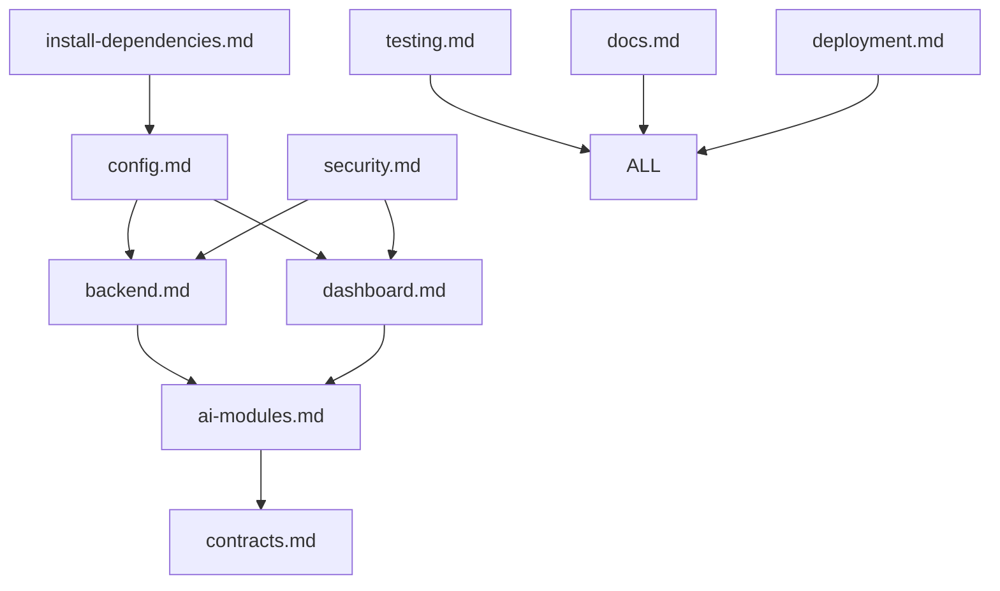

# Features Directory - Apex Arbitrage Windows Desktop

**MASTER FEATURE ARCHITECTURE BLUEPRINT**  
*Windows-Native Desktop Application Development Framework*

---

## 🚀 Features-Driven Development Overview

This directory contains the **complete technical specifications** for building the Apex Arbitrage Multichain Bot as a **Windows-native desktop application**. Each MD file represents a **self-contained feature module** that can be developed independently and integrated seamlessly.

## 📋 Feature Specifications

### **Core Features**
| Feature File | Purpose | Development Priority |
|-------------|---------|---------------------|
| `install-dependencies.md` | Windows installer & dependency management | **P0 - Critical** |
| `config.md` | Configuration management system | **P0 - Critical** |
| `backend.md` | Arbitrage execution engine | **P1 - High** |
| `dashboard.md` | User interface & control center | **P1 - High** |
| `ai-modules.md` | Machine learning & decision engine | **P2 - Medium** |

### **Supporting Features**
| Feature File | Purpose | Development Priority |
|-------------|---------|---------------------|
| `docs.md` | Documentation framework | **P2 - Medium** |
| `contracts.md` | Smart contract integration | **P2 - Medium** |
| `security.md` | Security & compliance framework | **P3 - Standard** |
| `testing.md` | Quality assurance protocols | **P3 - Standard** |
| `deployment.md` | Production deployment pipeline | **P3 - Standard** |

## 🏗️ Windows Desktop Architecture

### **Application Structure**
```
ApexArbitrage.exe
├── Windows Service (Backend Engine)
├── Desktop GUI (Dashboard)
├── Configuration Manager
├── AI Decision Engine
├── Smart Contract Interface
├── Security Framework
├── Testing Suite
└── Documentation System
```

### **Installation Flow**
1. **Download** `ApexArbitrage-Setup.exe`
2. **Auto-install** all dependencies (Node.js, Python, databases)
3. **Register** Windows Service for background operation
4. **Create** desktop shortcut with branded icon
5. **Launch** dashboard for immediate use

## 🔧 Development Methodology

### **Feature-Driven Development (FDD)**
- Each MD file = **Complete feature specification**
- Independent development & testing
- Modular integration architecture
- Continuous deployment pipeline

### **Implementation Process**
1. **Specification Phase**: Complete MD file documentation
2. **Development Phase**: Code generation from specifications
3. **Testing Phase**: Quality assurance validation
4. **Integration Phase**: Feature module connection
5. **Deployment Phase**: Windows executable packaging

## 📊 Feature Dependencies

### **Dependency Matrix**


## 🎯 Success Criteria

### **Feature Completion Standards**
- ✅ **Technical specification** complete with implementation details
- ✅ **Windows compatibility** tested across Windows 10/11
- ✅ **Performance benchmarks** meet institutional trading standards
- ✅ **Security validation** passes enterprise-grade audits
- ✅ **Integration testing** confirms seamless module interaction

### **Quality Metrics**
- **Latency**: Sub-100ms execution response
- **Reliability**: 99.99% uptime SLA
- **Security**: Zero-trust architecture
- **Usability**: Single-click operation from desktop
- **Scalability**: Handle billion-dollar transaction volumes

## 🔄 Development Workflow

### **Feature Development Cycle**
1. **Read MD specification** → Understand requirements
2. **Implement feature code** → Build according to spec
3. **Test feature isolation** → Validate functionality
4. **Integration testing** → Confirm system compatibility
5. **Windows packaging** → Bundle into executable
6. **Deployment validation** → Verify production readiness

### **Version Control Strategy**
- **Feature branches** for each MD file development
- **Integration branch** for module combination
- **Release branch** for Windows executable creation
- **Hotfix branches** for critical production issues

## 📈 Enterprise-Grade Standards

### **Institutional Trading Requirements**
- **Goldman Sachs-level** execution precision
- **Renaissance Technologies** algorithmic sophistication  
- **Citadel-grade** risk management protocols
- **Two Sigma** quantitative analysis capabilities

### **Compliance Framework**
- **SOC 2 Type II** security controls
- **PCI DSS** payment card industry standards
- **GDPR** data protection compliance
- **MiFID II** financial markets regulation

---

## 🚀 Getting Started

### **For Developers**
1. Read this README completely
2. Review individual feature MD files
3. Follow development priority sequence
4. Implement using Windows-native technologies
5. Test on Windows 10/11 environments

### **For Users**
1. Download the final `ApexArbitrage-Setup.exe`
2. Run installer with administrator privileges
3. Click desktop icon to launch application
4. Use dashboard to control all arbitrage operations

---

**This features directory represents the complete blueprint for transforming enterprise-grade blockchain arbitrage technology into a user-friendly Windows desktop application.**